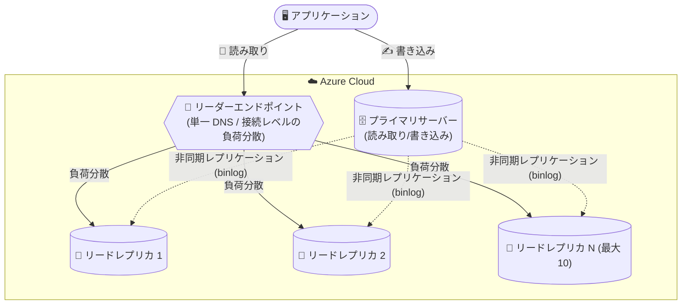

# Azure Database for MySQL: リーダーエンドポイント (Public Preview)

**リリース日**: 2026-10-01

**サービス**: Azure Database for MySQL - Flexible Server

**機能**: Reader Endpoint (リーダーエンドポイント)

**ステータス**: In preview

[このアップデートのインフォグラフィックを見る](https://takech9203.github.io/azure-news-summary/20261001-mysql-reader-endpoint.html)

## 概要

Azure Database for MySQL - Flexible Server で、複数のリードレプリカを利用する際の接続管理を簡素化する「リーダーエンドポイント (Reader Endpoint)」のパブリックプレビューが発表された。リーダーエンドポイントは、読み取り専用の接続トラフィックを複数のレプリカへ自動的に負荷分散する単一の DNS エンドポイントであり、アプリケーションアーキテクチャの簡素化と、スケーラビリティ・フォールトトレランスの向上を同時に実現する。

Azure Database for MySQL はプライマリサーバーあたり最大 10 個のリードレプリカをサポートしており、読み取りトラフィックをリーダーエンドポイント経由でルーティングすることで、個々のレプリカのエンドポイントを管理することなく接続を効率的に管理し、パフォーマンスを最適化できる。

リーダーエンドポイントはレプリカの可用性とレプリケーションラグを継続的に監視し、利用不可になったレプリカや設定された最大許容レプリケーションラグを超えたレプリカを自動的にルーティング対象から除外する。パブリックプレビュー期間中はすべての Azure 顧客が非本番環境・テスト用途で利用できる。

**アップデート前の課題**

- 複数のリードレプリカを使う場合、アプリケーション側で個々のレプリカのホスト名を管理し、読み取りトラフィックを振り分ける仕組みを自前で実装する必要があった
- 読み取りの負荷分散には ProxySQL などの軽量コネクションプロキシの導入や、マイクロサービスパターンによるスケールアウト設計が必要だった
- レプリカの障害やレプリケーション遅延を検知して接続先から除外する処理をアプリケーションやプロキシ層で作り込む必要があった

**アップデート後の改善**

- 単一の DNS エンドポイントで読み取り接続を複数レプリカへ自動的に負荷分散でき、個々のレプリカエンドポイントの管理が不要になった
- レプリカの可用性・レプリケーションラグを自動監視し、条件を満たさないレプリカをルーティングから自動除外する
- ルーティング方式 (ラウンドロビン / ネットワーク遅延ベース)、最大許容レプリケーションラグ、DNS TTL などをワークロードに合わせて設定できる

## アーキテクチャ図

アプリケーションは書き込みをプライマリサーバーへ、読み取りをリーダーエンドポイントへ送信する。リーダーエンドポイントは正常かつレプリケーションラグが許容範囲内のレプリカに新規接続を分散する。

## サービスアップデートの詳細

### 主要機能

1. **単一 DNS エンドポイントによる読み取り負荷分散**
   - 複数のリードレプリカに対する読み取り専用接続を、単一の DNS エンドポイント経由で自動的に負荷分散する
   - 接続レベル (connection-level) のルーティングであり、個々のクエリの解析や書き込みトラフィックのルーティングは行わない

2. **レプリカの自動ヘルスチェックと除外**
   - レプリカの可用性とレプリケーションラグを継続的に監視する
   - 利用不可になったレプリカや、設定した最大許容レプリケーションラグを超えたレプリカは自動的にルーティング対象から除外される

3. **2 種類のルーティング方式**
   - **Rotational (ローテーション)**: 対象レプリカにラウンドロビン方式で新規接続を分散する
   - **Performance (パフォーマンス)**: ネットワーク遅延情報に基づき、クライアントに最も近いと予想されるリージョンの対象レプリカを選択する

4. **柔軟な構成オプション**
   - ルーティングに参加させるリードレプリカの選択
   - 対象レプリカとみなす最大許容レプリケーションラグ
   - DNS TTL (選択されたレプリカの DNS マッピングをキャッシュできる時間)
   - 対象レプリカが 1 つもない場合にプライマリサーバーで読み取りを処理するかどうか
   - 新規作成されたレプリカをリーダーエンドポイントに自動的にアタッチするかどうか

5. **複数リーダーエンドポイントの作成**
   - 同一のソースサーバーに対して複数のリーダーエンドポイントを作成できる
   - アプリケーションやワークロードごとに、異なるレプリカ選択・ルーティング方式・ラグしきい値・DNS TTL を使い分けられる

## 技術仕様

| 項目 | 詳細 |
|------|------|
| 対象サービス | Azure Database for MySQL - Flexible Server |
| リードレプリカ数 | プライマリサーバーあたり最大 10 個 |
| ルーティング方式 | Rotational (ラウンドロビン) / Performance (ネットワーク遅延ベース)。作成後の変更は不可 |
| ルーティング単位 | 接続レベル (クエリの解析や書き込みのルーティングは行わない) |
| レプリケーション方式 | MySQL ネイティブの binlog ファイルポジションベースの非同期レプリケーション |
| 対応価格レベル | リードレプリカは General Purpose / Memory Optimized レベルのみ対応 (Burstable は非対応) |
| 構成可能項目 | 参加レプリカ、最大許容レプリケーションラグ、DNS TTL、プライマリへのフォールバック、新規レプリカの自動アタッチ |
| 提供範囲 (プレビュー) | すべての Azure 顧客 (非本番・テスト用途向け) |

## 設定方法

### 前提条件

1. Azure Database for MySQL - Flexible Server のインスタンス (General Purpose または Memory Optimized 価格レベル) をソースサーバーとして用意する
2. ソースサーバーにリードレプリカを作成しておく ([Azure portal でのリードレプリカ作成手順](https://learn.microsoft.com/azure/mysql/flexible-server/how-to-read-replicas-portal))

### 接続方法

リーダーエンドポイント作成後は、個々のレプリカのホスト名の代わりにリーダーエンドポイントのホスト名を読み取り用接続文字列として使用する。新規接続は構成されたルーティング方式に従って対象レプリカへ分散される。

なお、パブリックプレビュー時点では **Azure CLI はサポートされていない** ため、構成は Azure Portal 等から行う。

## メリット

### ビジネス面

- 読み取り負荷分散のためのプロキシ (ProxySQL など) の構築・運用が不要になり、運用コストと障害点を削減できる
- 読み取りスケールアウトの導入ハードルが下がり、トラフィック増加への対応が容易になる

### 技術面

- アプリケーションは単一の読み取りエンドポイントのみを扱えばよく、レプリカの追加・削除時にアプリケーション側の接続設定変更が不要 (自動アタッチ構成時)
- レプリケーションラグや可用性に基づく自動除外により、古いデータの読み取りやダウンしたレプリカへの接続を回避できる
- 複数のリーダーエンドポイントにより、ワークロードごとに異なる一貫性要件 (ラグしきい値) を設定できる

## デメリット・制約事項

パブリックプレビュー期間中は以下の制限がある。

- ジオレプリカ (geo-replica) はまだサポートされていない
- ルーティング方式は作成後に変更できない
- Azure CLI はサポートされていない
- `VERIFY_IDENTITY` モードの SSL 接続はリーダーエンドポイント経由では使用できない (その他の SSL モードはサポート)

また、リードレプリカ機能自体の特性として以下に留意が必要。

- レプリケーションは非同期であり、ソースとレプリカの間には測定可能な遅延が存在する (結果整合性を許容できるワークロード向け)
- リーダーエンドポイントは接続レベルのルーティングであり、書き込みトラフィックのルーティングは行わない (書き込みはプライマリへ直接接続する)
- リードレプリカに自動フェールオーバーの仕組みはない (高可用性目的ではなく読み取りスケール目的の機能)
- 非本番環境・テスト用途向けのプレビュー提供である

## 料金

リーダーエンドポイントの利用には追加料金が発生する。具体的な料金は [Azure 料金計算ツール](https://azure.microsoft.com/pricing/calculator/) で見積もり可能。

なお、リードレプリカ自体も、プロビジョニングされたコンピューティング (vCore) とストレージ (GB/月) に基づいてレプリカごとに課金される。詳細は [Azure Database for MySQL の料金ページ](https://azure.microsoft.com/pricing/details/mysql/flexible-server/) を参照。

## 利用可能リージョン

公式ドキュメントで最新のリージョン情報を確認のこと。

- [Azure Database for MySQL - Flexible Server の提供リージョン](https://learn.microsoft.com/azure/mysql/flexible-server/overview#azure-regions)

## 関連サービス・機能

- **リードレプリカ (Azure Database for MySQL - Flexible Server)**: リーダーエンドポイントの前提となる機能。binlog ベースの非同期レプリケーションで最大 10 個の読み取り専用レプリカを作成できる
- **Azure Monitor**: レプリカの「Replication lag in seconds」メトリックを提供。ラグがしきい値を超えた際のアラート設定に利用できる
- **ProxySQL**: 従来、読み取り負荷分散に利用されてきた軽量コネクションプロキシ。リーダーエンドポイントはマネージドな代替手段となる
- **Azure App Service / AKS / Virtual Machine Scale Sets**: アプリケーション層のスケールアウト基盤。リーダーエンドポイントと組み合わせることでデータベース層の読み取りもスケールできる

## 参考リンク

- [インフォグラフィック](https://takech9203.github.io/azure-news-summary/20261001-mysql-reader-endpoint.html)
- [公式アップデート情報](https://azure.microsoft.com/updates?id=569653)
- [Read Replicas - Azure Database for MySQL (Microsoft Learn)](https://learn.microsoft.com/azure/mysql/flexible-server/concepts-read-replicas)
- [What's new in Azure Database for MySQL (Microsoft Learn)](https://learn.microsoft.com/azure/mysql/flexible-server/whats-new)
- [リードレプリカの管理 (Azure portal)](https://learn.microsoft.com/azure/mysql/flexible-server/how-to-read-replicas-portal)
- [料金ページ](https://azure.microsoft.com/pricing/details/mysql/flexible-server/)

## まとめ

Azure Database for MySQL - Flexible Server のリーダーエンドポイントは、これまで ProxySQL などの自前プロキシやアプリケーション側の実装で行っていた読み取り負荷分散を、単一のマネージド DNS エンドポイントで置き換えるパブリックプレビュー機能である。レプリケーションラグに基づく自動除外や複数エンドポイントによるワークロード分離など、実運用を見据えた構成オプションが揃っている。複数のリードレプリカを運用中、または読み取りスケールアウトを検討中のチームは、非本番環境での検証を開始することを推奨する。ジオレプリカ非対応・CLI 非対応・`VERIFY_IDENTITY` 非対応などのプレビュー制限には留意されたい。

---

**タグ**: Azure Database for MySQL, Flexible Server, Reader Endpoint, Read Replica, 負荷分散, Public Preview, Databases
