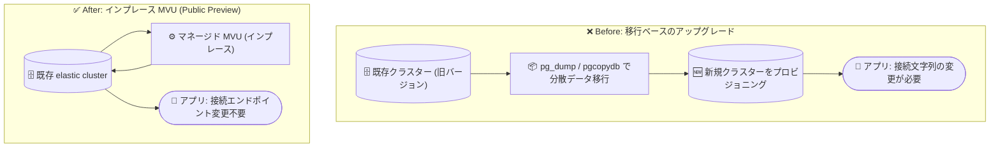

# Azure Database for PostgreSQL: elastic clusters のメジャーバージョンアップグレード (MVU) (Public Preview)

**リリース日**: 2026-10-02

**サービス**: Azure Database for PostgreSQL

**機能**: elastic clusters のメジャーバージョンアップグレード (Major Version Upgrades, MVU)

**ステータス**: In preview

[このアップデートのインフォグラフィックを見る](https://takech9203.github.io/azure-news-summary/20261002-postgresql-elastic-clusters-mvu.html)

## 概要

Azure Database for PostgreSQL の elastic clusters で、メジャーバージョンアップグレード (MVU) がパブリックプレビューとして利用可能になりました。既存の elastic cluster を、置き換え用クラスターのプロビジョニング、分散データの移行、アプリケーションの接続エンドポイントの変更を行うことなく、サポート対象の新しい PostgreSQL バージョンへインプレースでアップグレードできます。

elastic clusters は、オープンソースの Citus 拡張機能をマネージド提供する機能で、複数の Flexible Server ノードによる PostgreSQL の水平シャーディング (行ベース / スキーマベース) を実現します。今回のアップデートにより、Flexible Server で提供されてきたインプレースアップグレード体験が elastic clusters にも拡張され、既存のクラスタートポロジと構成を維持したまま、シャーディングされたワークロードのバージョンライフサイクルを効率的に管理できるようになります。これにより、最新の PostgreSQL および Citus のパフォーマンス改善、新機能、セキュリティ更新を取り込みつつ、分散 PostgreSQL ワークロードをサポート対象バージョンに保つことができます。

**アップデート前の課題**

- elastic clusters ではメジャーバージョンアップグレードがサポートされておらず、バージョンを上げるには新しいクラスターを別途プロビジョニングする必要があった
- `pg_dump` / `pg_restore` / `pgcopydb` などの論理移行ツールで分散データを移行する必要があり、ダウンタイム・複雑さ・運用負荷が大きかった
- 移行後はアプリケーションの接続エンドポイント (接続文字列) の変更が必要だった

**アップデート後の改善**

- 既存の elastic cluster をインプレースで新しい PostgreSQL バージョンへアップグレードできるようになった
- 置き換えクラスターのプロビジョニングや分散データの移行が不要になり、従来の移行ベースのアップグレードに伴うダウンタイム・複雑さ・運用負荷を削減できる
- 接続エンドポイントやクラスタートポロジ・構成を維持したままアップグレードできるため、アプリケーション側の変更が不要

## アーキテクチャ図



従来は新クラスターの作成と論理移行が必要でしたが、MVU により既存クラスターをそのままインプレースでアップグレードでき、接続エンドポイントも維持されます。

## サービスアップデートの詳細

### 主要機能

1. **インプレースのメジャーバージョンアップグレード**
   - 置き換えクラスターのプロビジョニングや分散データの移行なしに、既存の elastic cluster をサポート対象の新しい PostgreSQL バージョンへアップグレードできる
   - クラスタートポロジ (ノード構成) と既存の構成を維持したままアップグレードできる

2. **接続エンドポイントの維持**
   - アプリケーションの接続エンドポイントを変更する必要がなく、アプリケーション側の改修を最小化できる

3. **Flexible Server のアップグレード体験の拡張**
   - Flexible Server で提供されているインプレース MVU (内部的に `pg_upgrade` ツールを使用) の体験が elastic clusters に拡張された
   - 最新の PostgreSQL / Citus のパフォーマンス改善・機能・セキュリティ更新を取り込める

### Flexible Server のインプレース MVU の仕組み (参考)

Microsoft Learn の MVU ドキュメントによると、Flexible Server のインプレース MVU には以下の特徴があります (elastic clusters は Flexible Server のアップグレード体験を拡張したもの)。

- アップグレード前にプリチェック (事前検証) を実行し、失敗要因となる非互換を検出する
- プリチェック成功後、サービスを停止して暗黙的なバックアップを取得してからアップグレードを実行する (エラー時の復元に使用)
- [pg_upgrade](https://www.postgresql.org/docs/current/pgupgrade.html) ツールを使用し、バージョンをスキップして直接新しいバージョンへアップグレードすることも可能
- ほとんどの拡張機能はアップグレード中に自動的に新バージョンへ更新される (一部例外あり)
- アップグレード成功後に以前のバージョンへ自動で戻す手段はなく、戻す場合はアップグレード前の時点へのポイントインタイムリストア (PITR) で新しいサーバーに復元する

## 技術仕様

| 項目 | 詳細 |
|------|------|
| 対象 | Azure Database for PostgreSQL の elastic clusters |
| ステータス | Public Preview (2026 年 10 月) |
| アップグレード方式 | インプレース (置き換えクラスター・データ移行・接続エンドポイント変更が不要) |
| elastic clusters がサポートする PostgreSQL バージョン | 17 および 18 (Microsoft Learn の elastic clusters 制限事項 FAQ より) |
| 基盤技術 | Citus 拡張による分散 PostgreSQL (Flexible Server ノードで構成) |
| アップグレード後の戻し方 | 自動リバートなし。アップグレード前時点への PITR で別サーバーに復元 (Flexible Server MVU ドキュメントより) |

## 設定方法

### 前提条件 (Flexible Server MVU ドキュメントより)

1. ターゲットバージョンがアップグレード時点で Azure が公式にサポートするバージョンであること
2. アップグレード開始前にサーバーに 10〜20% 以上の空きストレージがあること (アップグレード中の一時ログ・メタデータ操作でディスク使用量が増加するため)
3. アップグレード前に Upgrade Validation Checks (アップグレード検証チェック) を実行し、ブロッキング要因 (非サポート拡張、論理レプリケーションスロット、イベントトリガーなど) がないことを確認すること

elastic clusters 固有の詳細手順については、公式ドキュメント ([aka.ms/ECMVU](https://aka.ms/ECMVU)) を参照してください。

### 事後作業

アップグレード完了後は、各データベースで `ANALYZE` を実行して統計情報 (`pg_statistic`) を更新することが推奨されています。統計情報が古いままだとクエリプランが悪化し、パフォーマンス低下やメモリの過剰消費につながる可能性があります。

```sql
ANALYZE;
```

## メリット

### ビジネス面

- 従来の移行ベースのアップグレードに比べて、ダウンタイム・複雑さ・運用工数を削減できる
- サポート対象バージョンを維持しやすくなり、サポート切れバージョンの利用に伴うリスクを低減できる
- 最新の PostgreSQL / Citus のセキュリティ更新を迅速に適用できる

### 技術面

- 置き換えクラスターのプロビジョニングと分散データの論理移行が不要
- 接続エンドポイントが変わらないため、アプリケーションの接続文字列の変更が不要
- 既存のクラスタートポロジと構成を維持したままアップグレードできる
- 最新の PostgreSQL / Citus のパフォーマンス改善・新機能を取り込める

## デメリット・制約事項

- 現時点ではパブリックプレビューであり、本番環境での利用は推奨されない (プレビューは非本番・テスト用途向け)
- Flexible Server のインプレース MVU では、アップグレード成功後に以前のバージョンへ自動で戻す手段はない (アップグレード前時点への PITR が必要)
- Flexible Server の MVU では一部の拡張機能や構成 (イベントトリガー、特定拡張など) がアップグレードをブロックするため、事前の検証チェックと対処が必要
- elastic clusters 固有のプレビュー時点での制約の詳細は、公式ドキュメント ([aka.ms/ECMVU](https://aka.ms/ECMVU)) で最新情報を確認すること

## ユースケース

### ユースケース 1: シャーディングされたマルチテナント SaaS ワークロードのバージョン更新

**シナリオ**: Citus のスキーマベース / 行ベースシャーディングで大規模マルチテナント SaaS を elastic clusters 上で運用しており、PostgreSQL の新バージョンの機能・性能改善を取り込みたいが、分散データの移行とエンドポイント変更に伴うダウンタイムとリスクを避けたい。

**実装例**: アップグレード検証チェックで非互換を事前に確認し、メンテナンスウィンドウ内でインプレース MVU を実行。アップグレード後に `ANALYZE` を実行して統計情報を更新する。

**効果**: 新クラスターの構築や `pg_dump` / `pgcopydb` による移行作業なしで、既存のトポロジ・接続エンドポイントを維持したままバージョンを更新でき、計画停止時間と運用工数を大幅に削減できる。

### ユースケース 2: サポート終了が近いバージョンからの計画的な移行

**シナリオ**: elastic clusters 上の分散 PostgreSQL ワークロードが、コミュニティ / Azure のサポート終了が近いバージョンで稼働している。

**実装例**: 非本番の elastic cluster でプレビューの MVU を検証し、拡張機能やアプリケーションの互換性を確認したうえで、本番適用の計画を策定する (GA 後の適用を推奨)。

**効果**: サポート対象バージョンへの移行パスをインプレースで確保でき、移行ベースのアップグレードに比べて計画・実行の負荷を低減できる。

## 料金

このアップデートに固有の追加料金に関する公式情報は確認できませんでした。Azure Database for PostgreSQL の料金の詳細は、以下の料金ページを参照してください。

- [Azure Database for PostgreSQL の料金](https://azure.microsoft.com/pricing/details/postgresql/)

## 利用可能リージョン

リージョン別の提供状況に関する公式情報は確認できませんでした。なお、elastic clusters 自体は Azure Database for PostgreSQL flexible server と同じリージョンで利用可能です ([リージョン別の提供状況](https://azure.microsoft.com/explore/global-infrastructure/products-by-region/))。

## 関連サービス・機能

- **Azure Database for PostgreSQL flexible server**: elastic clusters の各ノードは Flexible Server インスタンスで構成され、今回の MVU は Flexible Server のインプレースアップグレード体験を elastic clusters に拡張したもの
- **Citus 拡張**: elastic clusters の基盤となる PostgreSQL の水平シャーディング拡張。MVU により最新の Citus の改善も取り込める
- **Upgrade Validation Checks**: MVU 実行前にアップグレード準備状況を評価する検証機能。非サポート拡張や非互換構成を事前に検出できる
- **ポイントインタイムリストア (PITR)**: アップグレード後に以前のバージョンに戻す必要がある場合、アップグレード前時点への PITR を使用する

## 参考リンク

- [インフォグラフィック](https://takech9203.github.io/azure-news-summary/20261002-postgresql-elastic-clusters-mvu.html)
- [公式アップデート情報](https://azure.microsoft.com/updates?id=571504)
- [Major version upgrades - Azure Database for PostgreSQL (Microsoft Learn)](https://learn.microsoft.com/en-us/azure/postgresql/configure-maintain/concepts-major-version-upgrade) (aka.ms/ECMVU のリンク先)
- [Elastic clusters の概要 (Microsoft Learn)](https://learn.microsoft.com/en-us/azure/postgresql/elastic-clusters/concepts-elastic-clusters)
- [Elastic clusters の制限事項 FAQ (Microsoft Learn)](https://learn.microsoft.com/en-us/azure/postgresql/elastic-clusters/concepts-elastic-clusters-limitations)
- [料金ページ](https://azure.microsoft.com/pricing/details/postgresql/)

## まとめ

elastic clusters の MVU のパブリックプレビュー提供により、Citus ベースの分散 PostgreSQL ワークロードのメジャーバージョン更新が、新クラスターの構築・分散データ移行・接続エンドポイント変更なしのインプレース操作で行えるようになりました。これまで elastic clusters ではメジャーバージョンアップグレードがサポートされておらず、移行ベースの手段しかなかったため、運用面での改善インパクトは大きいアップデートです。elastic clusters を利用中、または採用を検討している場合は、まず非本番環境でアップグレード検証チェックと MVU の動作を確認し、GA に向けたバージョンアップ計画に組み込むことを推奨します。

---

**タグ**: Azure Database for PostgreSQL, elastic clusters, Citus, Major Version Upgrade, In preview, Databases, Hybrid + multicloud
