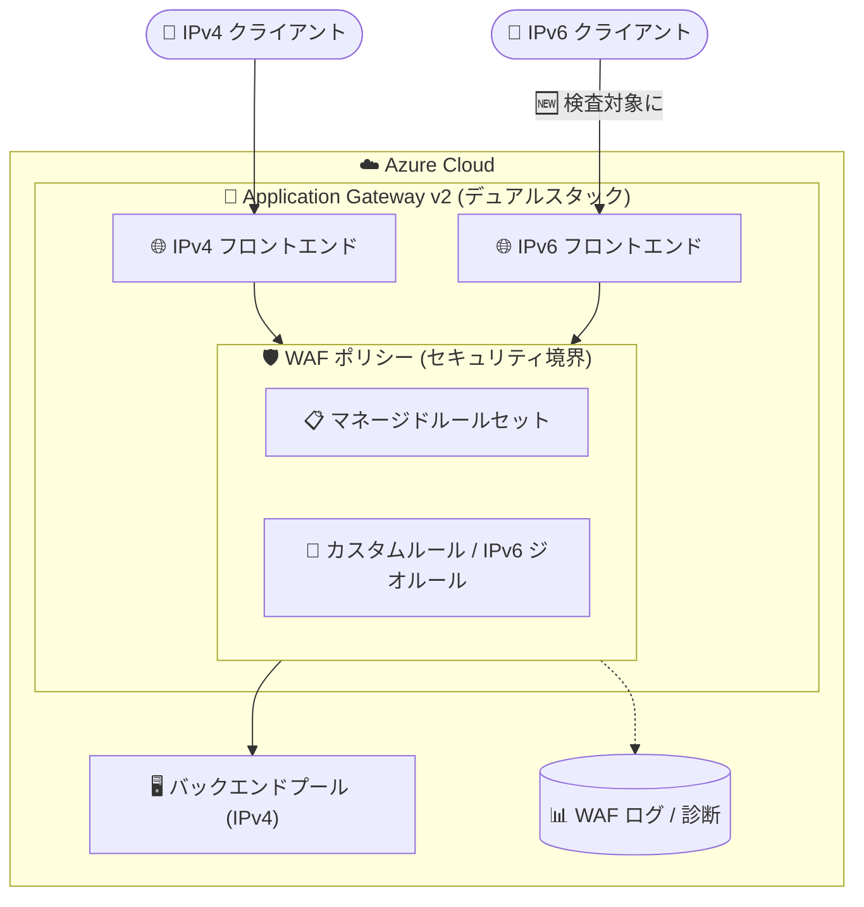

# Application Gateway: WAF の IPv6 サポート (Public Preview)

**リリース日**: 2026-10-05

**サービス**: Azure Application Gateway / Azure Web Application Firewall (WAF)

**機能**: IPv6 Support for Application Gateway WAF

**ステータス**: In preview

[このアップデートのインフォグラフィックを見る](https://takech9203.github.io/azure-news-summary/20261005-application-gateway-waf-ipv6.html)

## 概要

Application Gateway の Web Application Firewall (WAF) が、IPv6 トラフィックの検査 (inspection) と適用 (enforcement) をパブリックプレビューでサポートしました。マネージドルールセット、カスタムルール、診断機能といった WAF の保護スタック全体が IPv6 トラフィックに拡張され、デュアルスタック (IPv4 + IPv6) 構成の Application Gateway で IPv4 と IPv6 の両方に一貫したセキュリティ制御を適用できるようになります。

IPv4 アドレスの枯渇とモダンな接続要件により IPv6 の採用が世界的に加速するなか、本アップデートは「セキュリティ態勢を損なうことなく IPv6 を活用できるようにする、デュアルスタック環境向けプラットフォーム近代化の大きな一歩」と位置づけられています。

あわせて、IPv6 トラフィックに対するジオベース (Geomatch) カスタムルールもプレビュー機能として提供されます。こちらは Azure サブスクリプションでのプレビュー機能登録 (AFEC: `AllowAppGwWafIpv6Geo`) が必要です。

**アップデート前の課題**

- Application Gateway v2 はデュアルスタック (IPv4 + IPv6) フロントエンドをサポートしていたが、WAF カスタムルールには IPv6 に関する制限があった
- IP アドレスベースの一致条件を使用するカスタムルールは IPv6 トラフィックに対応していなかった
- ジオベースのカスタムルールは IPv6 トラフィックに対応しておらず、ジオベースルールを含む WAF ポリシーをデュアルスタック Application Gateway に関連付けると失敗する場合があった

**アップデート後の改善**

- マネージドルールセット、カスタムルール、診断機能が IPv6 トラフィックに対しても機能し、IPv4 / IPv6 で一貫した WAF 保護を適用できるようになった
- IPv6 ジオベースカスタムルールが利用可能になった (プレビュー機能 `AllowAppGwWafIpv6Geo` の登録が必要)
- 非対応構成を防ぐためのプラットフォーム側のバリデーションが整備され、プレビュー期間中も予測可能な動作が保証される

## アーキテクチャ図



デュアルスタック Application Gateway に着信する IPv4 / IPv6 の両トラフィックが、同一の WAF ポリシー (セキュリティ境界) で検査・適用されるようになります。バックエンドは引き続き IPv4 のみのサポートです。

## サービスアップデートの詳細

### 主要機能

1. **フル保護スタックの IPv6 対応**
   - マネージドルールセット、カスタムルール、診断機能による保護が IPv6 トラフィックに拡張される
   - マネージドルールセットによる IPv6 検査、IPv6 アドレス/範囲ベースの (非ジオ) カスタムルール、IPv6 トラフィックのログ・診断・監視には、プレビュー機能登録は不要

2. **デュアルスタック環境での一貫したセキュリティ制御**
   - IPv4 と IPv6 の両方に同一の WAF ポリシーで一貫した制御を適用でき、IPv6 導入時のセキュリティギャップを回避できる

3. **IPv6 ジオベースカスタムルール (要プレビュー機能登録)**
   - Geomatch カスタムルールによる国・地域ベースのアクセス制限を IPv6 トラフィックにも適用可能
   - 利用にはサブスクリプションで `AllowAppGwWafIpv6Geo` 機能 (プロバイダー名前空間 `Microsoft.Network`) の登録が必要

4. **非対応構成を防ぐバリデーション**
   - IPv6 ジオ評価をサポートしない非互換のデュアルスタック Application Gateway に対して、IPv6 向けジオベースカスタムルールを含む WAF ポリシーを関連付けることはできない
   - IPv6 をサポートしない非互換のデュアルスタック Application Gateway に既に関連付けられている WAF ポリシーには、ジオベースカスタムルールを作成できない
   - IPv4 専用の Application Gateway はこのバリデーションの影響を受けない

## 技術仕様

| 項目 | 詳細 |
|------|------|
| 対象サービス | Azure Application Gateway v2 + Azure Web Application Firewall |
| 対象 SKU | Application Gateway v2 (デュアルスタックフロントエンドは v2 のみサポート) |
| ステータス | Public Preview (GA 時期は未定) |
| IPv6 対応範囲 | マネージドルールセット、カスタムルール、ログ・診断・監視 |
| ジオベース IPv6 ルール | プレビュー機能 `AllowAppGwWafIpv6Geo` (Microsoft.Network) の登録が必要 |
| ゲートウェイ構成要件 | デュアルスタック (IPv4 + IPv6) 構成が必須。パブリック / プライベートの両 IP 構成がデュアルスタックであること |
| 非サポート | IPv6 専用 (IPv6-only) Application Gateway、IPv6 バックエンド、既存 IPv4 専用ゲートウェイのデュアルスタックへの変換 |

## 設定方法

### 前提条件

1. Application Gateway v2 をデュアルスタック (IPv4 + IPv6) 構成でデプロイしていること (既存の IPv4 専用ゲートウェイはデュアルスタックに変換できないため、新規作成が必要)
2. WAF ポリシーを作成し、デュアルスタック Application Gateway に関連付けていること
3. IPv6 ジオベースカスタムルールを使用する場合は、サブスクリプションでプレビュー機能を登録していること

### Azure CLI (IPv6 ジオベースカスタムルールのプレビュー機能登録)

```bash
# プレビュー機能 AllowAppGwWafIpv6Geo を登録
az feature register --name AllowAppGwWafIpv6Geo --namespace Microsoft.Network

# 登録状態を確認
az feature registration show --name AllowAppGwWafIpv6Geo --provider-namespace Microsoft.Network --output table
```

### Azure PowerShell

```powershell
# プレビュー機能 AllowAppGwWafIpv6Geo を登録
Register-AzProviderFeature -FeatureName "AllowAppGwWafIpv6Geo" -ProviderNamespace "Microsoft.Network"

# 登録状態を確認
Get-AzProviderFeature -FeatureName "AllowAppGwWafIpv6Geo" -ProviderNamespace "Microsoft.Network"
```

### Azure Portal

1. Azure Portal で **サブスクリプション** を開き、対象サブスクリプションを選択
2. **設定** > **プレビュー機能** で `AllowAppGwWafIpv6Geo` ("Enable IPv6 Geo Custom Rules for WAF") を検索し、**登録** を選択
3. Application Gateway をデュアルスタック構成でデプロイ (または更新) し、IPv6 向けジオベースカスタムルールを含む WAF ポリシーを作成・関連付け
4. WAF ログと診断で IPv6 トラフィックへの適用を検証

## メリット

### ビジネス面

- IPv4 アドレス枯渇への対応として IPv6 を採用する際に、セキュリティ態勢を損なわずに移行を進められる
- IPv6 接続が求められる規制・調達要件 (政府機関、通信事業者など) に対して、WAF 保護付きのデュアルスタック公開構成で対応できる

### 技術面

- IPv4 / IPv6 で WAF ポリシーを分ける必要がなく、単一ポリシーで一貫した保護・運用が可能
- IPv6 トラフィックも WAF ログ・診断に記録され、Azure Monitor などの既存の監視フローで可視化できる
- 国・地域ベースのアクセス制御 (Geomatch) を IPv6 クライアントにも適用できる

## デメリット・制約事項

- パブリックプレビュー段階であり、GA 時期は未定 (プレビューのため [Microsoft Azure プレビューの追加利用規約](https://azure.microsoft.com/support/legal/preview-supplemental-terms/) が適用される)
- IPv6 ジオベースカスタムルールの利用にはプレビュー機能 `AllowAppGwWafIpv6Geo` の登録が必要
- Application Gateway はデュアルスタック構成が必須で、IPv6 専用構成はサポートされない
- 既存の IPv4 専用 Application Gateway をデュアルスタックにアップグレードすることはできない (新規作成が必要)
- IPv6 バックエンド、IPv6 の Private Link は現時点でサポートされない
- Application Gateway Ingress Controller (AGIC) は IPv6 構成をサポートしない

## ユースケース

### ユースケース 1: デュアルスタック公開 Web アプリケーションの WAF 保護

**シナリオ**: IPv6 クライアントからのアクセスに対応するためデュアルスタックの Application Gateway で Web アプリケーションを公開しつつ、IPv4 と同等の WAF 保護 (OWASP CRS マネージドルール、ボット保護など) を IPv6 トラフィックにも適用したい。

**実装例**:

```bash
# デュアルスタック Application Gateway に関連付けた既存の WAF ポリシーが
# そのまま IPv6 トラフィックの検査・適用に拡張される
# (マネージドルールセットによる検査にはプレビュー機能登録は不要)
az network application-gateway waf-policy show \
  --name myWafPolicy \
  --resource-group myResourceGroup
```

**効果**: IPv6 経由の攻撃トラフィック (SQL インジェクション、XSS など) も WAF で検査・ブロックされ、デュアルスタック環境のセキュリティギャップを解消できる。

### ユースケース 2: IPv6 クライアントへの国・地域ベースのアクセス制御

**シナリオ**: 特定の国・地域からのアクセスのみ許可する Geomatch カスタムルールを運用しており、IPv6 クライアントにも同じポリシーを適用したい。

**実装例**:

```bash
# 1. プレビュー機能を登録
az feature register --name AllowAppGwWafIpv6Geo --namespace Microsoft.Network

# 2. 登録完了後、WAF ポリシーのジオベースカスタムルールが
#    デュアルスタック Application Gateway 上の IPv6 トラフィックにも適用される
```

**効果**: IPv4 / IPv6 を問わず一貫した国・地域ベースのアクセス制御を実現し、ジオフィルタリングの抜け道を防げる。

## 料金

本アップデートに固有の料金情報は公式発表では確認できませんでした。Application Gateway WAF (WAF_v2) の料金体系の詳細は、公式の料金ページを参照してください。

- [Application Gateway の料金](https://azure.microsoft.com/pricing/details/application-gateway/)

## 利用可能リージョン

本プレビューのリージョン固有の情報は公式発表では確認できませんでした。なお、デュアルスタック (IPv6) Application Gateway 自体は、Application Gateway v2 SKU がサポートされるすべてのパブリッククラウドリージョン、Microsoft Azure operated by 21Vianet、Azure Government で利用可能です。

- [Application Gateway の IPv6 フロントエンド構成 (リージョンと可用性)](https://learn.microsoft.com/azure/application-gateway/ipv6-application-gateway-portal)

## 関連サービス・機能

- **Azure Application Gateway v2**: 本機能の前提となるデュアルスタック (IPv4 + IPv6) フロントエンドをサポートするリージョナルロードバランサー。WAF ポリシーの関連付けは v2 のみサポート
- **Azure Monitor / Log Analytics**: WAF ログ・診断と統合され、IPv6 トラフィックに対する WAF アラートの追跡・検証に使用
- **Microsoft Defender for Cloud / Microsoft Sentinel**: WAF と統合され、セキュリティ状態の一元的な可視化や SIEM/SOAR による脅威検知・対応に活用可能
- **Azure Front Door WAF**: グローバル配信向けの WAF。リージョナルな Application Gateway WAF と使い分け・併用されることが多い

## 参考リンク

- [インフォグラフィック](https://takech9203.github.io/azure-news-summary/20261005-application-gateway-waf-ipv6.html)
- [公式アップデート情報](https://azure.microsoft.com/updates?id=573861)
- [IPv6 Geo-Based Custom Rules (Preview) - Microsoft Learn](https://learn.microsoft.com/azure/web-application-firewall/ag/custom-rules-geo-based-ipv6)
- [Azure Web Application Firewall on Application Gateway の概要 - Microsoft Learn](https://learn.microsoft.com/azure/web-application-firewall/ag/ag-overview)
- [Application Gateway の IPv6 フロントエンド構成 - Microsoft Learn](https://learn.microsoft.com/azure/application-gateway/ipv6-application-gateway-portal)
- [料金ページ](https://azure.microsoft.com/pricing/details/application-gateway/)

## まとめ

Application Gateway WAF が IPv6 トラフィックの検査・適用に対応したことで、デュアルスタック環境でも IPv4 と同等の WAF 保護を単一ポリシーで実現できるようになりました。IPv6 公開要件を持つワークロードを設計する Solutions Architect にとって、これまでの「IPv6 では WAF カスタムルール (IP ベース/ジオベース) が効かない」という制約が解消に向かう重要なアップデートです。IPv6 ジオベースカスタムルールにはプレビュー機能 `AllowAppGwWafIpv6Geo` の登録が必要な点、既存の IPv4 専用ゲートウェイはデュアルスタックへ変換できず新規作成が必要な点に注意しつつ、非本番環境での検証から始めることを推奨します。

---

**タグ**: Networking, Security, Application Gateway, Web Application Firewall, IPv6, Public Preview
