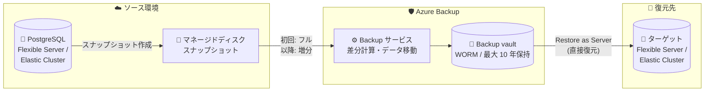

# Azure Backup: PostgreSQL flexible server / elastic cluster 向けバックアップ (v2) パブリックプレビュー

**リリース日**: 2026-10-05

**サービス**: Azure Backup / Azure Database for PostgreSQL

**機能**: Azure Backup for PostgreSQL flexible server and elastic cluster (v2)

**ステータス**: In preview

[このアップデートのインフォグラフィックを見る](https://takech9203.github.io/azure-news-summary/20261005-azure-backup-postgresql-v2.html)

## 概要

Azure Backup for PostgreSQL flexible server and elastic cluster (v2) がパブリックプレビューとして発表されました。v2 は、Azure Database for PostgreSQL flexible server および elastic cluster に対して、エンタープライズグレードの長期保持 (最大 10 年) を提供する新しいバックアップソリューションです。

最大の変更点はバックアップ方式の刷新です。従来の v1 (一般提供中) は `pg_dump` ベースの論理バックアップを使用していましたが、v2 ではマネージドディスクのスナップショットから取得する物理バックアップに置き換えられ、バックアップデータは Azure Backup コンテナー (Backup vault) に格納 (vaulted) されます。これにより、サーバーサイズの上限、バックアップ頻度、復元オプションに関する v1 の制限が解消されます。

v2 では、Premium SSD v1 で最大 32 TB、Premium SSD v2 で最大 64 TB のサーバーを保護でき (v1 は 1 TB まで)、日次バックアップスケジュール (RPO 1 日) と、ターゲットの flexible server / elastic cluster への直接復元 (Restore as Server) がサポートされます。また、flexible server に加えて elastic cluster (最大 8 ノード) も初めて保護対象となりました。

**アップデート前の課題**

- v1 は `pg_dump` ベースの論理バックアップのため、サーバーサイズは 1 TB までに制限され、1 TB を超えるサーバーではバックアップが失敗していた
- バックアップ頻度は週 1 回のみで、週に複数回スケジュールしても最初の 1 回しか実行されなかった
- 復元は「Restore as Files」(ストレージコンテナーへのファイル復元) のみで、ネイティブツールによる手動インポート (`pg_restore`) が必要だった
- フルバックアップのみで、増分・差分バックアップに対応していなかった
- elastic cluster の vaulted backup はサポートされていなかった

**アップデート後の改善**

- マネージドディスクスナップショットからの物理バックアップにより、Premium SSD v1 で最大 32 TB、Premium SSD v2 で最大 64 TB をサポート
- 日次・週次のバックアップスケジュールに対応し、RPO 1 日を実現 (オンデマンドバックアップも可能)
- 初回はフルバックアップ、2 回目以降は変更ブロックのみ転送する増分方式により、マルチテラバイト規模でも効率的にバックアップ
- 「Restore as Server」により、中間ストレージアカウントや手動の `pg_restore` なしで、ターゲットの flexible server / elastic cluster へ直接復元
- flexible server に加えて elastic cluster (最大 8 ノード) の保護に対応

## アーキテクチャ図

v2 では、ソースサーバーのマネージドディスクスナップショットから差分データのみを Backup vault に転送し、復元時は事前に作成したターゲットサーバーへ直接書き込みます。

## サービスアップデートの詳細

### v1 と v2 の比較

| 項目 | v1 (一般提供) | v2 (プレビュー) |
|------|--------------|----------------|
| バックアップ技術 | 論理バックアップ (`pg_dump`) | マネージドディスクスナップショットからの物理バックアップ |
| 保護対象 | Flexible server | Flexible server + Elastic cluster |
| 最大サイズ | 1 TB | Premium SSD v1: 32 TB / Premium SSD v2: 64 TB |
| バックアップ頻度 | 週 1 回 | 日次・週次 (RPO 1 日) |
| バックアップ種別 | フルのみ | 初回フル + 以降は増分 |
| 復元方法 | Restore as Files (ストレージコンテナー経由 + ネイティブツールでインポート) | Restore as Server (ターゲットサーバーへ直接復元) |
| 最大保持期間 | 最大 10 年 | 最大 10 年 |

### 主要機能

1. **Vault 分離型の長期バックアップ**
   - テナント内でスナップショットを取得し、Backup vault にストリーミング。バックアップデータをソースのサブスクリプション・アカウントから分離
   - Azure RBAC、ソフト削除、Multi-user authorization (有効時) によりバックアップデータを保護

2. **WORM イミュータブルバックアップ**
   - Backup vault のイミュータビリティ (WORM) を有効化すると、保持期間満了前の復旧ポイントの変更・上書き・削除を vault 管理者を含むすべてのユーザーに対して禁止
   - ランサムウェア対策、誤削除・悪意ある削除への防御、WORM コンプライアンス要件に対応

3. **柔軟なバックアップポリシー**
   - 日次または週次のスケジュールバックアップと、保護構成後のオンデマンドバックアップをサポート
   - 日次・週次・月次・年次の復旧ポイントごとに独立した保持期間 (7 日〜10 年) を設定可能

4. **増分データ転送**
   - 初回バックアップでディスク全体を転送し、以降は変更ブロックのみを転送
   - 直前のスナップショットが利用できない場合は、ユーザー操作なしで初期レプリケーションを自動的に再実行

5. **Restore as Server**
   - 復旧ポイントを、事前作成したターゲットの flexible server または elastic cluster に直接復元
   - 中間ストレージアカウントや手動の `pg_restore` 操作が不要

6. **一元的なバックアップ管理**
   - Azure の Resiliency エクスペリエンスを通じて、バックアップ/復元ジョブ、保護対象アイテム、アラート、レポートを他の Azure Backup 保護ワークロードと併せて一元管理

### バックアップフロー

1. Backup vault のマネージド ID に、ソースの flexible server / elastic cluster に対する必要な権限を付与 (ポータルでは構成中に不足ロールをインライン割り当て可能)
2. スケジュールと保持ルールを定義したバックアップポリシーを構成し、保護対象データソースを選択
3. スケジュール実行ごとに、Azure Backup が PostgreSQL リソースプロバイダーにディスクスナップショットの作成を依頼
4. 現在と直前のスナップショットの差分を計算し、差分のみを Backup vault に移動 (初回はフル転送)
5. スナップショットデータの vault へのコピー完了をもってジョブを「成功」とし、ポリシーの保持ルールに従って復旧ポイントを管理

### 復元フロー

1. 復元先となるターゲットの flexible server / elastic cluster を事前に作成 (Azure Backup はターゲットを自動作成しない)
2. Backup vault の復旧ポイントとターゲットを選択。Azure Backup が PostgreSQL メジャーバージョン、ディスクサイズ、ディスク種別、SKU 階層、ネットワーク構成を検証
3. 復旧ポイントの内容をターゲットサーバーのディスクに書き込み
4. PostgreSQL リソースプロバイダーが復元されたサーバーを起動し、トランザクション整合性のある状態でオンライン化

注: 復元はフルディスクイメージの書き込みのため、復元時間は復旧ポイントのサイズに比例します。マルチテラバイト規模のサーバーでは、RTO は分単位ではなく数時間〜数日を見込む必要があります。

### v1 から v2 への移行

- 既存の v1 保護対象アイテムを v2 に移行でき、同じバックアップポリシーと Backup vault を継続利用可能
- 移行後も既存の v1 復旧ポイントは利用可能 (v1 復旧ポイントは Restore as Files、v2 復旧ポイントは Restore as Server で復元)
- **移行は一方向**。v1 に戻すには、保護を停止してバックアップインスタンスを削除した後、v1 で再構成が必要
- 移行の前提条件: PostgreSQL 15 以降 (14 以前はメジャーバージョンアップグレードが必要)、General Purpose または Memory Optimized コンピュート階層 (Burstable は不可)

## 技術仕様

| 項目 | 詳細 |
|------|------|
| 保護対象 | Azure Database for PostgreSQL flexible server / elastic cluster (最大 8 ノード) |
| PostgreSQL メジャーバージョン | PostgreSQL 15 以降 |
| コンピュート階層 | General Purpose、Memory Optimized (Burstable は非対応) |
| ディスク種別と最大サイズ | Premium SSD v1: 最大 32 TB / Premium SSD v2: 最大 64 TB |
| サーバーロール | プライマリサーバーのみ (レプリカ非対応) |
| バックアップ単位 | サーバー / クラスター全体 (個別データベースの指定不可) |
| スケジュール | 日次または週次 (最小 RPO 1 日) + オンデマンド |
| 保持期間 | 7 日〜10 年 (日次・週次・月次・年次で独立設定) |
| CMK (カスタマーマネージドキー) | ソースサーバー / Backup vault の双方でサポート |
| 高可用性 (HA) 有効サーバー | バックアップ対象としてサポート (復元先は HA 構成不可) |
| VNet / プライベートエンドポイント | Trusted Access 経由でサポート |
| Backup vault の場所 | データソースと同一リージョン必須 (サブスクリプションは同一テナント内なら別でも可) |
| クロスリージョン / クロスサブスクリプション復元 | サポート (同一テナント内) |
| ソース削除後の復元 | サポート |

## 設定方法

### 前提条件

1. PostgreSQL 15 以降の flexible server または elastic cluster (14 以前はアップグレードが必要)
2. General Purpose または Memory Optimized コンピュート階層 (Burstable 不可)
3. データソースと同一リージョンの Backup vault
4. Backup vault のマネージド ID (または user-assigned managed identity) への、ソースサーバーに対する権限付与 (ポータルで構成時に不足ロールをインライン割り当て可能。サーバーへの書き込み権限がない場合は、ロール割り当てテンプレートをダウンロードしてデータベース管理者が実行可能)

### Azure Portal

1. Backup vault を作成 (または既存のものを使用) し、バックアップポリシー (日次/週次スケジュール、日次・週次・月次・年次の保持ルール) を構成
2. 保護対象の flexible server / elastic cluster を選択し、必要なロールの割り当てを確認・実行
3. 保護構成後は、スケジュールバックアップに加えてオンデマンドバックアップも実行可能
4. 復元時は、ターゲットサーバーを事前作成した上で復旧ポイントとターゲットを選択

### 復元先ターゲットの要件

Azure Backup は復元開始前に以下を検証します。

- ターゲットサーバー / クラスターが空であること
- Burstable コンピュート階層でないこと
- バックアップ取得時のソースと同じ PostgreSQL メジャーバージョンであること
- ソースと同じディスクサイズであること (ターゲットのディスクサイズがソース未満の場合は失敗)
- 高可用性 (HA) が構成されていないこと
- geo レプリカが構成されておらず、自身も geo レプリカでないこと
- Backup vault と同一リージョンであること
- Premium SSD v1 の復旧ポイントは Premium SSD v1 ターゲットへ、Premium SSD v2 の復旧ポイントは Premium SSD v2 ターゲットへ復元

## メリット

### ビジネス面

- 最大 10 年の長期保持と WORM イミュータビリティにより、コンプライアンス・監査要件に対応
- バックアップデータをソースのサブスクリプション・アカウントから分離して vault に格納することで、ランサムウェアや誤削除・悪意ある削除への耐性を強化
- インフラ管理不要のマネージドソリューションで、スケジュールと保持の運用を自動化

### 技術面

- 1 TB 制限の撤廃により、最大 32 TB / 64 TB のマルチテラバイト規模の PostgreSQL ワークロードを保護可能
- 週次のみ → 日次バックアップ (RPO 1 日) への改善
- 増分転送によりバックアップが効率化され、大規模サーバーでも現実的な時間でバックアップ可能
- Restore as Server により復元手順が簡素化され、手動の `pg_restore` が不要に
- elastic cluster (分散 PostgreSQL) の保護に初めて対応

## デメリット・制約事項

- アイテムレベルのバックアップ・復元 (個別データベース、テーブル、オブジェクト単位) は非対応
- Burstable コンピュート階層、PostgreSQL 14 以前は非対応 (構成はユーザーエラーで失敗)
- バックアップはプライマリサーバーのみ対象 (読み取りレプリカ・geo レプリカは不可)
- RPO 1 日はすべてのシナリオで保証されない (初回バックアップや初期再レプリケーションは全ディスク転送のため大規模サーバーでは 1 日超の可能性あり。日次データ変更量が多いサーバーや Premium SSD v2 でも 1 日を超える場合がある)
- 復元時間は復旧ポイントのサイズに比例し、マルチテラバイト規模では数時間〜数日かかる場合がある
- unlogged テーブルのデータは復元時に保持されない (失われる)
- v1 → v2 の移行は一方向 (v1 に戻すには保護停止 + バックアップインスタンス削除が必要)
- 計画された geo フェールオーバー後、バックアップ構成は新しいプライマリに自動では引き継がれない (旧プライマリに紐づいたままバックアップが失敗し始めるため、新プライマリで再構成が必要)
- 同一サーバーの多重保護は不可 (v1 と v2 のどちらか一方のみ)
- サポート終了した PostgreSQL バージョンで取得したバックアップからの復元は保証されない

## ユースケース

### ユースケース 1: マルチテラバイト PostgreSQL の長期保持

**シナリオ**: 1 TB を超える大規模な PostgreSQL flexible server を運用しており、従来の v1 vaulted backup ではサイズ制限によりバックアップを構成できなかった。規制要件により数年単位のバックアップ保持が必要。

**実装**: v2 で日次バックアップポリシーを構成し、日次復旧ポイントを数か月、週次・月次・年次復旧ポイントを長期保持 (最大 10 年) に設定する。増分転送により 2 回目以降のバックアップは変更ブロックのみが vault に移動される。

**効果**: 最大 32 TB (Premium SSD v1) / 64 TB (Premium SSD v2) のサーバーを RPO 1 日で保護しつつ、保持設定の工夫でストレージコストを最適化できる。

### ユースケース 2: ランサムウェア対策としてのイミュータブルバックアップ

**シナリオ**: 基幹データベースのバックアップがランサムウェア攻撃や内部不正によって削除・改ざんされるリスクに備えたい。

**実装**: Backup vault でイミュータビリティ (WORM) を有効化・ロックし、ソフト削除と Multi-user authorization を併用する。バックアップデータはソースサブスクリプションから分離された vault に格納される。

**効果**: 保持期間満了前の復旧ポイントは vault 管理者を含む誰も変更・削除できず、ソース環境が侵害されてもバックアップからの復旧が可能。

### ユースケース 3: v1 からの移行による運用改善

**シナリオ**: 既に v1 vaulted backup で保護している flexible server について、週次バックアップでは RPO が不十分で、復元時のファイル経由インポート作業も負担になっている。

**実装**: PostgreSQL 15 以降・General Purpose/Memory Optimized 階層であることを確認した上で、保護対象アイテムを v2 に移行する。既存のポリシーと vault、v1 復旧ポイントはそのまま維持される。

**効果**: 同じ vault で日次バックアップ (RPO 1 日) と Restore as Server に移行でき、既存の v1 復旧ポイントも Restore as Files で引き続き利用可能。

## 料金

v2 では以下の料金が発生します (v1 と同様の課金モデル)。

| 項目 | 内容 |
|------|------|
| 保護インスタンス料金 | データソースのサイズに基づき、保護インスタンスごとにユニット単位で課金 |
| バックアップストレージ料金 | vault に格納された総データ量と、Backup vault に構成した冗長性の種類に基づき課金 |

v2 は大規模サーバーの日次バックアップをサポートするため、ストレージコストは主に保持設定で決まります。日次復旧ポイントは数か月の保持にとどめ、長期保持には週次・月次・年次の復旧ポイントを使う構成が案内されています。

具体的な単価は [Azure Backup 料金ページ](https://azure.microsoft.com/pricing/details/backup/) を参照してください。

## 利用可能リージョン

v2 の vaulted backup は、以下を除くすべてのパブリックリージョンで利用可能です (ドキュメント記載時点): Austria East、Belgium Central、Chile Central、Indonesia Central、Israel Northwest、Malaysia South、Malaysia West、Mexico Central、Qatar Central、South Central US 2、Southeast US、Southeast US 3、Southeast US 5、Southwest US、West India。

最新の提供状況は [サポートマトリックス](https://learn.microsoft.com/azure/backup/backup-azure-postgresql-flex-server-elastic-cluster-v2-support-matrix) を参照してください。

## 関連サービス・機能

- **Azure Database for PostgreSQL flexible server**: 保護対象のマネージド PostgreSQL サービス。組み込みの運用バックアップ (最大 35 日保持) を補完する形で、v2 が 35 日を超える長期保持を提供
- **Azure Database for PostgreSQL elastic cluster**: 分散 PostgreSQL (最大 8 ノード)。v2 で初めて vaulted backup の保護対象に追加
- **Azure Backup vault**: バックアップデータの格納先。RBAC、ソフト削除、Multi-user authorization、イミュータビリティ (WORM)、CMK 暗号化をサポート
- **Azure Managed Disks (スナップショット)**: v2 の物理バックアップの基盤。増分スナップショットにより差分のみを転送
- **マネージド ID (Managed Identity)**: Backup vault の ID (または user-assigned managed identity) を使ってソース/ターゲットサーバーへの認証・権限付与を実施
- **Resiliency in Azure**: バックアップ/復元ジョブ、保護対象アイテム、アラート、レポートの一元管理エクスペリエンス

## 参考リンク

- [インフォグラフィック](https://takech9203.github.io/azure-news-summary/20261005-azure-backup-postgresql-v2.html)
- [公式アップデート情報](https://azure.microsoft.com/updates?id=573425)
- [About Azure Backup for PostgreSQL flexible server and elastic cluster (v2) - Microsoft Learn](https://learn.microsoft.com/azure/backup/backup-azure-postgresql-flex-server-elastic-cluster-v2-overview)
- [Support matrix (v2) - Microsoft Learn](https://learn.microsoft.com/azure/backup/backup-azure-postgresql-flex-server-elastic-cluster-v2-support-matrix)
- [About Azure Database for PostgreSQL Flexible server backup (v1) - Microsoft Learn](https://learn.microsoft.com/azure/backup/backup-azure-database-postgresql-flex-overview)
- [Azure Backup 料金ページ](https://azure.microsoft.com/pricing/details/backup/)

## まとめ

Azure Backup for PostgreSQL flexible server and elastic cluster (v2) は、`pg_dump` ベースの論理バックアップからマネージドディスクスナップショットベースの物理バックアップへの転換により、v1 の主要な制限 (1 TB 上限、週次のみ、ファイル経由の復元) を一挙に解消するアップデートです。最大 64 TB・RPO 1 日・Restore as Server・elastic cluster 対応により、大規模な PostgreSQL ワークロードの長期保持要件に現実的に応えられるようになりました。

v1 で保護中のサーバーを持つ場合は、PostgreSQL 15 以降かつ General Purpose/Memory Optimized 階層という前提条件と、移行が一方向である点を踏まえた上で、v2 への移行を評価することを推奨します。1 TB 超のサーバーや elastic cluster で長期保持が未整備だった環境では、プレビュー段階から非本番環境での検証を始める価値があります。なお、アイテムレベル復元の非対応や、大規模サーバーでの復元時間 (数時間〜数日) など、DR 設計上の考慮点も確認しておくべきです。

---

**タグ**: Azure Backup, Azure Database for PostgreSQL, Flexible Server, Elastic Cluster, Vaulted Backup, 長期保持, スナップショット, WORM, Preview
