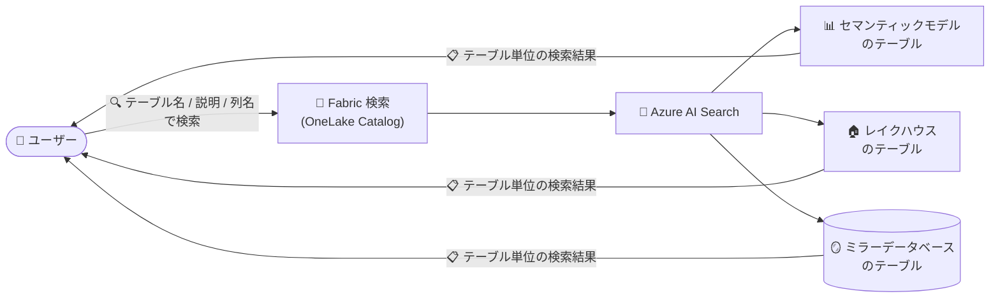

# Microsoft Fabric: OneLake Catalog 検索でのテーブル検出 (Table discovery)

**リリース日**: 2026-10-05 (発表日)

**サービス**: Microsoft Fabric (OneLake Catalog)

**機能**: OneLake Catalog 検索でのテーブル検出 (Table discovery in OneLake Catalog search)

**ステータス**: Announcement (2026-10-15 より提供開始予定)

[このアップデートのインフォグラフィックを見る](https://takech9203.github.io/azure-news-summary/20261005-fabric-onelake-catalog-table-discovery.html)

## 概要

2026 年 10 月 15 日より、Microsoft Fabric の検索 (Search) が、セマンティックモデル・レイクハウス・ミラーデータベース内の **テーブルを個別の検索結果として返す** ようになることが発表されました。ユーザーはテーブル名やテーブルの説明 (description) で検索できるほか、**列名の完全一致** によって目的のテーブルを見つけることも可能になります。

OneLake Catalog は、Microsoft Fabric 環境全体のデータ検出・ガバナンス状況の把握・セキュリティ管理を行う中心的なエクスペリエンスであり、Explore / Govern / Secure の 3 つのタブで構成されています。今回のアップデートにより、これまでアイテム (レイクハウス、セマンティックモデルなど) 単位であった検索の粒度が、その内部のテーブル単位まで細分化され、データ探索の効率が大きく向上します。

**アップデート前の課題**

- Fabric のグローバル検索は、アイテムの名前・タイトル・作成者・タグ・ワークスペースを対象としており、アイテム (レイクハウス、セマンティックモデルなど) 単位の結果しか得られなかった
- 目的のテーブルを見つけるには、まずアイテムを特定して開き、その中のテーブル一覧を手動で確認する必要があった
- 列名を手がかりにテーブルを探す手段がなかった

**アップデート後の改善**

- セマンティックモデル・レイクハウス・ミラーデータベース内のテーブルが、検索結果に個別のアイテムとして表示される
- テーブル名またはテーブルの説明 (description) で直接検索できる
- 列名の完全一致 (exact column-name match) でテーブルを発見できる

## アーキテクチャ図

ユーザーの検索クエリに対し、Fabric の検索がセマンティックモデル・レイクハウス・ミラーデータベースを横断してテーブル単位の結果を返すデータフローです。

## サービスアップデートの詳細

### 主要機能

1. **テーブル単位の検索結果**
   - セマンティックモデル、レイクハウス、ミラーデータベースに含まれるテーブルが、個別の検索結果として返される

2. **テーブル名・説明による検索**
   - テーブル名またはテーブルに付与された説明 (description) をキーワードとして検索できる

3. **列名の完全一致による検索**
   - 探しているデータの列名が分かっている場合、列名の完全一致でそのテーブルを発見できる

## 技術仕様

| 項目 | 詳細 |
|------|------|
| 提供開始日 | 2026 年 10 月 15 日 |
| 対象アイテム | セマンティックモデル、レイクハウス、ミラーデータベース |
| 検索対象 | テーブル名、テーブルの説明、列名 (完全一致) |
| 検索基盤 | Fabric のグローバル検索は Azure AI Search を使用 |
| アクセス制御 | OneLake Catalog はユーザーがアクセス権を持つ (または検出可能に設定された) コンテンツのみを表示 |

## メリット

### ビジネス面

- データ利用者 (アナリスト、データサイエンティスト) が目的のデータに到達するまでの時間を短縮できる
- 組織内のデータ資産の再利用が促進され、重複したデータ作成を抑制できる

### 技術面

- アイテムを開いて内部のテーブルを目視で探す手間が不要になり、データ探索のステップが削減される
- 列名という技術的な手がかりからテーブルを逆引きできるため、スキーマ知識を起点としたデータ検出が可能になる
- セマンティックモデル・レイクハウス・ミラーデータベースという異なる種類のアイテムを横断して、テーブルを一括検索できる

## デメリット・制約事項

- 列名による検索は **完全一致** のみ (部分一致は説明に記載されていない)
- 対象として明記されているのはセマンティックモデル・レイクハウス・ミラーデータベースのテーブルであり、その他のアイテム (ウェアハウスなど) のテーブルについては本発表では言及されていない
- Fabric のグローバル検索は Azure AI Search を利用しているため、ソブリンクラウドや Azure AI Search が未サポートのリージョンでは利用できない
- Catalog Search REST API (プレビュー) の検索対象は現時点ではワークスペースアイテムの表示名・説明にとどまり、テーブル単位の検索が API で利用できるかは本発表では確認できない

## ユースケース

### ユースケース 1: 列名からの目的テーブルの特定

**シナリオ**: アナリストが「customer_id」という列を含む売上関連テーブルを探したいが、どのレイクハウスやセマンティックモデルに格納されているか分からない。

**実装例**: Fabric の検索ボックスに列名 (完全一致) を入力すると、該当する列を持つテーブルが検索結果に個別に表示され、所属するアイテムを開くことなく目的のテーブルに到達できる。

**効果**: アイテムを 1 つずつ開いてスキーマを確認する作業が不要になり、データ探索時間を短縮できる。

### ユースケース 2: ミラーデータベースのテーブル検出

**シナリオ**: ミラーリングで Fabric に取り込んだ外部データベースのテーブルを、他部門のユーザーが再利用したい。

**実装例**: テーブル名またはテーブルの説明をキーワードに検索すると、ミラーデータベース内のテーブルが検索結果として表示される。

**効果**: ミラーリング済みデータの存在が組織内で発見されやすくなり、データの重複取り込みを防げる。

## 料金

本アップデートに固有の料金情報は確認できませんでした。Microsoft Fabric の料金は以下を参照してください。

- [Microsoft Fabric の料金](https://azure.microsoft.com/pricing/details/microsoft-fabric/)

## 利用可能リージョン

本アップデートに固有のリージョン情報は確認できませんでした。なお、Fabric のグローバル検索は Azure AI Search を使用するため、ソブリンクラウドおよび Azure AI Search が未サポートのリージョンでは利用できないことがドキュメントに記載されています。

- [Azure AI Search のリージョン サポート](https://learn.microsoft.com/azure/search/search-region-support)

## 関連サービス・機能

- **OneLake Catalog (Explore タブ)**: Fabric アイテムの検出・探索を行う中心的なエクスペリエンス。フィルター、ドメインスコープ、アイテム詳細ビューを提供し、今回のテーブル検出により探索の粒度が強化される
- **Azure AI Search**: Fabric のグローバル検索を支える検索基盤
- **Fabric Catalog Search REST API (プレビュー)**: ワークスペースを横断して OneLake Catalog のメタデータをプログラムから検索できる API
- **ミラーリング (Mirrored Database)**: 外部データベースを Fabric に複製する機能。ミラーデータベース内のテーブルが今回の検索対象に含まれる
- **セマンティックモデル / レイクハウス**: Fabric の主要なデータアイテム。内部のテーブルが個別の検索結果として返されるようになる

## 参考リンク

- [インフォグラフィック](https://takech9203.github.io/azure-news-summary/20261005-fabric-onelake-catalog-table-discovery.html)
- [公式アップデート情報](https://azure.microsoft.com/updates?id=573875)
- [OneLake catalog overview - Microsoft Learn](https://learn.microsoft.com/fabric/governance/onelake-catalog-overview)
- [Discover and explore Fabric items in the OneLake catalog - Microsoft Learn](https://learn.microsoft.com/fabric/governance/onelake-catalog-explore)
- [Fabric Catalog Search REST API - Microsoft Learn](https://learn.microsoft.com/rest/api/fabric/core/catalog/search)
- [料金ページ (Microsoft Fabric)](https://azure.microsoft.com/pricing/details/microsoft-fabric/)

## まとめ

本アップデートにより、2026 年 10 月 15 日から Microsoft Fabric の検索でセマンティックモデル・レイクハウス・ミラーデータベース内のテーブルが個別の検索結果として返されるようになります。テーブル名・説明・列名 (完全一致) による検索が可能になり、これまでアイテムを開いて内部を確認する必要があったデータ探索が大幅に効率化されます。Fabric 上に多数のデータアイテムを持つ組織では、テーブルの説明 (description) を整備しておくことで、提供開始後すぐにこの検索機能の恩恵を最大化できます。Solutions Architect としては、データカタログ整備 (説明・エンドースメント・タグ付け) の推進と合わせて活用を検討することを推奨します。

---

**タグ**: Microsoft Fabric, OneLake Catalog, Analytics, Search, Data Discovery, Announcement
