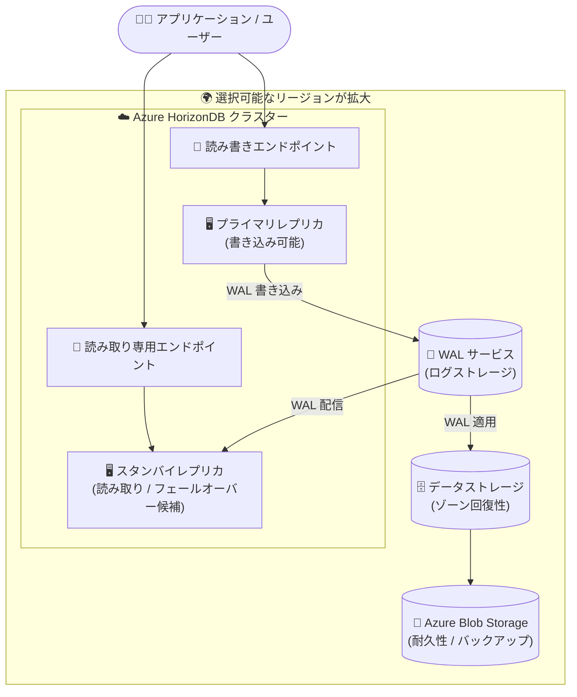

# Azure HorizonDB: 追加リージョンへの提供拡大 (Public Preview)

**リリース日**: 2026-10-05

**サービス**: Azure HorizonDB

**機能**: 追加リージョンへの提供拡大 (Regional Expansion)

**ステータス**: In preview

[このアップデートのインフォグラフィックを見る](https://takech9203.github.io/azure-news-summary/20261005-horizondb-regional-expansion.html)

## 概要

Azure HorizonDB の提供リージョンが拡大されました。Azure HorizonDB は、オープンソースの PostgreSQL エンジンをベースに構築された、フルマネージドで AI 対応の Database-as-a-Service (DBaaS) です。コンピュートとストレージを分離したアーキテクチャと「database-as-a-log」設計により、ミッションクリティカルなワークロードに対して予測可能なパフォーマンス、エンタープライズグレードのセキュリティ、高可用性、シームレスなスケーラビリティを提供します。

今回のリージョン拡大により、PostgreSQL ワークロードをアプリケーションやユーザーのより近くにデプロイできる柔軟性が高まり、Azure HorizonDB のデプロイ先の選択肢が増えました。Azure HorizonDB は 2026 年 6 月にパブリックプレビューとして発表されたサービスであり、提供開始からリージョン展開が継続的に進められています。

**アップデート前の課題**

- Azure HorizonDB が利用できるリージョンが限られており、アプリケーションやユーザーの所在地によってはデータベースを近接リージョンにデプロイできなかった
- リージョンの制約により、レイテンシー要件やデータ所在地 (データレジデンシー) 要件を満たせないケースがあった

**アップデート後の改善**

- 追加リージョンでの提供により、アプリケーションやユーザーに近い場所に PostgreSQL ワークロードをデプロイ可能になった
- デプロイ先リージョンの選択肢が増え、設計の柔軟性が向上した

## アーキテクチャ図

Azure HorizonDB はコンピュート (レプリカ) とストレージ (WAL サービス / データストレージ / Blob Storage) を分離したアーキテクチャを採用しています。今回のアップデートで、このクラスター構成をデプロイできるリージョンの選択肢が拡大しました。

## サービスアップデートの詳細

### 主要機能

1. **提供リージョンの拡大**
   - Azure HorizonDB (パブリックプレビュー) がデプロイ可能な Azure リージョンが追加され、アプリケーションやユーザーに近い場所に PostgreSQL ワークロードを配置できるようになった
   - なお、今回追加された個別のリージョン名はアップデート発表には明記されていないため、最新のリージョン一覧は [リージョン別の利用可能な製品](https://azure.microsoft.com/explore/global-infrastructure/products-by-region) または Azure Portal で確認が必要

2. **Azure HorizonDB の特徴 (おさらい)**
   - **コンピュートとストレージの分離**: ステートレスなコンピュートレプリカをストレージとは独立してスケール可能。レプリカは同一ストレージを共有するため、読み取りレプリカの追加が高速
   - **Database-as-a-log 設計**: コンピュートからストレージへは WAL (先行書き込みログ) のみを書き込み、ストレージノード側でページを再構成。書き込み増幅を抑え、データベースサイズによらず一貫した書き込みレイテンシーを実現
   - **AI 対応**: ベクトル埋め込みのネイティブサポート (pgvector、DiskANN インデックス)、SQL 内 AI 関数、セマンティック検索・ハイブリッド検索、Azure AI Foundry Tools との統合
   - **PostgreSQL 完全互換**: 既存の PostgreSQL アプリケーションを容易に移行可能

## 技術仕様

| 項目 | 詳細 |
|------|------|
| ベースエンジン | オープンソース PostgreSQL (完全互換) |
| クラスター構成 | 1 つの書き込み可能なプライマリレプリカ + 読み取り可能なスタンバイレプリカ (複数可) |
| エンドポイント | 読み書きエンドポイント (プライマリ向け) と読み取り専用エンドポイント (全読み取りレプリカへ負荷分散) |
| コンピュート | コアあたり 8 GB メモリ、ローカル NVMe SSD キャッシュ搭載 |
| ストレージ | WAL 専用フリートとデータ専用フリートの 2 系統、Azure Blob Storage で耐久性を確保 |
| ストレージのスケール | データ増加に応じて自動拡張 (ストレージサイズや IOPS の事前構成が不要) |
| ゾーン回復性 | ストレージは既定でゾーン回復性あり。コンピュートのゾーン回復には 2 レプリカ以上が必要 |
| バックアップ保持 | 現在は 7 日間固定 (1〜35 日の構成可能化は開発中) |

## メリット

### ビジネス面

- アプリケーションやユーザーに近いリージョンへのデプロイにより、エンドユーザー体験 (応答性) を改善できる
- デプロイ先リージョンの選択肢が増えることで、データ所在地や組織のリージョンポリシーに合わせた設計がしやすくなる
- プレビュー段階からリージョン展開が進んでおり、GA に向けたサービス拡充が確認できる

### 技術面

- データベースをアプリケーションと同一または近接リージョンに配置することで、ネットワークレイテンシーを低減できる
- コンピュートとストレージの独立スケール、共有ストレージによる高速なレプリカ追加・フェールオーバーといった HorizonDB の特長を、より多くのリージョンで利用できる

## デメリット・制約事項

- Azure HorizonDB は現在パブリックプレビューであり、本番ワークロードでの利用は推奨されない
- 今回のアップデート発表では追加されたリージョンの具体名が明記されておらず、利用可否は Azure Portal 等での確認が必要
- プレビュー時点では以下の機能が未提供 (開発中):
  - クロスリージョン読み取りレプリカ (リージョン間 DR 用レプリケーション)
  - カスタマーマネージドキー (CMK) による暗号化 (現在はサービスマネージドキーのみ)
  - バックアップ保持期間の構成 (現在は 7 日間固定)、長期保持 (LTR)
  - メンテナンスウィンドウの構成 (現在はシステム管理)
  - 組み込み接続プーリング (PgBouncer) — 外部プーラーで代替可能
  - 仮想ネットワークインジェクション (現在は Private Link のみサポート)
  - インデックスチューニング

## 料金

Azure HorizonDB の課金対象は以下のとおりです (詳細な単価は公式ページを参照)。

| 項目 | 課金方式 |
|------|---------|
| コンピュート | プロビジョニングされたコア時間 (core hours) |
| データベースストレージ | 使用量ベース (GB/月) |
| バックアップストレージ | 短期保持期間分の使用量ベース |

詳細は [Azure HorizonDB 製品ページ](https://azure.microsoft.com/products/horizondb) を参照してください。

## 利用可能リージョン

今回のアップデートで追加された個別のリージョン名は、発表およびドキュメントからは確認できませんでした。参考として、Microsoft Learn のドキュメント (2026 年 9 月 22 日更新時点) に記載されている提供リージョンは以下のとおりです。

| 地域 | リージョン |
|------|-----------|
| 南北アメリカ | Canada Central, Central US, East US, West US 2, West US 3 |
| ヨーロッパ | Germany West Central, Sweden Central |
| アジア太平洋 | Australia East, Korea Central |

最新のリージョン提供状況は [リージョン別の利用可能な製品](https://azure.microsoft.com/explore/global-infrastructure/products-by-region) または Azure Portal で確認してください。

## 関連サービス・機能

- **Azure Database for PostgreSQL**: 既存のフルマネージド PostgreSQL サービス。HorizonDB はコンピュート/ストレージ分離アーキテクチャを採用したクラウドネイティブな代替選択肢
- **Azure AI Foundry (Foundry Tools)**: HorizonDB の AI 機能 (AI 関数、エージェント、AI パイプライン) と統合し、インテリジェントアプリケーション構築を支援
- **Azure Blob Storage**: HorizonDB のデータ耐久性と WAL アーカイブ、バックアップ (スナップショット) の基盤
- **Microsoft Fabric (OneLake)**: トランザクションデータを OneLake にミラーリングし、分析データと統合可能
- **Azure Private Link**: 現時点での HorizonDB のプライベートネットワーク接続手段

## 参考リンク

- [インフォグラフィック](https://takech9203.github.io/azure-news-summary/20261005-horizondb-regional-expansion.html)
- [公式アップデート情報](https://azure.microsoft.com/updates?id=572940)
- [Microsoft Learn: Azure HorizonDB ドキュメント](https://learn.microsoft.com/azure/horizondb/)
- [Microsoft Learn: What is Azure HorizonDB?](https://learn.microsoft.com/azure/horizondb/overview)
- [Microsoft Learn: Azure HorizonDB リリースノート](https://learn.microsoft.com/azure/horizondb/release-notes/release-notes)
- [Azure HorizonDB 製品ページ (料金)](https://azure.microsoft.com/products/horizondb)
- [リージョン別の利用可能な製品](https://azure.microsoft.com/explore/global-infrastructure/products-by-region)

## まとめ

Azure HorizonDB のパブリックプレビューが追加リージョンに拡大され、PostgreSQL ワークロードをアプリケーションやユーザーの近くに配置できる選択肢が広がりました。HorizonDB はコンピュート/ストレージ分離と database-as-a-log 設計による高いスケーラビリティと、pgvector/DiskANN などの AI 機能を備えた次世代の PostgreSQL サービスであり、リージョン展開の進行は GA に向けた重要なマイルストーンです。評価を検討している場合は、自社のアプリケーションに近いリージョンでの提供可否を Azure Portal で確認し、非本番環境での検証から始めることを推奨します。なおプレビュー段階のため、クロスリージョンレプリカや CMK など未提供の機能がある点には注意が必要です。

---

**タグ**: Azure HorizonDB, PostgreSQL, Databases, Public Preview, リージョン拡大, AI-ready, DBaaS
