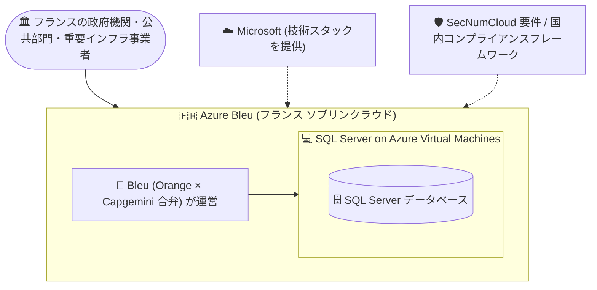

# SQL Server on Azure Virtual Machines: Azure Bleu (フランス ソブリンクラウド) で一般提供開始

**リリース日**: 2026-10-05

**サービス**: SQL Server on Azure Virtual Machines

**機能**: Azure Bleu での一般提供 (GA)

**ステータス**: Launched (GA)

[このアップデートのインフォグラフィックを見る](https://takech9203.github.io/azure-news-summary/20261005-sql-server-azure-vms-azure-bleu.html)

## 概要

SQL Server on Azure Virtual Machines が、フランスのソブリンクラウド環境である Azure Bleu で一般提供 (GA) されました。これにより、データレジデンシー (データ所在地) およびデータ主権の要件を満たしながら、フランスのソブリンクラウド環境で SQL Server ワークロードをデプロイ・管理できるようになります。

Bleu は、Microsoft のソブリンクラウド戦略における National Partner Clouds (国家パートナークラウド) の 1 つで、Orange と Capgemini の合弁会社が運営するフランスのクラウドです。フランスのセキュリティ認証制度である SecNumCloud の要件を満たすことを目的として設計されており、Microsoft が技術スタックを提供する一方、インフラは物理的・論理的に分離され、現地の人員によって運営され、国内のコンプライアンスフレームワークの下で管理されます。

SQL Server on Azure Virtual Machines は、オンプレミスのハードウェアを管理することなく、フル機能の SQL Server をクラウド上の仮想マシンで実行できるサービスです。今回の GA により、厳格な主権要件を持つフランスの政府機関・公共部門・重要インフラ事業者が、この IaaS 型の SQL Server をソブリン環境で利用できるようになります。

**アップデート前の課題**

- Azure Bleu 環境では SQL Server on Azure Virtual Machines が利用できず、SecNumCloud 等の主権要件を持つ組織はソブリンクラウド環境で SQL Server ワークロードを実行する選択肢が限られていた
- データレジデンシーおよびデータ主権の要件により、グローバルの Azure パブリッククラウドを利用できない組織が存在した

**アップデート後の改善**

- フランスのソブリンクラウド環境 (Azure Bleu) で SQL Server ワークロードをデプロイ・管理できるようになった
- データレジデンシーおよび主権要件を満たしながら、クラウド上でフル機能の SQL Server を利用可能になった

## アーキテクチャ図

Microsoft が技術スタックを提供し、Orange と Capgemini の合弁会社 Bleu が国内法の下で運営するソブリンクラウド環境に、SQL Server on Azure VMs をデプロイできるようになった構成を示しています。

## サービスアップデートの詳細

### 主要機能

1. **Azure Bleu での SQL Server on Azure VMs の一般提供**
   - フランスのソブリンクラウド環境で、フル機能の SQL Server を仮想マシン上にデプロイ・管理できる
   - データレジデンシーおよびデータ主権の要件を満たしながら SQL Server ワークロードを実行可能

2. **National Partner Cloud としての分離・独立運営**
   - Azure Bleu は物理的・論理的に分離された環境で、現地人員により運営される
   - Microsoft からの運営上の独立性が求められるシナリオ (国家安全保障、公共部門規制、地政学的リスク緩和など) に対応

### SQL Server on Azure Virtual Machines の特徴 (参考)

Microsoft Learn のドキュメントによると、SQL Server on Azure Virtual Machines では以下が提供されます (Azure Bleu 環境での個別機能の提供状況は公式ドキュメントを確認してください)。

- フルバージョンの SQL Server をクラウド上で実行 (オンプレミスのハードウェア管理が不要)
- SQL IaaS Agent extension への登録 (無料) により、自動バックアップ、自動パッチ適用、Azure Key Vault 統合、ポータルからの管理、Microsoft Entra 認証、SQL ベストプラクティス評価などの機能を利用可能
- Always On 可用性グループ、Always On フェールオーバークラスターインスタンスによる高可用性・ディザスターリカバリー
- 従量課金 (pay-as-you-go) と Azure Hybrid Benefit (ライセンス持ち込み) の柔軟なライセンスモデル

## 技術仕様

| 項目 | 詳細 |
|------|------|
| ステータス | Launched (GA)、2026 年 10 月 |
| 提供環境 | Azure Bleu (フランスのソブリンクラウド) |
| 運営主体 | Bleu (Orange と Capgemini の合弁会社) |
| Microsoft の役割 | 技術スタックの提供 (運営は現地事業体) |
| 対象コンプライアンス | SecNumCloud 要件への対応を目的に設計、国内コンプライアンスフレームワークの下で管理 |
| カテゴリ | Compute、Databases |

## メリット

### ビジネス面

- フランスの国内法・認証フレームワーク (SecNumCloud) への準拠が求められる組織でも、クラウド上で SQL Server を利用可能
- 外国の司法権の影響に対する耐性、運営の透明性・監査可能性といったソブリンクラウドの特性を享受できる
- オンプレミスのハードウェア管理が不要になり、公共部門・重要インフラ事業者のクラウド移行を促進

### 技術面

- フル機能の SQL Server (エディション・バージョンを選択可能) を仮想マシン上で実行でき、既存の SQL Server ワークロードとの互換性が高い
- Azure の仮想マシン基盤上で動作するため、既存の SQL Server 運用ノウハウを活かしたリフト & シフト移行がしやすい

## デメリット・制約事項

- Azure Bleu は Microsoft ではなく現地事業体 (Bleu) が運営する独立したクラウド環境であり、利用には Bleu との契約・アクセス手続きが必要
- Azure Bleu 環境における個別機能 (SQL IaaS Agent extension の各機能など) の提供状況は、本アップデート情報からは確認できないため、公式ドキュメントおよび Bleu の提供情報を確認する必要がある

## ユースケース

### ユースケース 1: フランス公共部門の SQL Server ワークロードのソブリンクラウド移行

**シナリオ**: フランスの政府機関が、データ主権・SecNumCloud 要件によりグローバルの Azure パブリッククラウドを利用できず、オンプレミスで SQL Server を運用している。

**効果**: Azure Bleu 上の SQL Server on Azure VMs へリフト & シフトすることで、データレジデンシー・主権要件を満たしながら、ハードウェア管理の負担を軽減しクラウドの運用メリットを得られる。

## 料金

Azure Bleu 環境における料金は本アップデート情報からは確認できませんでした。参考として、SQL Server on Azure Virtual Machines の一般的な料金モデル (Azure パブリッククラウド) は以下のとおりです。

| 項目 | 内容 |
|------|------|
| 従量課金 (pay-as-you-go) | VM の秒単位の実行コストに SQL Server ライセンス料が含まれる。ライセンス料は vCPU 数に依存し、バージョンによらず同一 |
| Azure Hybrid Benefit | Software Assurance 付きの既存 SQL Server ライセンスを持ち込み、ライセンス料を割引。コンピュート (ベースレート)、ストレージ、バックアップの費用は別途発生 |
| 無料ライセンスエディション | Developer エディション (開発・テスト用途) および Express エディション (軽量ワークロード) は SQL Server ライセンス費用が不要 (VM 費用のみ) |

詳細は公式の料金情報を確認してください。

- [SQL Server on Azure VMs の料金ガイダンス](https://learn.microsoft.com/azure/azure-sql/virtual-machines/windows/pricing-guidance)
- [Windows Virtual Machines の料金](https://azure.microsoft.com/pricing/details/virtual-machines/windows/)

## 利用可能リージョン

Azure Bleu (フランスのソブリンクラウド環境) で利用可能です。Azure Bleu 内の詳細な提供範囲は公式情報を確認してください。

## 関連サービス・機能

- **Azure Virtual Machines**: SQL Server on Azure VMs の基盤となる IaaS コンピュートサービス
- **SQL IaaS Agent extension**: SQL Server VM の自動バックアップ、自動パッチ適用、ポータル管理などを有効化する拡張機能 (登録は無料)
- **Microsoft Sovereign Cloud / National Partner Clouds**: Azure Bleu (フランス) や Delos Cloud (ドイツ) など、現地事業体が運営するソブリンクラウドの枠組み
- **Azure SQL Database / Azure SQL Managed Instance**: IaaS 型の SQL Server on Azure VMs に対する PaaS 型の代替・補完サービス

## 参考リンク

- [インフォグラフィック](https://takech9203.github.io/azure-news-summary/20261005-sql-server-azure-vms-azure-bleu.html)
- [公式アップデート情報](https://azure.microsoft.com/updates?id=571499)
- [SQL Server on Azure Virtual Machines の概要 (Microsoft Learn)](https://learn.microsoft.com/azure/azure-sql/virtual-machines/windows/sql-server-on-azure-vm-iaas-what-is-overview)
- [National Partner Clouds の概要 (Microsoft Learn)](https://learn.microsoft.com/azure/azure-sovereign-clouds/partner/overview-national-partner-clouds)
- [Microsoft Sovereign Cloud ドキュメント](https://learn.microsoft.com/azure/azure-sovereign-clouds/)
- [料金ガイダンス (Microsoft Learn)](https://learn.microsoft.com/azure/azure-sql/virtual-machines/windows/pricing-guidance)

## まとめ

SQL Server on Azure Virtual Machines が Azure Bleu で GA となり、フランスの政府機関・公共部門・重要インフラ事業者が、SecNumCloud をはじめとする主権・データレジデンシー要件を満たしながら、クラウド上でフル機能の SQL Server を実行できるようになりました。フランス国内の規制対象顧客を持つ Solutions Architect は、オンプレミス SQL Server ワークロードのソブリンクラウド移行の選択肢として Azure Bleu を検討するとよいでしょう。利用にあたっては、Azure Bleu での個別機能の提供状況と契約条件を Bleu および公式ドキュメントで確認することを推奨します。

---

**タグ**: SQL Server on Azure VMs, Azure Bleu, ソブリンクラウド, SecNumCloud, データレジデンシー, Compute, Databases, GA
