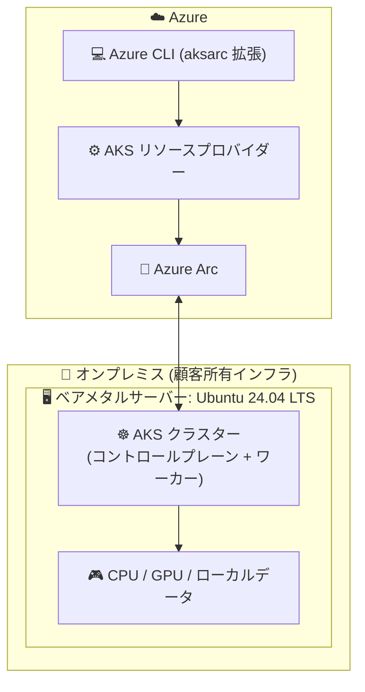

# Azure Kubernetes Service (AKS): AKS on bare metal の Ubuntu サポート (Public Preview)

**リリース日**: 2026-10-06

**サービス**: Azure Kubernetes Service (AKS) / AKS on bare metal

**機能**: AKS on bare metal now on Ubuntu

**ステータス**: In preview

[このアップデートのインフォグラフィックを見る](https://takech9203.github.io/azure-news-summary/20261006-aks-bare-metal-ubuntu.html)

## 概要

AKS on bare metal の Ubuntu サポートがパブリックプレビューになりました。顧客が所有する Ubuntu ベアメタルサーバー上に、ハイパーバイザーなしで Kubernetes クラスターを直接デプロイし、Azure Arc を通じて Azure から管理できます。クラスターのデプロイは Azure CLI (`aksarc` 拡張) で実行します。

従来、オンプレミスで Kubernetes を実行するには仮想化レイヤーの追加、慣れないインフラへの適応、あるいはアプリケーションが依存するハードウェア・ソフトウェアに対するコントロールの放棄が必要でした。特に AI ワークロードでは、こうしたトレードオフによってローカルデータへのアクセスが制限され、利用可能なコンピュート容量が減少し、GPU・ドライバー・ランタイムの選択肢が狭まる課題がありました。

今回のアップデートにより、既存の Ubuntu インフラをホスト OS の再イメージングなしでそのまま活用し、ワークロードに適した CPU・GPU ハードウェアとソフトウェアスタックを選択しながら、使い慣れた AKS と Azure のワークフローで Kubernetes を管理できるようになります。

**アップデート前の課題**

- オンプレミスで Kubernetes を実行するには仮想化レイヤーの追加が必要で、ハイパーバイザーのオーバーヘッドが発生していた
- AI ワークロードにおいて、GPU・ドライバー・ランタイムの選択肢が制限され、ローカルデータへのアクセスやコンピュート容量にも制約があった
- ハードウェアとソフトウェアに対するコントロールを維持したまま AKS の運用モデルを利用する手段がなかった (AKS on bare metal は従来、検証済み Azure Local ハードウェア上の Azure Linux のみをサポート)

**アップデート後の改善**

- 顧客所有の Ubuntu ベアメタルハードウェア上に、ハイパーバイザーなしで完全な Kubernetes クラスターを Azure CLI でデプロイ可能に
- ワークロードに適した CPU・GPU ハードウェアとサポートソフトウェアスタックを自由に選択可能に
- データの近くでアプリケーションを実行し、より多くのインフラ容量をワークロードに割り当てつつ、一貫した AKS 運用モデルをオンプレミスに拡張可能に

## アーキテクチャ図



顧客所有の Ubuntu ベアメタルサーバー上でハイパーバイザーなしに Kubernetes コントロールプレーンとワーカーが直接動作し、Azure Arc がホストとクラスターを Azure に接続して Azure CLI からのライフサイクル管理を可能にします。

## サービスアップデートの詳細

### 主要機能

1. **Ubuntu ホストへの直接デプロイ (ハイパーバイザー不要)**
   - Ubuntu 24.04 LTS (24.04.3 / 24.04.4) を実行する顧客所有の物理マシン上に、Kubernetes コントロールプレーンとワーカーコンポーネントを直接デプロイ
   - ホストの再イメージングは不要で、既存インフラにそのまま AKS を追加可能

2. **Azure Arc 経由の Azure 接続管理**
   - ホストを Azure Arc-enabled server として接続し、AKS リソースプロバイダーが Kubernetes レイヤーのライフサイクルを管理
   - クラスターは Azure Portal の Kubernetes Center > Clusters で確認可能 (プレビュー期間中、Ubuntu 向け Portal 操作は読み取り専用)

3. **Azure CLI (`aksarc` 拡張) によるデプロイ**
   - `az aksarc deploy` コマンド、またはワンライナーのデプロイスクリプト (`https://aka.ms/aksbm`) でクラスターを作成
   - Kubernetes バージョンは 1.33.3 (デフォルト) のほか 1.34.2 / 1.34.3 / 1.34.4 を指定可能

4. **ハードウェア・ソフトウェアスタックの選択自由度**
   - ワークロードに適した CPU・GPU ハードウェアとサポートソフトウェアスタックを顧客が選択
   - AI ワークロードでローカルデータへの近接性と GPU・ドライバー・ランタイムの選択肢を確保

### 責任分担モデル

| レイヤー | 責任 |
|----------|------|
| Azure 管理 / Azure Arc | ホストとクラスターの Azure への接続 (AKS が管理コンポーネントを提供) |
| Kubernetes レイヤー | AKS が管理 (ホストレベルのパッケージ、拡張機能、エージェント、ネットワークコンポーネントのインストール・管理) |
| ホスト OS / ハードウェア | 顧客が所有・管理 (Ubuntu のインストール・構成、カーネル・パッケージ・ドライバーの保守、セキュリティパッチ適用、ネットワーク・DNS・プロキシ・ファイアウォール構成、容量管理) |

## 技術仕様

| 項目 | 詳細 |
|------|------|
| ホスト OS | Ubuntu 24.04.3 LTS または 24.04.4 LTS |
| プロセッサアーキテクチャ | x86_64 |
| CPU | 最小 2 物理コア (推奨 4 物理コア) |
| メモリ | 最小 4 GB RAM (推奨 8 GB RAM) |
| ディスク | 256 GB 以上の空き容量 |
| クラスター構成 | プレビュー期間中は 1 ホストあたりシングルノードクラスター 1 つ |
| Kubernetes バージョン | 1.33.3 (デフォルト)、1.34.2、1.34.3、1.34.4 |
| ネットワーク | 固定のノード IP / コントロールプレーン IP が必要。アウトバウンド HTTPS (TCP 443) を許可 |
| デプロイ所要時間 | 約 40 分 |
| 必要な Azure CLI | バージョン 2.90.0 以降 + `aksarc` 拡張 |

## 設定方法

### 前提条件

1. 上記のハードウェア要件を満たす Ubuntu 24.04 LTS の物理マシン
2. アクティブな Azure サブスクリプション (リソースグループと Arc-enabled server は East US リージョンに作成)
3. リソースグループに対する Owner、または Contributor + User Access Administrator ロール (永続的な割り当て)
4. リソースプロバイダーの登録: `Microsoft.HybridCompute`、`Microsoft.HybridContainerService`、`Microsoft.Kubernetes`、`Microsoft.ExtendedLocation`、`Microsoft.HybridConnectivity`、`Microsoft.AzureStackHCI`
5. プレビュー機能フラグの登録と Azure Arc へのホスト接続

```bash
# プレビュー機能の登録
az feature register \
  --namespace Microsoft.HybridConnectivity \
  --name hiddenPreviewAccess

# リソースプロバイダーの登録 (抜粋)
az provider register --namespace Microsoft.HybridCompute
az provider register --namespace Microsoft.HybridContainerService
az provider register --namespace Microsoft.Kubernetes
az provider register --namespace Microsoft.ExtendedLocation
az provider register --namespace Microsoft.HybridConnectivity
az provider register --namespace Microsoft.AzureStackHCI
```

### Azure CLI

**方法 1: ワンコマンドデプロイ (Arc 接続 + クラスター作成を自動実行)**

```bash
curl -sSL https://aka.ms/aksbm | bash -s -- \
  -s <subscription-id> \
  -t <tenant-id>
```

**方法 2: ステップバイステップ**

```bash
# aksarc 拡張のインストール
az extension add --name aksarc --upgrade --allow-preview true

# Arc 接続済みホストにクラスターをデプロイ
az aksarc deploy \
  --resource-group <resource-group> \
  --arc-machine-names <host-name>

# Kubernetes バージョンを指定する場合
az aksarc deploy \
  --resource-group <resource-group> \
  --arc-machine-names <host-name> \
  --kubernetes-version 1.34.3-20260204

# デプロイ結果の確認
az aksarc show \
  --resource-group <resource-group> \
  --name <cluster-name> \
  --query properties.provisioningState \
  --output tsv
```

### Azure Portal

Azure Portal の **Kubernetes Center** > **Clusters** でクラスターを確認できます。ただし、プレビュー期間中の Ubuntu 向け Portal 操作は読み取り専用です (作成・管理は Azure CLI を使用)。

## メリット

### ビジネス面

- 既存の Ubuntu インフラ投資を再イメージングなしで活用でき、ハードウェア調達・移行コストを抑制できる
- データをオンプレミスに保持したまま Kubernetes レイヤーを Azure から管理でき、データ主権・規制要件に対応しやすい
- ハイパーバイザーレイヤーが不要になることで、インフラ容量をより多くワークロードに割り当てられる

### 技術面

- ハイパーバイザーのオーバーヘッドなしで Kubernetes を直接実行できる
- AI ワークロードに対して、GPU・ドライバー・ランタイムの選択肢とローカルデータへの近接性を確保できる
- 標準の Kubernetes API・ツールと、使い慣れた AKS / Azure の運用ワークフローを一貫して利用できる

## デメリット・制約事項

- パブリックプレビューであり、SLA 対象外。サポートはベストエフォートで、本番利用は非対象
- プレビュー期間中は 1 ホストあたりシングルノードクラスター 1 つのみサポート
- Azure 側のリソースグループと Arc-enabled server は East US リージョンに作成する必要がある
- ホスト OS (Ubuntu) のインストール・パッチ適用・ドライバー保守・ネットワーク構成は顧客の責任 (AKS はホスト OS のライフサイクルを管理しない)
- Ubuntu 向けの Azure Portal 操作はプレビュー期間中読み取り専用 (クラスター作成・管理は Azure CLI のみ)
- 固定 IP アドレス (ノード / コントロールプレーン) とアウトバウンド HTTPS (TCP 443) 接続が必須
- プレビュー期間中、Azure Linux ホストと Ubuntu ホストで機能・制限が異なる場合がある

## ユースケース

### ユースケース 1: オンプレミスデータを活用する AI ワークロードの実行

**シナリオ**: 大容量のローカルデータと GPU を保有する企業が、データを外部に移動させずに AI 推論・学習ワークロードを Kubernetes 上で実行し、クラスター管理は Azure の運用モデルに統一したい。

**実装例**:

```bash
# GPU 搭載の Ubuntu ベアメタルサーバーにワンコマンドでデプロイ
curl -sSL https://aka.ms/aksbm | bash -s -- \
  -s <subscription-id> \
  -t <tenant-id>
```

**効果**: 仮想化レイヤーによる GPU・ドライバー・ランタイムの制約を受けずに、データの近くで AI ワークロードを実行しながら、AKS の一貫した運用モデルで管理できる。

### ユースケース 2: エッジ拠点への Kubernetes 展開

**シナリオ**: 小売店舗、工場、フィールドサイトなどのエッジロケーションにある既存 Ubuntu サーバーに Kubernetes を展開し、各拠点のクラスターを Azure から一元管理したい。

**実装例**:

```bash
# 各拠点の Arc 接続済みホストにクラスターをデプロイ
az aksarc deploy \
  --resource-group <resource-group> \
  --arc-machine-names <edge-host-name>
```

**効果**: 拠点ごとのハードウェアを再イメージングせずに AKS を追加し、Azure Arc 経由で分散拠点の Kubernetes を統一的に管理できる。

## 利用可能リージョン

プレビュー期間中、Azure 側のリソースグループおよび Arc-enabled server リソースは **East US** リージョンに作成する必要があります (ホストマシン自体は顧客のオンプレミス環境に配置)。

## 関連サービス・機能

- **Azure Arc (Arc-enabled servers / Arc-enabled Kubernetes)**: Ubuntu ホストとクラスターを Azure に接続し、Azure からの管理を実現する基盤
- **AKS on Azure Local**: 検証済み Azure Local ハードウェア + Azure Linux で AKS を実行するもう 1 つのベアメタルオプション。Azure Local プラットフォームのライフサイクル管理が適用される
- **AKS Edge Essentials**: リソース制約のある Windows IoT / PC クラスのエッジデバイス向けの軽量 Kubernetes オプション
- **Azure Monitor / Microsoft Defender for Cloud**: Arc 接続クラスターの監視と脅威保護に利用可能

## 参考リンク

- [インフォグラフィック](https://takech9203.github.io/azure-news-summary/20261006-aks-bare-metal-ubuntu.html)
- [公式アップデート情報](https://azure.microsoft.com/updates?id=573782)
- [What is AKS on bare metal? (Microsoft Learn)](https://learn.microsoft.com/azure/aks-hybrid-edge/bare-metal/aks-bare-metal-overview)
- [Prepare an Ubuntu host for AKS on bare metal (Microsoft Learn)](https://learn.microsoft.com/azure/aks-hybrid-edge/bare-metal/aks-bare-metal-ubuntu-system-requirements)
- [Create an AKS on bare metal cluster on Ubuntu with Azure CLI (Microsoft Learn)](https://learn.microsoft.com/azure/aks-hybrid-edge/bare-metal/aks-bare-metal-create-cluster-ubuntu-cli)
- [Compare Azure Linux and Ubuntu (Microsoft Learn)](https://learn.microsoft.com/azure/aks-hybrid-edge/bare-metal/aks-bare-metal-compare-azure-linux-ubuntu)

## まとめ

AKS on bare metal の Ubuntu サポートにより、顧客所有の Ubuntu ハードウェア上でハイパーバイザーなしに AKS を実行し、Azure Arc 経由で一貫した AKS 運用モデルをオンプレミスに拡張できるようになりました。特に、GPU・ドライバー・ランタイムの選択肢とローカルデータへの近接性が重要な AI ワークロード、およびエッジ拠点への Kubernetes 展開において有力な選択肢となります。現時点ではシングルノードクラスターのみ・East US リージョン限定・SLA 対象外のプレビューであるため、本番導入は GA を待ちつつ、既存 Ubuntu インフラでの PoC 検証から着手することを推奨します。

---

**タグ**: AKS, Kubernetes, Azure Arc, Bare Metal, Ubuntu, Hybrid, Edge, AI Workloads, In Preview
