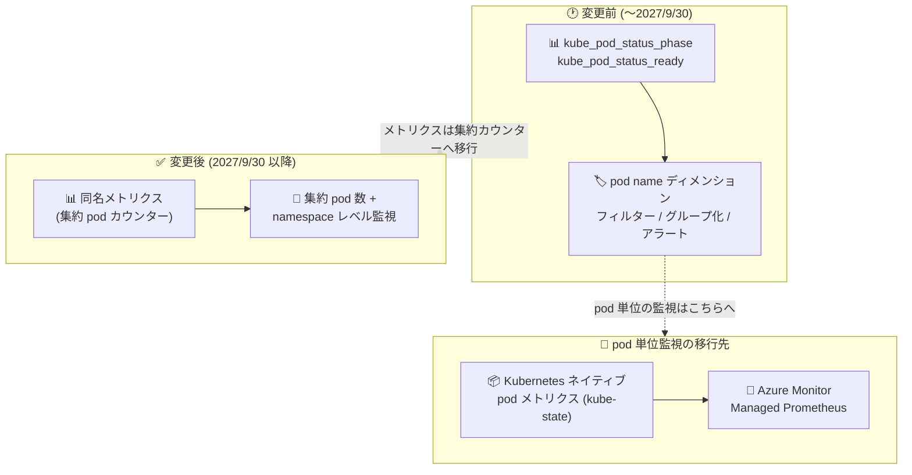

# Azure Kubernetes Service (AKS): Pod プラットフォームメトリクスの pod name ディメンション廃止

**リリース日**: 2026-10-06

**サービス**: Azure Kubernetes Service (AKS)

**機能**: AKS pod プラットフォームメトリクスにおける pod name ディメンションの廃止 (Retirement)

**ステータス**: Retirement (廃止予告: 2027 年 9 月 30 日)

[このアップデートのインフォグラフィックを見る](https://takech9203.github.io/azure-news-summary/20261006-aks-pod-name-dimension-metrics-retirement.html)

## 概要

2027 年 9 月 30 日より、以下の AKS 向け Azure Monitor プラットフォームメトリクスにおける **pod name ディメンション** のサポートが廃止され、これらのメトリクスは **集約された pod カウンター** に移行します。

- **Number of pods by phase** (`kube_pod_status_phase`)
- **Number of pods in Ready state** (`kube_pod_status_ready`)

変更後もメトリクス名は変わらず、集約された pod 数や namespace レベルの監視シナリオは引き続きサポートされます。一方、pod name ディメンションを使用したフィルタリング・グループ化・アラート設定はできなくなります。

廃止までの移行期間中、AKS は既存の実装と新しい集約実装の両方を維持し、どちらにもデータが投入されます。既存の監視エクスペリエンスは引き続き機能し、廃止前に集約実装側で少なくとも 1 年分の履歴データが利用可能になります。

**アップデート前の課題 (変更前の状態)**

- `kube_pod_status_phase` と `kube_pod_status_ready` は pod name ディメンションを持ち、pod 単位でのフィルタリング・分割 (グループ化)・アラート設定が可能だった
- プラットフォームメトリクスの pod name ディメンションに依存したダッシュボード・ブック・アラート・自動化が構成されている場合がある

**アップデート後の変更点**

- メトリクス名は変更されない
- 集約された pod 数 (aggregate pod counts) は引き続き利用可能
- namespace レベルの監視シナリオは引き続きサポート
- pod name ディメンションによるフィルタリング・グループ化・アラートは利用不可になる
- pod 単位の監視・トラブルシューティングには Azure Monitor Managed Prometheus と Kubernetes ネイティブの pod メトリクス (kube-state-metrics) の利用が推奨される

## アーキテクチャ図

プラットフォームメトリクスの pod name ディメンションは集約カウンターへ移行し、pod 単位の監視は Azure Monitor Managed Prometheus + kube-state-metrics で実現する構成が推奨されます。

## サービスアップデートの詳細

### 廃止の対象

| 項目 | 内容 |
|------|------|
| 廃止日 | 2027 年 9 月 30 日 |
| 廃止対象 | 以下のプラットフォームメトリクスにおける pod name ディメンション |
| 対象メトリクス 1 | Number of pods by phase (`kube_pod_status_phase`) |
| 対象メトリクス 2 | Number of pods in Ready state (`kube_pod_status_ready`) |
| 移行後の形態 | 集約 pod カウンター (メトリクス名は変更なし) |

### 影響を受けるケース

以下に該当するダッシュボード、ブック (Workbook)、アラート、自動化、監視ワークフローは影響を受ける可能性があります。

1. **pod name ディメンションでのフィルタリング**
   - `kube_pod_status_phase` または `kube_pod_status_ready` を使用し、pod name ディメンションでフィルターしている場合

2. **pod name ディメンションでの分割・グループ化**
   - メトリクスの結果を pod name ディメンションで分割 (split) またはグループ化している場合

### 移行期間中の動作

- AKS は既存の実装と新しい集約実装の両方を維持する
- 両方の実装にデータが投入され、既存の監視エクスペリエンスは引き続き機能する
- 廃止前に、集約実装側で少なくとも 1 年分の履歴データが利用可能になる

## 技術仕様

Microsoft Learn の [AKS 監視データリファレンス (Category: Pods)](https://learn.microsoft.com/azure/aks/monitor-aks-reference#category-pods) に記載されている現在の対象メトリクスの仕様は以下のとおりです。

| 項目 | kube_pod_status_phase | kube_pod_status_ready |
|------|------------------------|------------------------|
| 表示名 | Number of pods by phase | Number of pods in Ready state |
| 単位 | Count | Count |
| 集計 | Total (Sum), Average | Total (Sum), Average |
| ディメンション | `phase`, `namespace`, `pod` | `namespace`, `pod`, `condition` |
| タイムグレイン | PT1M〜PT12H | PT1M〜PT12H |

このうち `pod` ディメンション (pod name) が廃止対象です。

## 推奨されるアクション

1. **集約 pod 数のみを使用している場合**
   - 対応は不要

2. **pod name ディメンションを使用している場合**
   - 2027 年 9 月 30 日までに、ダッシュボード・アラート・ブック・自動化を更新する
   - pod 単位の監視・トラブルシューティングには、[Azure Monitor Managed Prometheus](https://learn.microsoft.com/azure/azure-monitor/metrics/prometheus-metrics-overview#azure-monitor-managed-service-for-prometheus) と [Kubernetes ネイティブの pod メトリクス (kube-state)](https://learn.microsoft.com/azure/azure-monitor/containers/prometheus-metrics-scrape-default#kube-state) の利用が推奨される

### 移行先: Azure Monitor Managed Prometheus の概要

Microsoft Learn のドキュメントによると、Azure Monitor managed service for Prometheus は以下の特徴を持つフルマネージドサービスです。

- AKS および Azure Arc enabled Kubernetes からのメトリクス収集にネイティブ対応 (Azure Monitor エージェントとデータ収集ルールによるオンボーディング)
- PromQL を完全サポートし、kube-state-metrics を含む Kubernetes ネイティブメトリクスを収集可能
- データは Azure Monitor ワークスペースに保存され、追加コストなしで 18 か月間保持
- 事前構成済みのアラート・レコーディングルール・ダッシュボードを提供し、Azure Managed Grafana やメトリクスエクスプローラー (PromQL) と統合

## デメリット・制約事項

- 2027 年 9 月 30 日以降、`kube_pod_status_phase` および `kube_pod_status_ready` では pod name ディメンションによるフィルタリング・グループ化・アラートが利用できなくなる
- pod 単位の監視をプラットフォームメトリクスだけで継続することはできず、Managed Prometheus などへの移行作業 (ダッシュボード・アラート・自動化の更新) が必要になる

## 料金

このアップデート (廃止) 自体に伴う料金変更の情報はアナウンスには記載されていません。

移行先として推奨される Azure Monitor managed service for Prometheus は、サービス自体や Azure Monitor ワークスペースの作成に直接のコストはなく、収集データの取り込み (ingestion) とクエリに基づく従量課金です。データは追加コストなしで 18 か月間保持されます。詳細は [Azure Monitor の料金ページ](https://azure.microsoft.com/pricing/details/monitor/) の Metrics タブを参照してください。

## 関連サービス・機能

- **Azure Monitor managed service for Prometheus**: pod 単位の監視・トラブルシューティングの推奨移行先。kube-state-metrics などの Kubernetes ネイティブメトリクスを収集可能
- **Azure Monitor ワークスペース**: Managed Prometheus のメトリクス保存先 (18 か月保持)
- **Container insights**: Prometheus メトリクスを対話的に分析できるビューを提供し、ノード・コントローラー・コンテナーの詳細メトリクスへドリルダウン可能
- **Azure Managed Grafana / Azure Monitor dashboards with Grafana**: Prometheus メトリクスの可視化に利用できるダッシュボード
- **Azure Monitor ブック (Workbooks) / メトリクスエクスプローラー (PromQL)**: PromQL による Prometheus メトリクスのクエリ・可視化

## 参考リンク

- [インフォグラフィック](https://takech9203.github.io/azure-news-summary/20261006-aks-pod-name-dimension-metrics-retirement.html)
- [公式アップデート情報](https://azure.microsoft.com/updates?id=570232)
- [AKS 監視データリファレンス (Category: Pods)](https://learn.microsoft.com/azure/aks/monitor-aks-reference#category-pods)
- [Azure Monitor managed service for Prometheus の概要](https://learn.microsoft.com/azure/azure-monitor/metrics/prometheus-metrics-overview#azure-monitor-managed-service-for-prometheus)
- [Managed Prometheus の既定スクレイプ対象 (kube-state)](https://learn.microsoft.com/azure/azure-monitor/containers/prometheus-metrics-scrape-default#kube-state)
- [Azure Monitor 料金ページ](https://azure.microsoft.com/pricing/details/monitor/)
- [Microsoft Q&A (Azure Kubernetes Service)](https://learn.microsoft.com/answers/tags/200/azure-kubernetes-service)

## まとめ

AKS の pod プラットフォームメトリクス (`kube_pod_status_phase`, `kube_pod_status_ready`) における pod name ディメンションが 2027 年 9 月 30 日に廃止され、これらのメトリクスは集約 pod カウンターへ移行します。集約 pod 数や namespace レベルの監視のみを使用している場合は対応不要ですが、pod name ディメンションでフィルター・グループ化・アラートを構成している場合は影響を受けます。移行期間中は新旧両方の実装が維持されるため、廃止日までにダッシュボード・アラート・ブック・自動化を棚卸しし、pod 単位の監視が必要なシナリオは Azure Monitor Managed Prometheus + Kubernetes ネイティブ pod メトリクス (kube-state-metrics) へ計画的に移行することを推奨します。

---

**タグ**: Azure Kubernetes Service, AKS, Azure Monitor, Platform Metrics, Retirement, Managed Prometheus, kube-state-metrics, Observability
