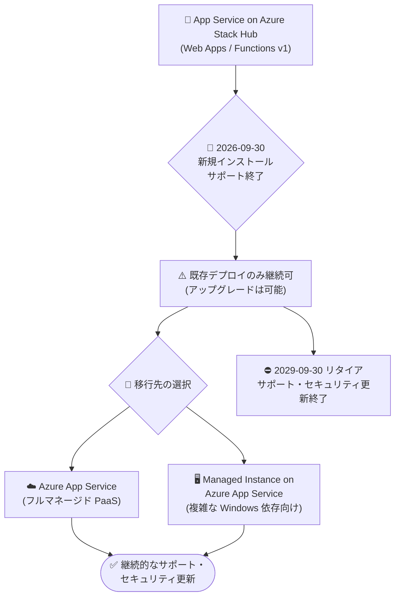

# Azure App Service on Azure Stack Hub: リタイアメント発表

**リリース日**: 2026-10-06

**サービス**: Azure App Service on Azure Stack Hub

**機能**: サービスリタイアメント (2029 年 9 月 30 日)

**ステータス**: Retirement (アナウンス)

[このアップデートのインフォグラフィックを見る](https://takech9203.github.io/azure-news-summary/20261006-app-service-azure-stack-hub-retirement.html)

## 概要

Microsoft は、Azure App Service on Azure Stack Hub を **2029 年 9 月 30 日** にリタイアすることを発表しました。Azure App Service on Azure Stack Hub は、Azure Stack Hub 上で Web アプリや Azure Functions (v1) アプリをホストできる PaaS オファリングで、オンプレミス環境において Azure App Service と同等のアプリケーションホスティング体験を提供してきました。

段階的な終了スケジュールとして、まず **2026 年 9 月 30 日** に新規インストールのサポートが終了し、以降は新しい製品リリース・機能追加・機能強化は提供されなくなります。既存のサポート対象デプロイメントはリタイアメントまで稼働を継続でき、最新リリースへのアップグレードも可能ですが、2029 年 9 月 30 日以降はサポート、セキュリティ更新、プラットフォーム改善、新機能が一切提供されなくなります。

移行先としては、Azure 上のフルマネージドな **Azure App Service**、およびレジストリアクセスや COM コンポーネントなど複雑な Windows 依存関係を持つアプリケーション向けの **Managed Instance on Azure App Service** が案内されています。

**アップデート前の状況**

- Azure Stack Hub 上で App Service リソースプロバイダーをデプロイし、オンプレミスで Web Apps / Azure Functions v1 をホストできた
- 新規インストールや製品アップデートが継続的に提供されていた

**アップデート後の変化**

- 2026 年 9 月 30 日以降: 新規インストールのサポート終了、新規リリース・機能追加・機能強化の提供終了
- 既存のサポート対象デプロイメントは、リタイアメントまで稼働継続と最新リリースへのアップグレードが可能
- 2029 年 9 月 30 日以降: サポート・セキュリティ更新・プラットフォーム改善が完全に終了

## アーキテクチャ図

2026 年 9 月 30 日の新規インストールサポート終了を経て、2029 年 9 月 30 日に完全リタイアとなるタイムラインと、2 つの移行パス (Azure App Service / Managed Instance on Azure App Service) を示しています。

## サービスアップデートの詳細

### 重要な日付

| 日付 | 内容 |
|------|------|
| 2026-10-06 | リタイアメント発表 |
| **2026-09-30** | 新規インストールのサポート終了。以降、新しい製品リリース・機能・機能強化の提供なし |
| **2029-09-30** | 完全リタイア。サポート・セキュリティ更新・プラットフォーム改善・新機能の提供が終了 |

### 影響範囲

- **対象**: Azure Stack Hub 上に App Service リソースプロバイダーをデプロイしている環境 (Web Apps、Azure Functions v1 ワークロード)
- 既存のサポート対象デプロイメントは、リタイアメント日まで稼働を継続でき、最新リリースへのアップグレードも可能
- リタイアメント日以降は、セキュリティ更新が提供されないため、継続利用はセキュリティ・コンプライアンス上のリスクとなる

### 移行先の選択肢

1. **Azure App Service (Azure 上)**
   - サポートとセキュリティ更新を継続して受けるための主な移行先
   - グローバルな可用性を持つフルマネージドプラットフォーム
   - Windows / Linux ホスティング、オートスケール、デプロイメントスロット、高度なネットワーク・セキュリティ機能
   - Azure サービスとの統合と継続的なイノベーション

2. **Managed Instance on Azure App Service**
   - 複雑な Windows 依存関係を持つアプリケーション向けの移行先
   - レジストリアクセス、COM コンポーネント、カスタムランタイムなど Windows 固有の依存関係を必要とするアプリの移行を加速

## 推奨アクション (Solutions Architect 向け)

Microsoft は、できるだけ早くアプリケーションの評価と移行を開始することを推奨しています。

1. **インベントリ作成**: Azure Stack Hub 上の App Service アプリケーションと依存関係を棚卸しする
2. **互換性評価**: 各アプリの Azure App Service / Managed Instance との互換性を評価する (特に Azure Functions v1 は Azure 側では最新バージョンへのアップグレードが必要になる点に留意)
3. **移行先の選択**: ワークロード特性に応じて適切な Azure ホスティング先を選択する
4. **移行実施**: コード・構成・データを移行する
5. **検証**: 移行後のワークロードを検証する
6. **期限遵守**: **2029 年 9 月 30 日までに移行を完了する**

また、Azure Stack Hub を利用している組織では、2026 年 9 月 30 日以降に App Service リソースプロバイダーの新規インストールがサポートされなくなるため、新規のオンプレミス PaaS 展開計画がある場合は早急な計画見直しが必要です。

## デメリット・制約事項

- オンプレミス (Azure Stack Hub) 上での App Service ホスティングという選択肢がなくなるため、データレジデンシーや接続要件でオンプレミス実行が必須のワークロードは代替アーキテクチャの検討が必要
- 2026 年 9 月 30 日以降は新機能・機能強化が提供されず、既存環境は維持モードとなる
- リタイアメント日以降の継続利用はセキュリティ更新が受けられず、リスクが残る

## 料金

移行先となる Azure App Service の料金は、公式料金ページを参照してください。

- [Azure App Service 料金ページ](https://azure.microsoft.com/pricing/details/app-service/)

## 関連サービス・機能

- **Azure App Service**: 主な移行先。フルマネージドな Web アプリ / API ホスティング PaaS
- **Managed Instance on Azure App Service**: Windows 固有の依存関係 (レジストリ、COM、カスタムランタイムなど) を持つアプリ向けの移行先
- **Azure Functions**: Azure Stack Hub では v1 のみ提供されていたため、Azure への移行時には最新の Functions ランタイムへのアップグレード検討が必要
- **Azure Stack Hub**: 本サービスの稼働基盤。リソースプロバイダーとしての App Service が終了対象

## 参考リンク

- [インフォグラフィック](https://takech9203.github.io/azure-news-summary/20261006-app-service-azure-stack-hub-retirement.html)
- [公式アップデート情報](https://azure.microsoft.com/updates?id=568178)
- [App Service on Azure Stack Hub 概要 (Microsoft Learn)](https://learn.microsoft.com/azure-stack/operator/azure-stack-app-service-overview)
- [移行のメリット (公式案内リンク)](https://go.microsoft.com/fwlink/?LinkId=2372122)
- [移行の計画 (公式案内リンク)](https://go.microsoft.com/fwlink/?LinkId=2372018)
- [移行の実施 (公式案内リンク)](https://go.microsoft.com/fwlink/?LinkId=2372019)
- [Azure App Service 料金ページ](https://azure.microsoft.com/pricing/details/app-service/)

## まとめ

Azure App Service on Azure Stack Hub は 2029 年 9 月 30 日にリタイアされ、それに先立ち 2026 年 9 月 30 日に新規インストールのサポートと新機能提供が終了します。Azure Stack Hub 上で Web Apps や Azure Functions v1 を運用している組織は、約 3 年の移行期間のうちに、Azure App Service または Managed Instance on Azure App Service への移行を完了する必要があります。アプリケーションのインベントリ作成と互換性評価を早期に開始し、移行計画を立てることを強く推奨します。

---

**タグ**: App Service, Azure Stack Hub, Retirement, Hybrid + multicloud, Compute, Web, Migration
