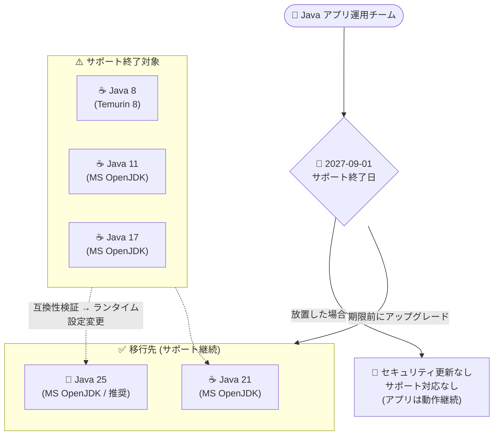

# Azure App Service: Java 8 / 11 / 17 のサポートが 2027 年 9 月 1 日に終了

**リリース日**: 2026-10-06

**サービス**: Azure App Service

**機能**: Java 8, 11, 17 ランタイムのサポート終了 (Retirement)

**ステータス**: Retirement (アナウンス)

[このアップデートのインフォグラフィックを見る](https://takech9203.github.io/azure-news-summary/20261006-app-service-java-8-11-17-retirement.html)

## 概要

Microsoft は、Azure App Service における **Java 8、Java 11、Java 17 のサポートを 2027 年 9 月 1 日に終了する**ことを発表しました。サポート終了後も、App Service 上でホストされている対象バージョンのアプリは引き続き動作しますが、セキュリティ更新プログラムの提供が停止され、Java 8 / 11 / 17 に対するカスタマーサービス (サポート対応) も提供されなくなります。

Microsoft は必要なアクションとして、潜在的なセキュリティ脆弱性を回避し App Service アプリのリスクを最小化するため、**2027 年 9 月 1 日までに Java 25 へのアップグレード**を行うよう案内しています。

App Service の言語ランタイムサポートポリシーでは、各言語コミュニティのサポートタイムラインに従ってランタイムのライフサイクルが管理されます。サポート対象のランタイムが廃止される場合、影響を受ける開発者には廃止の少なくとも 6 か月前に非推奨の通知が送付されます (通知の対象はアカウント管理者、サービス管理者、共同管理者。その他のロールは Service Health アラートへのオプトインが必要)。

**アップデート前 (現在) の状況**

- App Service では Java 8、11、17、21、25 がサポートされており、Java 8 / 11 / 17 もセキュリティパッチの提供とカスタマーサポートの対象だった
- サポート対象の JDK は毎年 1 月・4 月・7 月・10 月の四半期ごとに自動的にパッチ適用されている

**アップデート後 (2027 年 9 月 1 日以降) の影響**

- Java 8 / 11 / 17 上のアプリは動作し続けるが、セキュリティ更新プログラムが提供されなくなる
- Java 8 / 11 / 17 に関するカスタマーサービス (サポート対応) が受けられなくなる
- サポート外の言語バージョンを使用するアプリは、サポートされるバージョンへアップグレードしない限り App Service のサポートを受けられない

## アーキテクチャ図



Java 8 / 11 / 17 で稼働中の App Service アプリは、2027 年 9 月 1 日の期限までに Java 25 (Microsoft 推奨) または Java 21 へ移行する必要があります。期限を過ぎてもアプリは動作しますが、セキュリティパッチとサポートの対象外となります。

## サービスアップデートの詳細

### 主要なポイント

1. **サポート終了日: 2027 年 9 月 1 日**
   - Java 8、Java 11、Java 17 の 3 バージョンが同時にサポート終了となる
   - 対象は App Service (Windows / Linux) 上の Java SE、Tomcat、JBoss EAP の各スタックで該当 Java バージョンを使用するアプリ

2. **サポート終了後の動作**
   - アプリは引き続き動作する (強制停止はされない)
   - セキュリティ更新プログラムが提供されなくなる
   - Java 8 / 11 / 17 に対するカスタマーサービスが提供されなくなる

3. **必要なアクション: Java 25 へのアップグレード**
   - Microsoft は公式アナウンスで Java 25 へのアップグレードを案内 (手順: https://aka.ms/javasupport)
   - App Service では Java 21 もサポート対象として提供されており、段階的な移行先の選択肢となる

4. **JDK ディストリビューション**
   - App Service の Java ランタイムは Microsoft Build of OpenJDK (Java 11 / 17 / 21 / 25) および Eclipse Adoptium Temurin (Java 8) として提供
   - サポート対象 JDK は四半期ごと (1 月・4 月・7 月・10 月) に自動パッチ適用され、CVSS v2 ベーススコア 9.0 以上の重大な脆弱性に対する修正は利用可能になり次第リリースされる

## 技術仕様

| 項目 | 詳細 |
|------|------|
| サポート終了日 | 2027 年 9 月 1 日 |
| 対象バージョン | Java 8 (Adoptium Temurin 8)、Java 11 / 17 (Microsoft OpenJDK) |
| 対象サービス | Azure App Service (Windows / Linux) |
| 対象スタック | Java SE、Tomcat 各バージョン、JBoss EAP の該当 Java バージョン構成 |
| 終了後の動作 | アプリは動作継続。セキュリティ更新・カスタマーサービスは提供終了 |
| 推奨移行先 | Java 25 (Microsoft OpenJDK)。Java 21 (Microsoft OpenJDK) もサポート対象 |
| 通知 | 廃止の 6 か月以上前に通知。アカウント管理者・サービス管理者・共同管理者が受信対象 |

**注意**: Linux の Java 8 / 11 スタック (Java SE、Tomcat 8.5 / 9.0) は Alpine 3.16 ベースで提供されていますが、Alpine 3.16 は App Service でサポートされる最後の Alpine ディストリビューションです。また、Tomcat 8.5 (2024 年 3 月 31 日 EOL) と Tomcat 10.0 (2022 年 10 月 31 日 EOL) はすでにコミュニティサポートが終了しており、セキュリティ更新を受けられないため、Tomcat 9.0 または 10.1 以降への移行が推奨されています。

## 設定方法

### 現在の Java バージョンの確認とアップグレード

**Azure CLI**

```bash
# Linux アプリの現在のランタイムスタックを確認
az webapp config show \
  --resource-group <resource-group> \
  --name <app-name> \
  --query linuxFxVersion

# Linux アプリを Java 25 (Java SE) に変更する例
az webapp config set \
  --resource-group <resource-group> \
  --name <app-name> \
  --linux-fx-version "JAVA|25-java25"

# Windows アプリの Java バージョンを変更する例
az webapp config set \
  --resource-group <resource-group> \
  --name <app-name> \
  --java-version 25 \
  --java-container "JAVA" \
  --java-container-version "SE"
```

**Azure Portal**

1. 対象の App Service アプリを開く
2. 「設定」>「構成」>「全般設定」を選択
3. 「Java バージョン」を新しいバージョン (Java 25 など) に変更して保存

実際の切り替え前に、ステージングスロットや開発環境で新バージョンでの動作検証を行ってください。メジャーバージョンの更新は新しいランタイムオプションとして提供されるため、アプリ側の互換性確認が必要です。

## Solutions Architect 向け推奨アクション

1. **棚卸し (今すぐ)**: サブスクリプション内の App Service アプリのうち、Java 8 / 11 / 17 で稼働しているものを特定する。Azure Resource Graph や Azure CLI で `linuxFxVersion` / `javaVersion` を横断的に確認する
2. **移行計画の策定 (〜2026 年内目安)**: Java 25 (推奨) または Java 21 への移行計画を策定する。Java 8 からの移行はライブラリ互換性 (Jakarta EE 名前空間変更、モジュールシステム等) の影響が大きいため、十分な検証期間を確保する
3. **フレームワーク・サーバーの同時更新**: Tomcat 8.5 / 10.0 など既に EOL のミドルウェアを使用している場合、Java バージョンと合わせて Tomcat 9.0 / 10.1 以降へ更新する
4. **検証とロールアウト (〜2027 年前半)**: ステージングスロットを活用したブルーグリーンデプロイで段階的に切り替え、2027 年 9 月 1 日の期限前に本番移行を完了する
5. **通知体制の整備**: サポート終了通知は管理者ロールにのみ送付されるため、運用チームが Service Health アラートを構成して通知を受け取れるようにする

## デメリット・制約事項

- 期限 (2027-09-01) までに移行しない場合、セキュリティパッチが適用されない状態で稼働し続けることになり、脆弱性リスクが増大する
- サポート外バージョンのアプリは、問題発生時に App Service のサポートを受ける前提としてサポート対象バージョンへのアップグレードが必要になる
- Java 8 から Java 21 / 25 への移行は、削除された API、Jakarta EE への名前空間移行 (Tomcat 10 以降)、モジュールシステムなどの非互換により、単純なランタイム変更では済まないケースがある
- 古いマイナーバージョンにピン留めしているアプリは、非推奨の Azul Zulu for Azure バイナリを使用している可能性があり、こちらもすでにセキュリティパッチの対象外

## 関連サービス・機能

- **Azure Functions / Azure Spring Apps / Azure Container Apps**: Microsoft がマネージド Java ランタイムを提供するサービス。これらで稼働する Java アプリも各サービスのランタイムサポートタイムラインの確認が必要
- **Microsoft Build of OpenJDK**: App Service の Java 11 以降のランタイムとして使用される無償の OpenJDK ディストリビューション。ローカル開発用にもダウンロード可能
- **Azure Service Health**: サポート終了通知をアラートとして受信するために活用できる
- **App Service デプロイスロット**: 新 Java バージョンの検証と段階的な切り替え (ブルーグリーンデプロイ) に活用できる

## 参考リンク

- [インフォグラフィック](https://takech9203.github.io/azure-news-summary/20261006-app-service-java-8-11-17-retirement.html)
- [公式アップデート情報](https://azure.microsoft.com/updates?id=568585)
- [App Service 言語ランタイムサポートポリシー (Microsoft Learn)](https://learn.microsoft.com/azure/app-service/language-support-policy)
- [Java アップグレード手順 (aka.ms/javasupport)](https://aka.ms/javasupport)
- [Azure における Java のサポート (Microsoft Learn)](https://learn.microsoft.com/azure/developer/java/fundamentals/java-support-on-azure)
- [Microsoft Build of OpenJDK サポートポリシー](https://learn.microsoft.com/java/openjdk/support)

## まとめ

Azure App Service 上の Java 8 / 11 / 17 のサポートが 2027 年 9 月 1 日に終了します。LTS 3 バージョンが同時に終了するため、エンタープライズで稼働中の多くの Java アプリが影響を受ける可能性があります。期限後もアプリは動作しますが、セキュリティ更新とサポートが受けられなくなるため、実質的に本番運用の継続は推奨されません。約 1 年のリードタイムがあるうちに、対象アプリの棚卸しと Java 25 (または Java 21) への移行計画の策定・検証を開始することを強く推奨します。

---

**タグ**: App Service, Java, Retirement, サポート終了, Compute, Web
