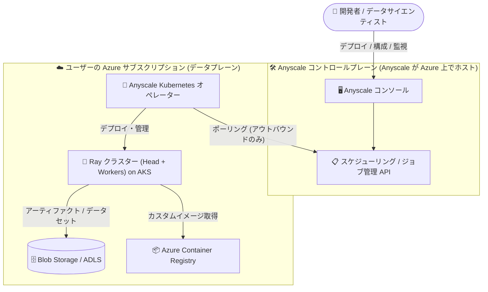

# Azure Kubernetes Service (AKS): Anyscale on Azure の一般提供開始 (GA)

**リリース日**: 2026-10-07

**サービス**: Azure Kubernetes Service (AKS) / Anyscale on Azure

**機能**: Anyscale on Azure (Ray ベースの分散 Python ワークロード向けマネージドプラットフォーム)

**ステータス**: Launched (GA)

[このアップデートのインフォグラフィックを見る](https://takech9203.github.io/azure-news-summary/20261007-anyscale-on-azure.html)

## 概要

Anyscale on Azure が一般提供 (GA) になりました。Anyscale on Azure は、[Ray](https://docs.ray.io) 上で分散 Python ワークロードを実行するためのマネージドプラットフォームで、ユーザー自身の Azure Kubernetes Service (AKS) クラスターに直接デプロイされ、チームが既に利用している Azure サービス (Microsoft Entra ID、Azure Blob Storage / ADLS、Azure Container Registry、Azure Load Balancer) と統合されます。

Anyscale on Azure は「Azure Native Integration」として提供され、Azure portal および Anyscale コンソール (https://console.azure.anyscale.com) からアクセスできます。プラットフォームはコントロールプレーン (Anyscale が Azure 上でホストし、スケジューリング、監視、ジョブ管理、コンソールを提供) とデータプレーン (ユーザーの Azure サブスクリプション内の AKS クラスター上で動作) に分離されており、ワークロード、データ、コンテナーイメージはすべてユーザーのテナント内に留まります。

Microsoft の発表によると、CPU のみ対応や推論特化型の他エンジンと異なり、Ray は CPU と GPU の混在クラスターを単一の Python ランタイムとして扱えるため、データ準備、分散トレーニング、ファインチューニング、強化学習、高スループット推論、エージェント実行を 1 つのプログラムとして構成できます。本サービスは Anyscale と Microsoft の緊密なエンジニアリング協業により構築されました。

**アップデート前の課題**

- AKS 上で Ray を実行するには、KubeRay オペレーターの導入やクラスターライフサイクル管理などをユーザー自身で構築・運用する必要があった
- Ray 向けの開発者ツール、ジョブ管理、監視ダッシュボードを個別に整備する必要があった

**アップデート後の改善**

- Azure portal から Anyscale クラウドを作成すると、Anyscale オペレーターが AKS クラスターに自動インストールされ、Ray クラスターのライフサイクルがマネージドで管理される
- Microsoft Entra ID による SSO、マネージド ID によるアクセス制御、Blob Storage / ACR / Load Balancer との統合が組み込みで提供される
- 利用料金は Azure サブスクリプションに統合して請求され、Azure Native サービスとして調達・運用できる

## アーキテクチャ図

Anyscale がホストするコントロールプレーンと、ユーザーのサブスクリプション内で動作するデータプレーンが分離されており、AKS 上のオペレーターがコントロールプレーンをポーリングして Ray クラスターを管理します。ネットワーク接続はすべてクラスターからのアウトバウンドで、インバウンドのファイアウォール規則は不要です。

## サービスアップデートの詳細

### 主要機能

1. **Kubernetes ネイティブなデプロイ**
   - すべての Anyscale クラウドリソースは Kubernetes を使用し、AKS クラスターにデプロイされたオペレーターが Ray クラスターのライフサイクルを管理する

2. **Microsoft Entra ID シングルサインオン**
   - チームは既存の Azure 資格情報で Anyscale にサインインでき、別途 ID プロバイダーを用意する必要がない

3. **Azure サービスとの統合**
   - AKS (Ray ワークロードのコンピュート基盤)、Azure Blob Storage / ADLS (アーティファクトとデータセット)、Azure Container Registry (カスタムコンテナーイメージ)、Azure Load Balancer (Ray クラスター・サービスへのクライアントアクセス) と連携する

4. **マネージド ID によるアクセス管理**
   - Azure マネージド ID でクラウドリソースへのアクセスを制御。クラウド全体で共有する単一 ID、またはユーザー・プロジェクト・ワークロードタイプ単位の細かな ID マッピングを選択できる

5. **マルチリソースクラウド**
   - 1 つの Anyscale クラウドに複数の「クラウドリソース」(クラウドにアタッチされた Kubernetes クラスター) を保持可能。環境の分離、別リージョンでのキャパシティ追加、他の Kubernetes オファリングのクラスター接続に利用できる (ジョブは複数リソース間のフォールバックに対応、サービスはプライマリリソースのみ)

### セキュリティ・運用モデル

- コントロールプレーンはデータプレーンから分離されており、ユーザーの AKS クラスターへ直接アクセスしない。クラスター内のオペレーターがコントロールプレーンのエンドポイントをポーリングしてローカルで操作を実行する
- 共有責任モデル: AKS クラスター・ストレージ・マネージド ID はユーザーが所有 (サポートは Microsoft)、Anyscale コンソール・API・オペレーターは Anyscale が所有・運用。サポートリクエストはすべて標準の Azure サポートプロセスから開始し、Microsoft がトリアージして必要に応じて Anyscale にルーティングする

## 技術仕様

| 項目 | 詳細 |
|------|------|
| デプロイモデル | Azure Native Integration (AKS ベースのデプロイのみ対応) |
| コントロールプレーン | Anyscale がホスト (米国で稼働)。スケジューリング、ジョブ管理、監視、コンソールを提供 |
| データプレーン | ユーザーの Azure サブスクリプション内の AKS クラスター。ワークロード・データ・イメージはテナント内に留まる |
| 認証 | Microsoft Entra ID SSO、Azure マネージド ID |
| ストレージ | Azure Blob Storage / Azure Data Lake Storage (ADLS) |
| ネットワーク | オペレーターからのアウトバウンド接続のみ (インバウンド規則不要)。ingress / gateway コントローラーはユーザーが用意 |
| リージョンの扱い | クラウドはリージョン固有。クロスリージョンレプリケーションやマルチリージョンクラスターは非対応 |
| アクセス方法 | Azure portal、Anyscale コンソール、Anyscale CLI、Anyscale SDK |

## 設定方法

### 前提条件

1. Azure テナントとユーザーアカウントに適切な権限があること (詳細はデプロイクイックスタートを参照)
2. データプレーンとなる AKS クラスター
3. ingress または gateway コントローラー (オペレーターはルーティングリソースを作成するが、コントローラー自体はユーザーが用意する。コントローラーがないとクライアントトラフィックが Ray ヘッドノードに到達できず、ワークスペース作成が失敗する)

### デプロイの流れ

1. Azure portal から Anyscale クラウドを作成する (クラウドの作成・削除は Azure portal 経由のみ対応)
2. クラウド作成時に、Azure portal が Anyscale Kubernetes オペレーターとマネージド ID を自動的にデプロイする
3. Anyscale コンソール (https://console.azure.anyscale.com) に Azure 資格情報でサインインし、Anyscale CLI / SDK からジョブ・ワークスペース・サービスを実行する

詳細な手順は [デプロイクイックスタート](https://learn.microsoft.com/azure/anyscale-on-azure/quickstart-azure-cli) を参照してください。

## メリット

### ビジネス面

- Azure サブスクリプションへの統合請求により、調達・コスト管理が Azure に一元化される
- Azure の標準サポートプロセスを起点とした一本化されたサポートモデル (Microsoft がトリアージし、必要に応じて Anyscale へルーティング)
- 既存の Azure 資格情報 (Entra ID) をそのまま利用でき、ID 管理の追加コストが不要

### 技術面

- KubeRay オペレーターや Ray クラスター管理を自前で構築せずに、AKS 上でマネージドな Ray プラットフォームを利用できる
- CPU と GPU の混在クラスターを単一の Python ランタイムとして扱い、データ準備からトレーニング、推論、エージェント実行までを 1 つのプログラムで構成できる
- ワークロード・データ・コンテナーイメージがユーザーのテナント内に留まり、コントロールプレーンはクラスターへ直接アクセスしない (アウトバウンドポーリングモデル)

## デメリット・制約事項

- AKS ベースのデプロイのみ対応。VM スタックの機能や Anyscale ホステッドクラウドは利用不可
- クラウドの作成・削除は Azure portal のみ対応 (`anyscale cloud setup` / `register` / `delete` などの CLI コマンドは非サポート)
- `anyscale workspace_v2 ssh` / `anyscale workspace_v2 pull` / `anyscale image archive` の各 CLI コマンドは非サポート
- 利用可能リージョンが限定されている (下記「利用可能リージョン」を参照)
- Anyscale スケジューラーのワークロード優先度はジョブとワークスペースのみに適用され、サービスには適用されない
- Anyscale コンソールの Billing / Usage / Resource quotas / Budgets / Resource notifications / Cost analysis の各組織設定、およびリネージ追跡・ジョブキューは利用不可
- コントロールプレーンは米国で稼働し、システムログ・メトリクス・クラスター状態などの運用メタデータが選択リージョン外のコントロールプレーンに送信される。データレジデンシー要件がある場合は事前に [データ分類](https://docs.anyscale.com/administration/security-and-compliance/data-classification) を確認すること

## ユースケース

### ユースケース 1: LLM の分散ファインチューニングと推論パイプライン

**シナリオ**: AKS 上の GPU ノードプールを使い、データ準備 (Ray Data)、分散トレーニング / ファインチューニング (Ray Train)、高スループットのバッチ推論、オンラインサービング (Ray Serve) を単一の Ray プログラムとして構成する。

**効果**: フレームワーク間のデータ受け渡しやクラスターの切り替えなしに、ML パイプライン全体を 1 つのランタイムで実行できる。

### ユースケース 2: 既存 AKS 環境への Ray プラットフォームの導入

**シナリオ**: すでに AKS、Blob Storage、ACR、Entra ID を運用しているチームが、自前で KubeRay を運用せずにマネージドな Ray 環境を導入する。

**効果**: 既存の Azure ガバナンス (マネージド ID、Entra ID SSO、Azure 請求) の枠内で、分散 Python ワークロードの実行基盤を迅速に立ち上げられる。

## 料金

従量課金 (ペイアズユーゴー) で、Azure サブスクリプションに統合して請求されます。課金は以下の 2 要素で構成されます。

- **Anyscale ランタイムサービス**: Azure メーター経由の使用量ベース課金 (Compute / Memory / GPU 種別ごとのメーター)
- **基盤の AKS インフラ**: コンピュート、ストレージ、ネットワーキングは標準の AKS / Azure 料金で課金

具体的な単価はリージョン・通貨により異なります。詳細は [Anyscale on Azure 料金ページ](https://azure.microsoft.com/pricing/details/anyscale-on-azure/) を参照してください。

## 利用可能リージョン

以下の 12 リージョンで利用可能です (未対応リージョンはサポート経由でリクエスト可能)。

| リージョン | Azure リージョン名 |
|------|------|
| West Central US | `westcentralus` |
| East US | `eastus` |
| East US 2 | `eastus2` |
| West US 2 | `westus2` |
| West US 3 | `westus3` |
| South Central US | `southcentralus` |
| West Europe | `westeurope` |
| North Europe | `northeurope` |
| Sweden Central | `swedencentral` |
| UK South | `uksouth` |
| Australia East | `australiaeast` |
| Southeast Asia | `southeastasia` |

注: 日本リージョン (Japan East / Japan West) は現時点で未対応です。また、GPU SKU (NC / ND / NV シリーズなど) の提供状況はリージョンにより異なり、通常はクォータ承認が必要です。

## 関連サービス・機能

- **Azure Kubernetes Service (AKS)**: Anyscale のデータプレーンとして Ray ワークロードを実行するコンピュート基盤
- **Microsoft Entra ID**: Anyscale コンソールへの SSO と ID 管理
- **Azure Blob Storage / Azure Data Lake Storage (ADLS)**: アーティファクトの保存とデータセットへのアクセス
- **Azure Container Registry (ACR)**: カスタムコンテナーイメージの配布
- **Azure Load Balancer**: Ray クラスター / サービスへのクライアントアクセス
- **Ray on AKS (KubeRay + Kueue)**: マネージドサービスを使わず OSS の KubeRay / Kueue で Ray を自己運用する選択肢 ([Ray on AKS 概要](https://learn.microsoft.com/azure/aks/ray-overview))

## 参考リンク

- [インフォグラフィック](https://takech9203.github.io/azure-news-summary/20261007-anyscale-on-azure.html)
- [公式アップデート情報](https://azure.microsoft.com/updates?id=573744)
- [Microsoft Learn: What is Anyscale on Azure?](https://learn.microsoft.com/azure/anyscale-on-azure/overview)
- [Microsoft Learn: Anyscale on Azure アーキテクチャ概要](https://learn.microsoft.com/azure/anyscale-on-azure/architecture)
- [Microsoft Learn: サポートリージョン](https://learn.microsoft.com/azure/anyscale-on-azure/supported-regions)
- [Anyscale ドキュメント](https://docs.anyscale.com)
- [料金ページ](https://azure.microsoft.com/pricing/details/anyscale-on-azure/)

## まとめ

Anyscale on Azure の GA により、AKS 上で Ray ベースの分散 Python / AI ワークロードを実行するためのマネージドプラットフォームが、Azure Native Integration として正式に利用可能になりました。Entra ID SSO、マネージド ID、Blob Storage / ACR 統合、Azure 統合請求といった Azure ネイティブな運用モデルを備えつつ、データプレーンはユーザーのテナント内に留まる点が特徴です。AKS 上で KubeRay を自己運用しているチームや、分散トレーニング・推論基盤の導入を検討しているチームは、サポートリージョン (日本リージョンは未対応) とデータレジデンシー要件を確認のうえ、評価を開始することを推奨します。

---

**タグ**: Azure Kubernetes Service, AKS, Anyscale, Ray, 分散コンピューティング, AI/ML, GPU, Compute, Containers, GA
