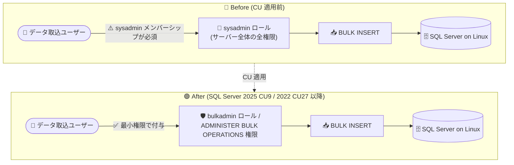

# SQL Server on Linux: bulkadmin 固定サーバーロールのサポート (GA)

**リリース日**: 2026-10-07

**サービス**: SQL Server on Linux

**機能**: bulkadmin 固定サーバーロールおよび ADMINISTER BULK OPERATIONS 権限のサポート

**ステータス**: Launched (GA)

[このアップデートのインフォグラフィックを見る](https://takech9203.github.io/azure-news-summary/20261007-sql-server-linux-bulkadmin.html)

## 概要

SQL Server 2025 CU9 および SQL Server 2022 CU27 以降、SQL Server on Linux で **bulkadmin 固定サーバーロール** と **ADMINISTER BULK OPERATIONS 権限** がサポートされるようになりました。これにより、Linux 上の SQL Server でも、ユーザーを sysadmin ロールのメンバーにすることなく、バルクデータインポート操作 (`BULK INSERT` など) を実行できるようになります。

従来、Microsoft Learn の公式ドキュメントでは「bulkadmin ロールおよび ADMINISTER BULK OPERATIONS 権限は SQL Server on Linux ではサポートされない」と明記されており、Linux 環境でバルクインサートを実行するには sysadmin ロールのメンバーシップが必要でした。これはサーバー全体のあらゆる操作を許可する過剰な権限付与であり、最小権限の原則 (Principle of Least Privilege) に反する運用を強いられるという課題がありました。

今回のアップデートにより、Windows 版 SQL Server と同様の権限モデルで、バルク操作に必要な最小限の権限のみをユーザーに付与できるようになり、Linux 環境におけるセキュリティガバナンスが大きく改善されます。

**アップデート前の課題**

- SQL Server on Linux では bulkadmin 固定サーバーロールと `ADMINISTER BULK OPERATIONS` 権限がサポートされていなかった
- Linux 環境で `BULK INSERT` などのバルク操作を実行するには、ユーザーを sysadmin ロールのメンバーにする必要があり、過剰な権限付与が発生していた
- Windows 版と Linux 版で権限モデルに差異があり、クロスプラットフォームでの運用設計が複雑だった

**アップデート後の改善**

- bulkadmin 固定サーバーロールへの追加、または `ADMINISTER BULK OPERATIONS` 権限の付与のみでバルクデータインポートが実行可能になった
- sysadmin メンバーシップが不要になり、最小権限の原則に沿った権限設計が可能になった
- Windows 版 SQL Server と同等の権限モデルが Linux でも利用でき、プラットフォーム間の差異が縮小した

## アーキテクチャ図



従来はバルクインサートの実行に sysadmin ロールが必須でしたが、アップデート後は bulkadmin ロールまたは `ADMINISTER BULK OPERATIONS` 権限のみでバルク操作を実行でき、最小権限の原則に沿った運用が可能になります。

## サービスアップデートの詳細

### 主要機能

1. **bulkadmin 固定サーバーロールのサポート**
   - bulkadmin 固定サーバーロールのメンバーは `BULK INSERT` ステートメントを実行可能
   - SQL Server 2025 CU9 および SQL Server 2022 CU27 以降の SQL Server on Linux で利用可能

2. **ADMINISTER BULK OPERATIONS 権限のサポート**
   - ロールメンバーシップではなく、サーバーレベル権限の `GRANT` によるきめ細かな権限付与が可能
   - ユーザー定義サーバーロールへの組み込みにも利用できる

3. **sysadmin 依存の解消**
   - バルクデータインポート操作のために sysadmin ロールのメンバーシップが不要に
   - Windows 版 SQL Server と同等の権限モデルを Linux で実現

## 技術仕様

| 項目 | 詳細 |
|------|------|
| 対象プラットフォーム | SQL Server on Linux |
| 対象バージョン | SQL Server 2025 CU9 以降、SQL Server 2022 CU27 以降 |
| 追加されたロール | bulkadmin 固定サーバーロール |
| 追加された権限 | `ADMINISTER BULK OPERATIONS` (サーバーレベル権限) |
| 対象操作 | `BULK INSERT` などのバルクデータインポート操作 |
| ロールの権限変更 | 固定サーバーロールのため権限内容の変更は不可 (メンバー追加のみ) |

## 設定方法

### 前提条件

1. SQL Server 2025 CU9 以降、または SQL Server 2022 CU27 以降が Linux 上にインストールされていること
2. ロールメンバーの追加・権限付与を行う管理者権限を持つログインで接続すること

### T-SQL

```sql
-- 方法 1: ログインを bulkadmin 固定サーバーロールに追加する
ALTER SERVER ROLE bulkadmin ADD MEMBER [bulk_import_user];

-- 方法 2: ADMINISTER BULK OPERATIONS 権限を直接付与する
GRANT ADMINISTER BULK OPERATIONS TO [bulk_import_user];

-- ロールメンバーシップの確認
SELECT IS_SRVROLEMEMBER('bulkadmin', 'bulk_import_user');
```

## メリット

### ビジネス面

- 最小権限の原則に沿ったアクセス管理により、セキュリティ監査・コンプライアンス対応が容易になる
- sysadmin 権限保持者を減らすことで、内部不正や誤操作による事業リスクを低減できる

### 技術面

- データ取込専用アカウントに sysadmin を付与する必要がなくなり、権限設計がシンプルになる
- Windows 版 SQL Server と権限モデルが揃い、Linux への移行やクロスプラットフォーム運用時の設計差異が減る
- ユーザー定義サーバーロールと `ADMINISTER BULK OPERATIONS` 権限を組み合わせた柔軟な権限管理が可能

## デメリット・制約事項

- 本機能の利用には SQL Server 2025 CU9 または SQL Server 2022 CU27 以降への更新が必要 (それ以前のビルドでは従来どおり sysadmin が必要)
- Microsoft Learn のドキュメントによると、bulkadmin ロールのメンバーは特定の条件下で権限昇格の可能性があるため、最小権限の原則を適用し、メンバーの活動を監視することが推奨されている
- Microsoft Entra 認証ベースのログインに対しては、Linux / Windows を問わずバルク操作 (`BULK INSERT`) はサポートされず、このシナリオでは引き続き sysadmin ロールのメンバーのみがバルクインサートを実行できる (Microsoft Learn ドキュメント記載時点の情報)

## ユースケース

### ユースケース 1: ETL パイプライン用サービスアカウントの最小権限化

**シナリオ**: Linux 上の SQL Server に対して、ETL ジョブが CSV ファイルを定期的に `BULK INSERT` でロードしている。従来は ETL 用サービスアカウントに sysadmin を付与していたが、セキュリティ監査で過剰権限と指摘された。

**実装例**:

```sql
-- ETL 用ログインから sysadmin を外し、bulkadmin のみ付与
ALTER SERVER ROLE sysadmin DROP MEMBER [etl_service];
ALTER SERVER ROLE bulkadmin ADD MEMBER [etl_service];

-- 対象データベース・テーブルへの必要最小限の権限は別途付与
GRANT INSERT ON dbo.SalesStaging TO [etl_user];
```

**効果**: ETL アカウントの権限がバルク操作と対象テーブルへの書き込みに限定され、監査指摘の解消とサーバー全体への影響リスクの低減が期待できる。

## 関連サービス・機能

- **BULK INSERT / OPENROWSET(BULK)**: 本アップデートで権限要件が緩和されるバルクデータインポートの中心的な T-SQL 機能
- **固定サーバーロール (sysadmin / securityadmin など)**: bulkadmin はこれら固定サーバーロールの 1 つで、SQL Server 2022 以降は `##MS_` プレフィックス付きの最小権限ロール群も利用可能
- **SQL Server on Azure VM (Linux)**: Azure 上で Linux 版 SQL Server を運用している場合も、対象 CU の適用により本機能を利用可能

## 参考リンク

- [インフォグラフィック](https://takech9203.github.io/azure-news-summary/20261007-sql-server-linux-bulkadmin.html)
- [公式アップデート情報](https://azure.microsoft.com/updates?id=573443)
- [Microsoft Learn: サーバーレベルのロール](https://learn.microsoft.com/sql/relational-databases/security/authentication-access/server-level-roles)
- [Microsoft Learn: SQL Server on Linux のリリース情報](https://learn.microsoft.com/sql/linux/sql-server-linux-release-notes)
- [Microsoft Learn: SQL Server 2022 on Linux のエディションとサポートされる機能](https://learn.microsoft.com/sql/linux/sql-server-linux-editions-and-components-2022)

## まとめ

SQL Server 2025 CU9 / SQL Server 2022 CU27 以降、SQL Server on Linux で bulkadmin 固定サーバーロールと `ADMINISTER BULK OPERATIONS` 権限が利用可能になり、バルクデータインポートのために sysadmin メンバーシップを付与する必要がなくなりました。Linux 上で SQL Server を運用し、ETL やデータロードに sysadmin 権限のアカウントを使用している場合は、対象 CU への更新と権限の見直し (sysadmin から bulkadmin / `ADMINISTER BULK OPERATIONS` への移行) を推奨します。

---

**タグ**: SQL Server, SQL Server on Linux, bulkadmin, BULK INSERT, セキュリティ, 最小権限, GA
