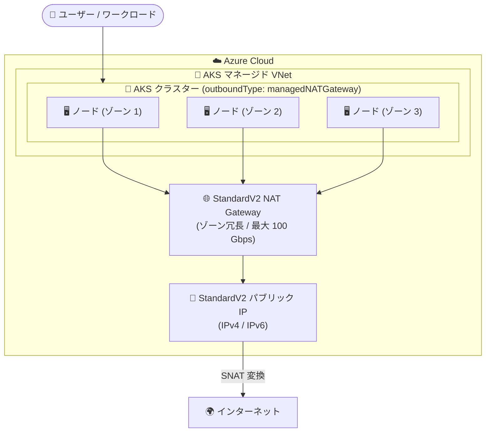

# Azure Kubernetes Service (AKS): マネージド StandardV2 NAT Gateway が一般提供 (GA) 開始

**リリース日**: 2026-10-08

**サービス**: Azure Kubernetes Service (AKS), Azure NAT Gateway

**機能**: Managed StandardV2 NAT Gateway for AKS

**ステータス**: Launched (GA)

[このアップデートのインフォグラフィックを見る](https://takech9203.github.io/azure-news-summary/20261008-aks-standardv2-nat-gateway-ga.html)

## 概要

AKS のマネージド StandardV2 NAT Gateway が一般提供 (GA) になった。AKS マネージド仮想ネットワークを使用するクラスターにおいて、AKS が StandardV2 NAT Gateway のプロビジョニングと管理を自動的に行う。サポート対象リージョンでは、`managedNATGateway` アウトバウンドタイプを使用する新規クラスターのデフォルト SKU が StandardV2 になる。

StandardV2 NAT Gateway は、デフォルトでのゾーン冗長性、最大 100 Gbps のスループット (Standard は 50 Gbps)、IPv6 サポート、フローログサポートを提供する。既存の AKS クラスターは、マネージド Standard NAT Gateway またはロードバランサーからマネージド StandardV2 NAT Gateway へ移行できる。

Preview 時には専用のアウトバウンドタイプ `managedNATGatewayV2` が使用されていたが、GA では API バージョン `2026-06-01` 以降で `managedNATGateway` アウトバウンドタイプに統合され、SKU は `natGatewayProfile.sku` プロパティで表現される。Preview API バージョン (`2026-01-02-preview` ~ `2026-05-02-preview`) は約 1 年間 `managedNATGatewayV2` を引き続き受け付けるため、その間に明示的な `sku` 指定を伴う `managedNATGateway` への移行が推奨される。

**アップデート前の課題**

- マネージド NAT Gateway (`managedNATGateway`) は Standard SKU のみで、単一アベイラビリティゾーンでの動作となり、ゾーン障害時にアウトバウンド接続が中断されるリスクがあった
- Standard SKU のマネージド NAT Gateway では IPv6 アウトバウンド IP とカスタマー定義のアウトバウンド IP がサポートされていなかった
- StandardV2 のマネージド型 (`managedNATGatewayV2`) はパブリックプレビュー段階であり、フィーチャーフラグの登録が必要で、SLA の対象外だった

**アップデート後の改善**

- サポート対象リージョンの新規クラスターでは StandardV2 がデフォルト SKU となり、追加設定なしでゾーン冗長なアウトバウンド接続が得られる
- フィーチャーフラグや専用アウトバウンドタイプが不要になり、標準の `managedNATGateway` アウトバウンドタイプで StandardV2 を利用できる
- StandardV2 では Azure マネージド IPv6 アウトバウンド IP と、カスタマー定義のアウトバウンド IP アドレス / プレフィックス (StandardV2 SKU) の両方がサポートされる
- 既存のマネージド Standard NAT Gateway クラスターは `natGatewayProfile.sku` を `StandardV2` に設定することでアップグレードできる

## アーキテクチャ図



この図は、AKS マネージド VNet 内の複数ゾーンに分散したノードが、AKS が自動プロビジョニングするゾーン冗長な StandardV2 NAT Gateway を経由してインターネットへアウトバウンド接続する構成を示している。NAT Gateway と IP の作成・管理は AKS が行うため、ユーザーの運用負荷なしでゾーン冗長なアウトバウンド接続が実現される。

## サービスアップデートの詳細

### 主要機能

1. **StandardV2 が新規クラスターのデフォルト SKU に**
   - API バージョン `2026-06-01` 以降、SKU 未指定の新規クラスターはサポート対象リージョンで `StandardV2` がデフォルトになる
   - AKS がリージョンの StandardV2 対応状況を検証し、未対応リージョンでは自動的に `Standard` が使用される
   - `Standard` を明示的に選択することも引き続き可能

2. **`managedNATGateway` アウトバウンドタイプへの統合**
   - Preview 時の `managedNATGatewayV2` アウトバウンドタイプは廃止され、`managedNATGateway` + `networkProfile.natGatewayProfile.sku` に統合された
   - Preview API バージョン (`2026-01-02-preview` ~ `2026-05-02-preview`) は約 1 年間 `managedNATGatewayV2` を受け付ける (移行猶予期間)

3. **Standard から StandardV2 へのアップグレード**
   - 既存のマネージド Standard NAT Gateway クラスターは `natGatewayProfile.sku` を `StandardV2` に設定することでアップグレード可能
   - StandardV2 から Standard へのダウングレードは不可
   - 既存の Standard クラスターは何もしなければそのまま Standard NAT Gateway を使い続ける (API からは読み取り専用の `natGatewayProfile.sku: Standard` として返される)

4. **柔軟なアウトバウンド IP 構成 (StandardV2)**
   - Azure マネージド IP: `managedOutboundIPProfile` で IPv4 / IPv6 の個数を指定 (各 1〜16)
   - カスタマー定義 IP: 事前作成した StandardV2 SKU のパブリック IP アドレス / プレフィックスを `outboundIPs` / `outboundIPPrefixes` で指定
   - 両モデルの併用は不可で、NAT Gateway 作成時に選択したモデルは後から変更できない

5. **StandardV2 SKU の機能 (Azure NAT Gateway 側)**
   - ゾーン冗長: リージョン内の全アベイラビリティゾーンにまたがって動作し、単一ゾーン障害時も接続を維持
   - 最大 100 Gbps のスループット (Standard は 50 Gbps)
   - IPv4 / IPv6 両方のパブリック IP アドレス / プレフィックスをサポート
   - フローログによるアウトバウンドトラフィックの監視・分析
   - NAT64 変換 (IPv6 のみのワークロードから IPv4 宛先への通信。別途 DNS64 ソリューションが必要)

## 技術仕様

| 項目 | `StandardV2` | `Standard` |
|------|-------------|-----------|
| 新規クラスターのデフォルト | サポート対象リージョンでデフォルト | 明示選択時、または StandardV2 未対応リージョン |
| アベイラビリティゾーン | デフォルトでゾーン冗長 | ゾーナルまたは非ゾーナル |
| 最大スループット | 100 Gbps | 50 Gbps |
| Azure マネージド アウトバウンド IPv4 | サポート | サポート |
| Azure マネージド アウトバウンド IPv6 | サポート | 非サポート |
| カスタマー定義アウトバウンド IP / プレフィックス | サポート (StandardV2 SKU の IP が必要) | AKS マネージド NAT Gateway では非サポート |
| 対応パブリック IP SKU | StandardV2 のみ | Standard のみ |
| SKU 変更 | Standard → StandardV2 のアップグレードは可、ダウングレードは不可 | - |
| 必要 API バージョン | `2026-06-01` 以降 | - |
| アウトバウンドフロー | IP あたり 64,512 (TCP/UDP)、最大 16 IP | 同左 |

## 設定方法

### 前提条件

1. Azure CLI の最新バージョンがインストールされていること
2. Kubernetes バージョン 1.20.x 以上
3. マネージド NAT Gateway はカスタム VNet (BYO VNet) とは併用不可 (AKS マネージド VNet のみ)
4. カスタマー定義 IP を使用する場合は StandardV2 SKU のパブリック IP アドレス / プレフィックスが必要

### Azure CLI

```bash
# managedNATGateway アウトバウンドタイプでクラスターを作成
# (サポート対象リージョンでは StandardV2 がデフォルトで使用される)
az aks create \
    --resource-group <resource-group> \
    --name <cluster-name> \
    --location <location> \
    --outbound-type managedNATGateway \
    --nat-gateway-managed-outbound-ip-count 1 \
    --generate-ssh-keys
```

カスタマー定義 IP を使用する場合は、事前に StandardV2 SKU のパブリック IP を作成する。

```bash
# ゾーン冗長な StandardV2 パブリック IP の作成
az network public-ip create \
    --resource-group <resource-group> \
    --name <public-ip-name> \
    --location eastus2 \
    --sku StandardV2 \
    --allocation-method Static \
    --version IPv4 \
    --zone 1 2 3
```

クラスター構成 (ARM / API) では `networkProfile.natGatewayProfile` で IP モデルを指定する。

```json
{
  "properties": {
    "networkProfile": {
      "outboundType": "managedNATGateway",
      "natGatewayProfile": {
        "managedOutboundIPProfile": {
          "count": 1,
          "countIPv6": 1
        }
      }
    }
  }
}
```

## メリット

### ビジネス面

- ゾーン冗長なアウトバウンド接続がデフォルトになり、ゾーン障害時のサービス中断リスクが追加コストなしで低減される (Standard と StandardV2 の料金は同一)
- GA により SLA の対象となり、プロダクション環境で安心して利用できる
- フィーチャーフラグや Preview CLI 拡張が不要になり、導入の手間が削減される

### 技術面

- 新規クラスターは SKU を意識せずに作成するだけで、サポート対象リージョンでは自動的に StandardV2 (ゾーン冗長、100 Gbps) が適用される
- 既存のマネージド Standard NAT Gateway クラスターは SKU 設定の変更のみで StandardV2 へアップグレードできる
- Standard SKU のマネージド NAT Gateway では不可能だった IPv6 アウトバウンド IP とカスタマー定義 IP / プレフィックスが利用可能になる
- フローログによりアウトバウンドトラフィックの可視化・分析が可能になる
- IP あたり 64,512 の SNAT ポートにより、ロードバランサーアウトバウンドと比較して SNAT ポート枯渇のリスクが低減される

## デメリット・制約事項

- StandardV2 NAT Gateway は StandardV2 SKU のパブリック IP アドレス / プレフィックスのみをサポートし、既存の Standard SKU パブリック IP は使用できない
- `type: LoadBalancer` の Service を処理する AKS マネージドロードバランサーは引き続き Standard Load Balancer であり、Standard パブリック IP が必要。タグ付きパブリック IP を事前プロビジョニングする場合は、NAT Gateway 用 (StandardV2) と受信 Service 用 (Standard) の両 SKU を計画する必要がある
- StandardV2 から Standard へのダウングレードは不可
- Azure マネージド IP とカスタマー定義 IP のモデルは NAT Gateway 作成時に決定され、後から切り替えられない
- マネージド NAT Gateway はカスタム VNet (BYO VNet) と併用できない (BYO VNet では `userAssignedNATGateway` を使用する)
- 一部リージョン (Canada East、India South Central、Sweden South、West India) では StandardV2 NAT Gateway が未サポートであり、これらのリージョンでは Standard SKU が使用される
- StandardV2 NAT Gateway をサブネットに関連付けると、ロードバランサーアウトバウンドルールを使用した IPv6 アウトバウンドトラフィックが中断される既知の問題がある

## ユースケース

### ユースケース 1: 新規プロダクションクラスターのゾーン冗長アウトバウンド接続

**シナリオ**: 高可用性が求められるプロダクション環境向けに、複数アベイラビリティゾーンに分散した AKS クラスターを新規構築する。アウトバウンド接続もゾーン障害に耐える構成にしたい。

**実装例**:

```bash
# サポート対象リージョンで作成すると StandardV2 がデフォルトで適用される
az aks create \
    --resource-group prod-rg \
    --name prod-aks-cluster \
    --location eastus2 \
    --node-count 6 \
    --zones 1 2 3 \
    --outbound-type managedNATGateway \
    --nat-gateway-managed-outbound-ip-count 2 \
    --generate-ssh-keys
```

**効果**: ノードとアウトバウンド経路の両方がゾーン冗長となり、単一ゾーン障害時でも外部 API やコンテナーレジストリへのアウトバウンド通信が維持される。

### ユースケース 2: 既存クラスターの Standard NAT Gateway からのアップグレード

**シナリオ**: マネージド Standard NAT Gateway を使用している既存の AKS クラスターで、ゾーン冗長性と高スループットを得るために StandardV2 へ移行したい。

**実装例**: クラスター構成の `networkProfile.natGatewayProfile.sku` を `StandardV2` に設定して更新する (API バージョン `2026-06-01` 以降)。

**効果**: クラスターを再作成することなく、アウトバウンド接続をゾーン冗長な StandardV2 NAT Gateway へアップグレードできる。ダウングレードは不可のため、事前に StandardV2 の制約 (StandardV2 パブリック IP 要件など) を確認した上で実施する。

### ユースケース 3: Preview の `managedNATGatewayV2` からの移行

**シナリオ**: Preview 期間中に `managedNATGatewayV2` アウトバウンドタイプで構築したクラスターを、GA の API に合わせて移行したい。

**実装例**: API バージョン `2026-06-01` 以降を使用し、`outboundType: managedNATGateway` + `natGatewayProfile.sku: StandardV2` の明示指定へ構成を更新する。

**効果**: Preview API バージョン (`2026-01-02-preview` ~ `2026-05-02-preview`) は約 1 年間 `managedNATGatewayV2` を受け付けるが、廃止前に GA の表現へ移行することで、IaC テンプレートや自動化パイプラインの継続性が確保される。

## 料金

Standard と StandardV2 の NAT Gateway の料金は同一である (公式料金ページに「2 つの SKU 間でコスト差はない」と明記)。

| 項目 | 課金内容 |
|------|---------|
| リソース時間 | NAT Gateway がデプロイされている時間に基づく時間課金 (1 時間未満は 1 時間として課金) |
| データ処理 | NAT Gateway を経由したアウトバウンドおよび戻りトラフィックのデータ量に基づく課金 |
| フローログ (StandardV2) | 有効化した時間に応じた月額固定料金 (NatGatewayFlowlogsV1) |

StandardV2 パブリック IP アドレスの料金と帯域幅 (Bandwidth) 料金は別途発生する。具体的な単価は [Azure NAT Gateway の料金ページ](https://azure.microsoft.com/pricing/details/azure-nat-gateway/)を参照されたい。

## 利用可能リージョン

StandardV2 がデフォルト SKU となるのは「サポート対象リージョン」であり、AKS がクラスター作成時にリージョンの対応状況を検証する。以下のリージョンでは StandardV2 NAT Gateway が未サポートであり、Standard SKU が使用される。

- Canada East
- India South Central
- Sweden South
- West India

最新の未サポートリージョン一覧は [Azure NAT Gateway の概要 (StandardV2 の主な制限)](https://learn.microsoft.com/azure/nat-gateway/nat-overview#key-limitations-of-standardv2) を参照されたい。

## 関連サービス・機能

- **Azure NAT Gateway**: AKS のアウトバウンド接続を提供する基盤サービス。StandardV2 SKU がゾーン冗長性、高スループット、IPv6、フローログ、NAT64 を提供する
- **Azure Kubernetes Service (AKS)**: 本アップデートの対象。AKS Automatic クラスターには事前構成済みのマネージド NAT Gateway が含まれる
- **Azure Load Balancer**: AKS のデフォルトのアウトバウンドタイプ。SNAT ポート数に制限があり、大規模環境では NAT Gateway への移行が推奨される。`type: LoadBalancer` Service の受信経路としては引き続き Standard Load Balancer が使用される
- **Azure Virtual Network**: マネージド NAT Gateway は AKS マネージド VNet でのみ使用可能。BYO VNet では `userAssignedNATGateway` アウトバウンドタイプで Standard / StandardV2 の NAT Gateway を関連付ける
- **StandardV2 パブリック IP アドレス / プレフィックス**: StandardV2 NAT Gateway のアウトバウンド IP に必須の SKU

## 参考リンク

- [インフォグラフィック](https://takech9203.github.io/azure-news-summary/20261008-aks-standardv2-nat-gateway-ga.html)
- [公式アップデート情報](https://azure.microsoft.com/updates?id=574430)
- [Microsoft Learn - AKS での NAT Gateway の作成](https://learn.microsoft.com/azure/aks/nat-gateway)
- [Microsoft Learn - Azure NAT Gateway の概要](https://learn.microsoft.com/azure/nat-gateway/nat-overview)
- [Azure NAT Gateway 料金ページ](https://azure.microsoft.com/pricing/details/azure-nat-gateway/)
- [Preview 時のレポート (2026-04-13)](./2026-04-13-aks-standardv2-nat-gateway.md)

## まとめ

AKS のマネージド StandardV2 NAT Gateway が GA となり、サポート対象リージョンの新規クラスターでは `managedNATGateway` アウトバウンドタイプのデフォルト SKU が StandardV2 になった。追加コストなし (Standard と同一料金) でゾーン冗長なアウトバウンド接続、最大 100 Gbps のスループット、IPv6 サポートが得られる点は、プロダクション環境の可用性設計において大きな前進である。

Solutions Architect への推奨アクションは次の 3 点である。(1) 新規クラスターは API バージョン `2026-06-01` 以降で作成し、デフォルトの StandardV2 を活用する。(2) 既存のマネージド Standard NAT Gateway クラスターは、StandardV2 パブリック IP 要件とダウングレード不可の制約を確認した上で、SKU アップグレードを計画する。(3) Preview の `managedNATGatewayV2` アウトバウンドタイプを使用している場合は、Preview API の廃止 (約 1 年の猶予) までに `managedNATGateway` + 明示的な `sku` 指定へ移行する。また、タグ付きパブリック IP を事前プロビジョニングしている環境では、NAT Gateway 用 StandardV2 と受信 Service 用 Standard の両 SKU の IP 在庫計画を見直されたい。

---

**タグ**: #Azure #AKS #Kubernetes #NATGateway #StandardV2 #ZoneRedundant #IPv6 #Networking #GA
