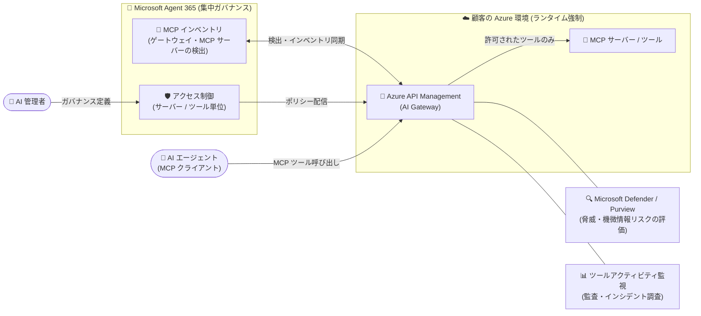

# Azure API Management: Microsoft Agent 365 との統合 (Public Preview)

**リリース日**: 2026-10-08

**サービス**: Azure API Management / Microsoft Agent 365

**機能**: Microsoft Agent 365 と Azure API Management の統合 (MCP サーバー・ツールの集中ガバナンスとランタイム制御)

**ステータス**: In preview

[このアップデートのインフォグラフィックを見る](https://takech9203.github.io/azure-news-summary/20261008-apim-agent-365-integration.html)

## 概要

Microsoft Agent 365 と Azure API Management (APIM) の統合がパブリックプレビューになりました。この統合により、Agent 365 による「集中ガバナンス」と、APIM による「ランタイムでのポリシー強制」を接続し、組織内の MCP (Model Context Protocol) サーバーとツールを一元的に統制できるようになります。

Microsoft Agent 365 は、組織内で増え続ける AI エージェントを「観測 (Observe)・統制 (Govern)・保護 (Secure)」するためのコントロールプレーンで、Microsoft 365 管理センターのエージェントレジストリを中心に、Microsoft Entra、Microsoft Purview、Microsoft Defender と連携します。一方、Azure API Management は AI ゲートウェイ機能により、REST API の MCP サーバー化や既存 MCP サーバーの公開・保護・監視を担います。今回の統合は、この 2 つを接続するものです。

運用モデルとしては、AI 管理者が Agent 365 でガバナンスを集中管理し、プラットフォームチームがそのポリシーを顧客自身の Azure 環境内の APIM を通じてランタイムで強制する、という役割分担が可能になります。なお、APIM v2 ティアは MCP インベントリの集中管理とサーバー単位のブロック/ブロック解除をサポートし、現在プレビュー中の AI Gateway ティアでは、ツール単位のブロック、ツールアクティビティの可観測性、ツール脅威保護が追加されます。

**アップデート前の課題**

- Agent 365 のエージェントガバナンス (レジストリ、アクセス制御、コンプライアンス) と、APIM ゲートウェイでの MCP サーバーのランタイム制御が分離しており、組織横断で一貫した統制を適用する仕組みがなかった
- APIM ゲートウェイで管理されている MCP サーバー・ツールを、Microsoft 365 側の AI 管理者が一元的に把握するインベントリがなかった

**アップデート後の改善**

- Agent 365 から APIM ゲートウェイと MCP サーバーを検出し、ゲートウェイ管理下のツールの集中インベントリを作成できる
- Agent 365 で定義したアクセス制御を、APIM がランタイムで強制する (サーバー単位、および AI Gateway ティアではツール単位)
- ツールアクティビティの監視により、監査・運用可視化・インシデント調査を支援
- Microsoft Defender と Microsoft Purview により、ツールの要求・応答をセキュリティ脅威や機微情報リスクの観点で評価・保護できる

## アーキテクチャ図

AI 管理者が Agent 365 でガバナンス (インベントリ・アクセス制御) を集中管理し、顧客の Azure 環境内の APIM が MCP ツール呼び出しをランタイムで強制します。Defender / Purview がツールの要求・応答を保護し、アクティビティ監視が監査を支援します。

## サービスアップデートの詳細

### 主要機能

1. **APIM ゲートウェイと MCP サーバーの検出 (Discover)**
   - Agent 365 から Azure API Management のゲートウェイと MCP サーバーを検出し、ゲートウェイ管理下のツールの集中インベントリを作成する

2. **MCP サーバーへのアクセス制御 (Control)**
   - Agent 365 から MCP サーバーへのアクセスを制御し、Azure API Management がランタイムで強制を適用する

3. **ツール単位のアクセス制御 (AI Gateway ティア)**
   - APIM の AI Gateway ティア (プレビュー) を使用すると、MCP サーバー全体を無効化することなく、個々のツールだけをブロックできる

4. **ツールアクティビティの監視 (Monitor)**
   - ツールアクティビティを監視し、監査、運用の可視化、インシデント調査を支援する

5. **ツールインタラクションの保護 (Protect)**
   - Microsoft Defender と Microsoft Purview の機能を使用して、ツールの要求と応答をセキュリティ脅威および機微情報リスクの観点で評価する

### ティアごとの機能差

| 機能 | APIM v2 ティア | AI Gateway ティア (プレビュー) |
|------|------|------|
| MCP インベントリの集中管理 | ✅ | ✅ |
| サーバー単位のブロック / ブロック解除 | ✅ | ✅ |
| ツール単位のブロック | - | ✅ |
| ツールアクティビティの可観測性 | - | ✅ |
| ツール脅威保護 | - | ✅ |

## 技術仕様

| 項目 | 詳細 |
|------|------|
| 統合対象 | Microsoft Agent 365 (集中ガバナンス) × Azure API Management (ランタイム強制) |
| 統制対象 | APIM ゲートウェイで管理される MCP サーバーとツール |
| ランタイム強制の実行場所 | 顧客自身の Azure 環境内の APIM |
| v2 ティアのサポート範囲 | MCP インベントリの集中管理、サーバー単位のブロック / ブロック解除 |
| AI Gateway ティア (プレビュー) の追加機能 | ツール単位のブロック、ツールアクティビティの可観測性、ツール脅威保護 |
| セキュリティ連携 | Microsoft Defender (脅威検出)、Microsoft Purview (機微情報リスク評価) |
| APIM の MCP サーバー公開方法 | REST API の MCP サーバー化、または既存 MCP サーバーの公開 (ツールのみ対応。MCP リソース / プロンプトは非対応) |
| Agent 365 の前提 | 少なくとも 1 ユーザーに対象ライセンスが必要 (ユーザー単位ライセンス。Microsoft E5 との併用が推奨) |

## メリット

### ビジネス面

- AI 管理者 (Microsoft 365 側) とプラットフォームチーム (Azure 側) の役割分担を保ったまま、組織全体で一貫した MCP ガバナンスを実現できる
- ゲートウェイ管理下のツールの集中インベントリにより、組織内の AI エージェントが利用できるツールを可視化し、監査対応 (audit-ready) を支援する
- インシデント発生時に、ツールアクティビティの記録を調査に活用できる

### 技術面

- ガバナンスポリシーが APIM によりランタイムで強制されるため、「定義されたポリシー」と「実際の挙動」の乖離を防げる
- AI Gateway ティアでは、問題のあるツールだけをピンポイントでブロックでき、MCP サーバー全体を停止する必要がない
- Defender / Purview との連携により、ツールの要求・応答レベルで脅威と機微情報リスクを評価できる

## デメリット・制約事項

- パブリックプレビューであり、本番環境での利用は想定されていない (SLA なし)
- ツール単位のブロック、ツールアクティビティの可観測性、ツール脅威保護には、現在プレビュー中の APIM AI Gateway ティアが必要
- APIM の MCP サーバー機能は現時点でツールのみをサポートし、MCP リソースやプロンプトは非対応。ワークスペースでも MCP サーバー機能は非サポート
- Agent 365 の利用には対象ライセンスが必要 (ユーザー単位課金)

## ユースケース

### ユースケース 1: 組織内 MCP ツールの集中インベントリとガバナンス

**シナリオ**: 複数のチームが APIM 経由で MCP サーバーを公開している企業で、AI 管理者が Agent 365 からゲートウェイと MCP サーバーを検出し、組織全体のツールインベントリを作成。利用を許可する MCP サーバー・ツールをポリシーとして定義し、APIM がランタイムで強制する。

**効果**: シャドー化しがちな MCP ツールを可視化し、承認されていないツールへのエージェントのアクセスを実行時にブロックできる。

### ユースケース 2: インシデント発生時の個別ツールの緊急ブロック

**シナリオ**: ある MCP サーバーの特定ツールに脆弱性や情報漏えいリスクが見つかった際、AI Gateway ティアのツール単位ブロックを使用して、該当ツールのみを即座に無効化する。サーバー上の他のツールは引き続き利用可能なまま、ツールアクティビティの記録を使ってインシデント調査を行う。

**効果**: MCP サーバー全体を停止することなくリスクを封じ込め、業務影響を最小化しながら調査・対応を進められる。

## 料金

このアップデートに固有の料金情報は公式発表では確認できませんでした。関連する料金は以下を参照してください。

- [Azure API Management 料金ページ](https://azure.microsoft.com/pricing/details/api-management/)
- [Microsoft Agent 365 プランと価格](https://www.microsoft.com/microsoft-agent-365) (ユーザー単位ライセンス)

## 関連サービス・機能

- **Microsoft Agent 365**: AI エージェントの観測・統制・保護を担うコントロールプレーン。Microsoft 365 管理センターのエージェントレジストリでエージェントとツールを集中管理する
- **Azure API Management (AI Gateway)**: REST API の MCP サーバー化や既存 MCP サーバーの公開を行い、認証・認可・レート制限・監視などのポリシーをランタイムで強制する
- **Microsoft Defender**: ツールインタラクションに対する継続的な脅威検出と保護
- **Microsoft Purview**: 情報保護・DLP によるツールの要求・応答の機微情報リスク評価
- **Microsoft Entra ID**: ユーザーおよびユーザーの代理として動作するエージェントへの一貫したリスクベースのアクセス制御
- **Azure API Center**: 組織内の MCP サーバーの登録・検出を行うエンタープライズ向けレジストリ (APIM 外部でホストされるサーバーも対象)

## 参考リンク

- [インフォグラフィック](https://takech9203.github.io/azure-news-summary/20261008-apim-agent-365-integration.html)
- [公式アップデート情報](https://azure.microsoft.com/updates?id=574204)
- [Microsoft Learn: MCP servers in Azure API Management (概要)](https://learn.microsoft.com/azure/api-management/mcp-server-overview)
- [Microsoft Learn: REST API を MCP サーバーとして公開する](https://learn.microsoft.com/azure/api-management/export-rest-mcp-server)
- [Microsoft Learn: Microsoft Agent 365 overview](https://learn.microsoft.com/microsoft-agent-365/overview)
- [Azure API Management 料金ページ](https://azure.microsoft.com/pricing/details/api-management/)

## まとめ

Microsoft Agent 365 と Azure API Management の統合により、AI エージェントが利用する MCP サーバー・ツールに対して「Agent 365 での集中ガバナンス定義」と「APIM でのランタイム強制」を接続する統制モデルがパブリックプレビューとして利用可能になりました。v2 ティアでのインベントリ集中管理・サーバー単位ブロックに加え、プレビュー中の AI Gateway ティアではツール単位のブロック・可観測性・脅威保護まで踏み込める点が特徴です。組織内で MCP サーバーの導入が進んでいる、あるいは AI エージェントのガバナンス体制を検討中の Solutions Architect は、APIM のティア要件 (v2 / AI Gateway) と Agent 365 のライセンス要件を確認のうえ、プレビュー環境での評価を推奨します。

---

**タグ**: Azure API Management, Microsoft Agent 365, MCP, AI Gateway, AI エージェント, ガバナンス, セキュリティ, Microsoft Defender, Microsoft Purview, Integration, Public Preview
