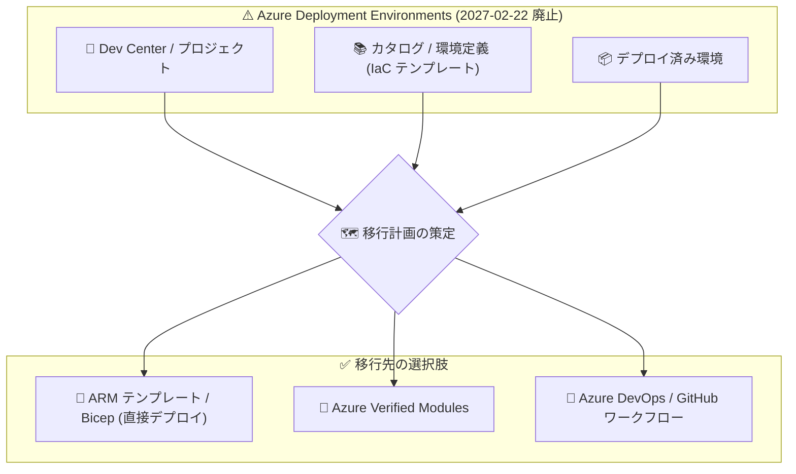

# Azure Deployment Environments: 2027 年 2 月 22 日にサービス廃止

**リリース日**: 2026-10-08

**サービス**: Azure Deployment Environments

**機能**: サービス廃止 (Retirement) のアナウンス

**ステータス**: Retirement

[このアップデートのインフォグラフィックを見る](https://takech9203.github.io/azure-news-summary/20261008-deployment-environments-retirement.html)

## 概要

Azure Deployment Environments (ADE) が **2027 年 2 月 22 日に廃止** されることが発表されました。それに先立ち、**2026 年 9 月 14 日からクローズダウンプロセスが開始** されます。廃止後、サービスは利用できなくなります。

ADE は、プラットフォームエンジニアが管理する IaC テンプレート (環境定義) を使い、開発者がセルフサービスでアプリケーションインフラ環境 (開発・テスト・ステージングなど) をオンデマンドに作成できるサービスです。CI/CD パイプラインとの統合、サンドボックス環境、ハンズオン・トレーニング用の一時環境などのシナリオで利用されてきました。

Microsoft は、中断を避けるために現在の利用状況の評価と移行計画の策定を今すぐ開始することを推奨しています。ADE には単一の 1 対 1 の後継サービスは存在せず、ワークロードごとに要件を評価して代替アプローチを選定する必要があります。

**この廃止がユーザーに意味すること**

- サブスクリプション、プロジェクト、テンプレート、デプロイワークフローにわたる現在の ADE 利用状況をすべて確認する必要がある
- 廃止日までに、環境プロビジョニングと開発者セルフサービスの代替アプローチを特定する必要がある
- 運用・開発への影響を最小化するため、できるだけ早く移行計画の検証を開始する必要がある

## アーキテクチャ図

ADE の Dev Center・カタログ・環境を棚卸しし、要件に応じて Bicep/ARM の直接デプロイ、Azure Verified Modules、CI/CD パイプラインのいずれか (または組み合わせ) へ移行します。

## 廃止スケジュール

| 日付 | 内容 |
|------|------|
| 2026-09-14 | クローズダウンプロセスの開始 |
| 2027-02-22 | サービス廃止。作成・デプロイ・再デプロイなどの書き込み操作がブロックされる見込み |
| 廃止後の一定期間 | インベントリ・読み取り・ログ・削除の各操作は、期間限定のクリーンアップ期間中は利用可能の計画 |

**重要**: 関連サービスの Microsoft Dev Box は別の廃止日 (**2028 年 9 月 18 日**) が設定されています。Dev Center とプロジェクトは両サービスで共有されるため、Dev Box の依存関係 (Dev Box プールなど) が残っていないことを確認するまで、共有 Dev Center リソースを削除しないでください。

## 移行先の選択肢

Microsoft の廃止ガイドでは、以下の代替アプローチが提示されています。ADE のすべてのワークロードを置き換える単一のサービスはないため、シナリオごとに評価が必要です。

1. **Azure Resource Manager (ARM) テンプレート / Bicep による直接デプロイ**
   - サブスクリプション、リソースグループ、ID、ポリシー、デプロイオーケストレーション、ライフサイクル管理を既存のプラットフォームエンジニアリングプロセスで管理できるチーム向け

2. **Azure Verified Modules (AVM)**
   - 標準化・ガバナンス適用済みの再利用可能なビルディングブロックが必要なチーム向け
   - 移行前にモジュールのカバレッジ、バージョニング、ポリシー統合、所有権を検証する

3. **Azure DevOps / GitHub のワークフロー (CI/CD)**
   - 環境プロビジョニングをリポジトリとパイプラインに統合できる場合に適する
   - ADE 固有のコマンド、SDK 統合、Dev Center プラットフォームを対象とする `azd` 構成の再構築が必要

4. **パートナーソリューションに関する注意**
   - Microsoft が確認したサードパーティソリューションの中に、Bicep / ARM のライフサイクルを直接サポートするものはなく、Bicep / ARM は Azure 上で直接利用することが案内されている

移行先を選定する前に、作成・更新・削除・ポリシー・ID・ロギング・障害復旧・コスト管理の代表的なシナリオをテストすることが推奨されています。

## 推奨アクション

Azure Updates および廃止ガイドで推奨されているアクションは以下のとおりです。

1. **棚卸し (インベントリ)**
   - 環境、環境定義、カタログ、環境タイプ、プロジェクト、Dev Center、デプロイ用サブスクリプション、ID、ロール割り当てを棚卸しする
   - [Service Retirement workbook](https://learn.microsoft.com/azure/advisor/advisor-workbook-service-retirement) と Azure Resource Graph で ADE のホスト・コントロールプレーンリソースを特定する
   - ADE の環境インスタンスは ARM リソース ID を持たないため、開発者ポータル、Azure CLI、ADE データプレーン API、運用テレメトリで別途棚卸しする

2. **移行先の決定と検証**
   - 組織の要件 (ガバナンス、アクセス制御、IaC 互換性、ネットワーク、コスト管理、ライフサイクル、開発者セルフサービス) に照らして代替プラットフォームを決定する
   - テンプレート、カタログのソース参照、パラメーター、構成を保全し、プロビジョニング自動化を再構築する
   - 代表的なデプロイと復旧手順をテストする

3. **ユーザーと自動化の移行**
   - 2027 年 2 月 22 日より前に、ユーザーと自動化を代替ワークフローへ移行する
   - プラットフォームエンジニアリングチーム、開発者、管理者へ社内スケジュールを周知する

4. **クリーンアップ (オフボード)**
   - 開発者ポータルで各環境を削除し、デプロイリソースグループで削除結果を確認する
   - 不要になった顧客所有リソースを削除する (ADE メタデータの削除だけではすべての Azure リソースの課金が止まるとは限らないため、Azure Cost Management で課金停止を確認する)
   - 依存関係がなくなった後、ADE 専用の環境タイプ、定義、カタログ、ID、ロール割り当て、昇格されたデプロイ権限を削除する

## デメリット・制約事項

- ADE には 1 対 1 の後継サービスがなく、シナリオごとに移行先の評価・選定・再構築が必要
- ADE 固有の機能 (開発者ポータルでのセルフサービス、環境タイプごとのガバナンス適用、`azd` の Dev Center 統合など) は、代替手段で同等の仕組みを自前で構成する必要がある
- ADE の環境インスタンスは ARM リソース ID を持たないため、Azure Resource Graph だけでは棚卸しが完結しない
- 環境削除後も、管理対象のデプロイリソースグループ外のリソースは稼働・課金が継続する可能性がある

## 関連サービス・機能

- **Microsoft Dev Box**: ADE と Dev Center・プロジェクトを共有する補完サービス。別の廃止日 (2028-09-18) が設定されており、ADE 廃止日以降も Dev Box の定義・イメージ・プール・スケジュール・ネットワーク接続・ユーザー操作は継続する
- **Azure Resource Manager / Bicep**: 移行先候補となる IaC デプロイ基盤
- **Azure Verified Modules**: 標準化された再利用可能な IaC モジュール群
- **Azure DevOps / GitHub Actions**: 環境プロビジョニングを組み込む CI/CD 基盤
- **Azure Advisor (Service Retirement workbook) / Azure Resource Graph**: 影響を受けるリソースの特定に利用

## 参考リンク

- [インフォグラフィック](https://takech9203.github.io/azure-news-summary/20261008-deployment-environments-retirement.html)
- [公式アップデート情報](https://azure.microsoft.com/updates?id=567934)
- [Azure Deployment Environments retirement guide (Microsoft Learn)](https://learn.microsoft.com/azure/deployment-environments/deployment-environments-retirement-guide)
- [What is Azure Deployment Environments? (Microsoft Learn)](https://learn.microsoft.com/azure/deployment-environments/overview-what-is-azure-deployment-environments)
- [Service Retirement workbook (Azure Advisor)](https://learn.microsoft.com/azure/advisor/advisor-workbook-service-retirement)

## まとめ

Azure Deployment Environments は 2026 年 9 月 14 日からクローズダウンが始まり、2027 年 2 月 22 日に廃止されます。廃止日には書き込み操作がブロックされる見込みのため、ADE を利用中の組織は、今すぐ環境・テンプレート・ワークフローの棚卸しを開始し、Bicep/ARM 直接デプロイ、Azure Verified Modules、Azure DevOps / GitHub の CI/CD ワークフローなどの代替アプローチを選定・検証して、廃止日前にユーザーと自動化の移行を完了させることが推奨されます。Dev Center を Microsoft Dev Box と共有している場合は、Dev Box の依存関係を確認するまで共有リソースを削除しない点に注意が必要です。

---

**タグ**: Azure Deployment Environments, Retirement, Developer tools, DevOps, Platform Engineering, IaC
