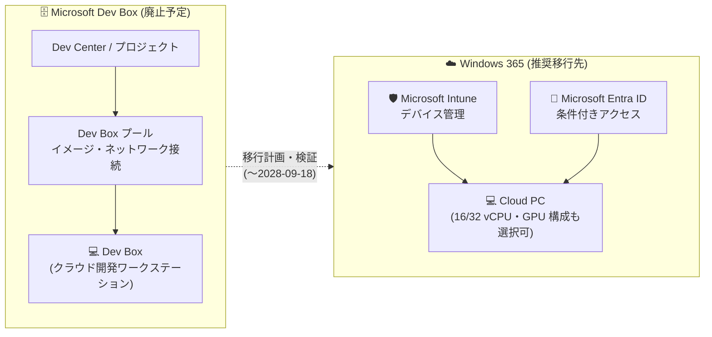

# Microsoft Dev Box: 2028 年 9 月 18 日にサービス廃止

**リリース日**: 2026-10-08

**サービス**: Microsoft Dev Box

**機能**: サービス全体の廃止 (Retirement)

**ステータス**: Retirement (廃止予告)

[このアップデートのインフォグラフィックを見る](https://takech9203.github.io/azure-news-summary/20261008-dev-box-retirement.html)

## 概要

Microsoft Dev Box が **2028 年 9 月 18 日 (17:00 UTC)** に廃止されることが発表された。それに先立ち、**2026 年 9 月 14 日 (16:00 UTC)** からクローズダウン期間 (closing-down process) が開始される。廃止後、Microsoft Dev Box は利用できなくなり、残存するカスタマーワークロードは削除されることが明記されている。

Microsoft Dev Box は現在メンテナンスモードにあり、新機能の開発は予定されていない。Microsoft は開発者向けクラウド環境への投資を **Windows 365** に集中させており、仮想化された開発者環境の推奨される移行先として Windows 365 が案内されている。

既存の Dev Box デプロイメントは移行期間中も引き続きサポートされるため、即座にサービスが停止するわけではない。ただし Microsoft は、開発者ワークフローの中断を避けるため、今から移行計画の策定を開始することを推奨している。

**ユーザーへの影響**

- 現在 Microsoft Dev Box を使用している場合、移行期間中は既存のデプロイメントを継続利用できる
- サービスに対する新機能の開発は予定されていない
- Windows 365 への移行を評価し、計画を開始することが推奨される
- 廃止後は Microsoft Dev Box は利用不可となり、残存ワークロードは削除が見込まれる

## アーキテクチャ図

廃止対象の Microsoft Dev Box の構成要素と、推奨移行先である Windows 365 (Intune / Entra ID で集中管理される Cloud PC) への移行パスを示す。自動移行ツールはなく、移行先環境の再構築と検証が必要となる。

## 廃止スケジュールと対応の詳細

### タイムライン

1. **2026 年 9 月 14 日 16:00 UTC**
   - クローズダウン期間 (closing-down process) が開始
   - 既存デプロイメントは移行期間中サポートが継続される

2. **2026 年 10 月 8 日**
   - Azure Updates で Microsoft Dev Box の廃止が正式にアナウンスされる

3. **2028 年 9 月 18 日 17:00 UTC**
   - Microsoft Dev Box が完全に廃止される
   - 以降サービスは利用不可となり、残存するカスタマーワークロードは削除が見込まれる

### 推奨移行先: Windows 365

Microsoft が推奨する移行先は Windows 365 である。公式ドキュメント (Dev Box retirement guide) では以下が案内されている。

- **永続的な Cloud PC**: セッションをまたいで開発者の作業内容が保持される
- **集中管理**: Microsoft Intune によるデバイス管理、Microsoft Entra ID・条件付きアクセス・コンプライアンスポリシーとの統合
- **開発者向け構成**: Windows 11 developer configuration イメージをサポートし、事前構成済みの開発環境を提供
- **柔軟な構成**: 16 vCPU、32 vCPU、GPU 搭載 Cloud PC など、ワークロード要件に応じた構成を選択可能
- **事前展開**: 開発者が接続する前に、承認済みアプリケーション、スクリプト、ポリシー、カスタムイメージを展開可能

**重要な注意点**: Windows 365 は Dev Box の 1 対 1 の代替ではない。アーキテクチャ、ライセンス、管理、ネットワーク、イメージ配信、開発者セルフサービスの仕組みが異なるため、完全な機能パリティを前提とせず、ワークロードごとに検証が必要である。また、自動移行ツールは提供されていない。

## 推奨アクション

公式アナウンスおよび廃止ガイドでは、以下のアクションが推奨されている。

1. **現状の棚卸し**
   - Dev Center、プロジェクト、プール、定義 (definitions)、ネットワーク接続、イメージ、アクティブな Dev Box、ユーザー、ロール割り当て、自動化を含む現在の Dev Box 利用状況をレビューする
   - [Azure Advisor Service Retirement ワークブック](https://learn.microsoft.com/azure/advisor/advisor-workbook-service-retirement)で影響を受けるサブスクリプションとリソースを特定する

2. **移行シナリオの分類**
   - Windows 365 に直接移行できるシナリオと、追加の計画が必要なシナリオを識別する

3. **将来環境の要件検証**
   - ID、デバイス管理、ネットワーク、イメージ、ライセンス要件を移行先環境で検証する
   - 適切な Windows 365 のオファリングとライセンスモデルを選定する

4. **早期のテストと段階的移行**
   - リスク低減のため、代替ワークフローのテストをできるだけ早期に開始する
   - ビジネス優先度・準備状況・地域・サポート体制に基づいて移行ウェーブを計画し、ユーザー移行前に移行先 Cloud PC をプロビジョニング・検証する
   - 移行完了後、検証を経て Dev Box リソースを削除する

5. **コスト削減とオフボーディング**
   - 未使用のリソースを削除してコストを削減する
   - 廃止予定のサービスに対して新たな長期依存を作らない

不明点がある場合は、Microsoft の担当者 (アカウントチーム) に問い合わせることが案内されている。

## 技術仕様

| 項目 | 詳細 |
|------|------|
| 廃止対象 | Microsoft Dev Box (サービス全体) |
| 廃止日 | 2028 年 9 月 18 日 17:00 UTC |
| クローズダウン期間開始 | 2026 年 9 月 14 日 16:00 UTC |
| 現在のステータス | メンテナンスモード (新機能開発なし) |
| 推奨移行先 | Windows 365 (Cloud PC) |
| 自動移行ツール | 提供なし (手動での再構築・検証が必要) |
| 廃止後のワークロード | 利用不可。残存ワークロードは削除が見込まれる |
| 影響カテゴリ | Developer tools / DevOps / Virtual desktop infrastructure |

## 関連サービス・機能

- **Windows 365**: 推奨される移行先。Intune / Entra ID と統合された永続的な Cloud PC を提供。GPU 構成や Windows 11 developer configuration イメージをサポート
- **Microsoft Intune**: Windows 365 Cloud PC のデバイス管理・ポリシー適用を担う
- **Microsoft Entra ID**: 移行先環境における ID 管理・条件付きアクセスの基盤
- **Azure Deployment Environments**: Dev Box と Dev Center / プロジェクトのアーキテクチャコンポーネントを共有する補完サービス。棚卸し時に構成の確認が必要
- **Azure Advisor**: Service Retirement ワークブックにより、廃止の影響を受けるリソースを特定可能

## 参考リンク

- [インフォグラフィック](https://takech9203.github.io/azure-news-summary/20261008-dev-box-retirement.html)
- [公式アップデート情報](https://azure.microsoft.com/updates?id=567933)
- [Microsoft Dev Box retirement guide - Microsoft Learn](https://learn.microsoft.com/azure/dev-box/dev-box-retirement-guide)
- [Microsoft Dev Box の概要 - Microsoft Learn](https://learn.microsoft.com/azure/dev-box/overview-what-is-microsoft-dev-box)
- [Windows 365 への移行ガイダンス - Microsoft Learn](https://learn.microsoft.com/windows-365/enterprise/migration-to-windows365)
- [Windows 365 公式サイト](https://www.microsoft.com/windows-365)
- [Azure Advisor Service Retirement ワークブック - Microsoft Learn](https://learn.microsoft.com/azure/advisor/advisor-workbook-service-retirement)

## まとめ

Microsoft Dev Box は **2028 年 9 月 18 日**に廃止され、**2026 年 9 月 14 日**からクローズダウン期間が開始される。サービスは既にメンテナンスモードにあり、Microsoft の開発者向けクラウド環境への投資は Windows 365 に集中している。既存デプロイメントは移行期間中サポートされるため即座の停止はないが、廃止後は残存ワークロードの削除が見込まれるため、計画的な移行が不可欠である。

推奨される次のアクションは以下の通り:

1. Azure Advisor の Service Retirement ワークブックと組織内インベントリで、Dev Center・プロジェクト・プール・イメージなど影響を受けるリソースを棚卸しする
2. Windows 365 は 1 対 1 の代替ではないため、ワークロードごとに機能差分・ライセンス・ネットワーク・イメージ要件を検証する
3. 代替ワークフローのテストを早期に開始し、移行ウェーブを計画して 2028 年 9 月 18 日までに移行を完了させる

---

**タグ**: #MicrosoftDevBox #DevBox #Retirement #Windows365 #CloudPC #DeveloperTools #DevOps #VirtualDesktopInfrastructure #Intune #EntraID
