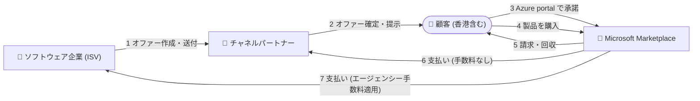

# Microsoft Marketplace: マルチパーティプライベートオファーが香港に拡大

**リリース日**: 2026-10-08

**サービス**: Microsoft Marketplace

**機能**: マルチパーティプライベートオファー (Multiparty Private Offers) の香港 (Hong Kong SAR) 展開

**ステータス**: Announcement

[このアップデートのインフォグラフィックを見る](https://takech9203.github.io/azure-news-summary/20261008-marketplace-multiparty-private-offers-hong-kong.html)

## 概要

Microsoft Marketplace のマルチパーティプライベートオファー (MPO) が香港 (Hong Kong SAR) に拡大することが発表された。MPO は、ソフトウェア企業 (ISV) がチャネルパートナーと協業し、サードパーティのクラウド・AI ソリューションを Marketplace 経由で顧客に販売する仕組みである。ISV はパートナーが持つ既存の顧客関係を活用して新市場に進出でき、顧客は信頼するパートナーを通じてクラウド・AI 導入を進められる。

MPO は通常のプライベートオファーと同様に、条件・価格の交渉と Marketplace を通じた簡素化された購買を提供するが、顧客への販売はチャネルパートナーが担う点が特徴である。Microsoft のパートナーエコシステムは 50 万以上のパートナーで構成され、調査会社 Omdia は 2030 年までに Marketplace 上のクラウドビジネスの 60% がチャネル主導の販売に依存すると推計している。

今回の拡大により、香港は顧客 (課金アカウント) とチャネルパートナー (税プロファイル) の両方でサポート対象となり、サポート対象国・地域は米国、英国、日本、オーストラリアなどを含む 37 の国・地域となった。

**アップデート前の課題**

- 香港の課金アカウントを持つ顧客は MPO 経由で製品を購入できなかった
- 香港の税プロファイルを持つチャネルパートナーは MPO を販売できなかった

**アップデート後の改善**

- 香港の顧客が MPO 経由でサードパーティソリューションを購入可能になった
- 香港のチャネルパートナーが Partner Center で税プロファイルを完了すれば MPO を販売可能になった

## アーキテクチャ図

ISV が作成したオファーをチャネルパートナーが確定して顧客に提示し、顧客は Azure portal で承諾後に Marketplace 経由で購入する。請求・回収と各当事者への支払いは Microsoft が行う。

## サービスアップデートの詳細

### 主要機能

1. **香港のサポート追加**
   - 顧客: 香港の課金アカウント ID で MPO 経由の購入が可能
   - チャネルパートナー: Partner Center で香港の税プロファイルを完了すれば MPO の販売が可能

2. **MPO の購入フロー**
   - ソフトウェア企業 (または resale enabled offers の認定パートナー) が MPO を作成しチャネルパートナーに送付
   - チャネルパートナーがオファーを確定し顧客に提示
   - 顧客が Azure portal のプライベートオファー管理セクションで承諾し、Marketplace 経由で各製品を購入
   - Microsoft が顧客の課金条件に従って請求・回収し、チャネルパートナー (手数料なし) と ISV (エージェンシー手数料適用) に支払う

3. **クラウド消費コミットメント (MACC) への充当**
   - Azure のクラウド消費コミットメントを持つ顧客が co-sell 対象ソリューションを購入した場合、購入額全体がコミットメントに充当される

## 技術仕様

| 項目 | 詳細 |
|------|------|
| 対象プログラム | Multiparty private offers (Microsoft Marketplace) |
| 新規サポート地域 | Hong Kong SAR (顧客・チャネルパートナーの両方) |
| 顧客側の要件 | サポート対象国・地域の課金アカウント ID |
| チャネルパートナー側の要件 | Partner Center で対象国・地域の税プロファイルを完了 |
| 提供時期 | 2026 年 10 月 (Effective) |

## メリット

### ビジネス面

- ISV は香港のチャネルパートナーの顧客基盤を活用して新市場に進出できる
- チャネルパートナーは ISV と組んで独自オファーを構成し、提供ソリューションを拡充できる
- co-sell 対象の購入は顧客の MACC に全額充当されるため、大型案件の成約を後押しする

### 技術面

- 顧客は Azure portal 上でオファーの承諾から購入までを一元的に完了できる
- 請求・回収・支払いを Microsoft が仲介するため、当事者間の商流管理が簡素化される

## デメリット・制約事項

- 顧客はサポート対象国・地域の課金アカウント ID が必要
- チャネルパートナーはサポート対象国・地域の税プロファイルの完了が必要
- カナダはチャネルパートナーの税プロファイル対象外 (顧客としてのみサポート)
- 米国のチャネルパートナーは再販証明書 (resale certificate) の提出が必要
- MACC への充当は co-sell 対象ソリューションの購入に限られる

## 利用可能リージョン

今回の発表で Hong Kong SAR が顧客・チャネルパートナーの両方で追加された。サポート対象は米国、英国、日本、オーストラリア、南アフリカ、欧州各国など 37 の国・地域 (カナダは顧客のみ)。最新の一覧は [Multiparty private offers overview](https://learn.microsoft.com/en-us/partner-center/marketplace-offers/multiparty-private-offers-overview) を参照。

## 関連サービス・機能

- **Microsoft Partner Center**: ISV による MPO の作成、チャネルパートナーの登録・税プロファイル設定を行う
- **Azure portal (プライベートオファー管理)**: 顧客がオファーを承諾し購入を行う
- **Microsoft Azure Consumption Commitment (MACC)**: co-sell 対象の購入額がコミットメントに充当される
- **Resale enabled offers**: ISV に代わり認定パートナーが MPO を作成できる仕組み

## 参考リンク

- [インフォグラフィック](https://takech9203.github.io/azure-news-summary/20261008-marketplace-multiparty-private-offers-hong-kong.html)
- [公式アップデート情報](https://azure.microsoft.com/updates?id=571831)
- [発表ブログ (Microsoft Partner Blog)](https://aka.ms/HongKongMPO)
- [Multiparty private offers overview (Microsoft Learn)](https://learn.microsoft.com/en-us/partner-center/marketplace-offers/multiparty-private-offers-overview)
- [Multiparty private offers for channel partners (Microsoft Learn)](https://learn.microsoft.com/en-us/partner-center/marketplace-offers/multiparty-private-offers-for-channel-partners)

## まとめ

Microsoft Marketplace のマルチパーティプライベートオファーが香港に拡大し、香港の顧客とチャネルパートナーがチャネル主導の Marketplace 取引に参加できるようになった。香港市場で事業を展開する ISV・パートナーは、Partner Center での登録・税プロファイル設定を確認し、MPO を活用した販売戦略を検討するとよい。MACC を持つ顧客にとっては、co-sell 対象ソリューションの購入がコミットメント消化につながる点も商談上のポイントとなる。

---

**タグ**: Microsoft Marketplace, Multiparty Private Offers, Partner Center, Hong Kong, Announcement
