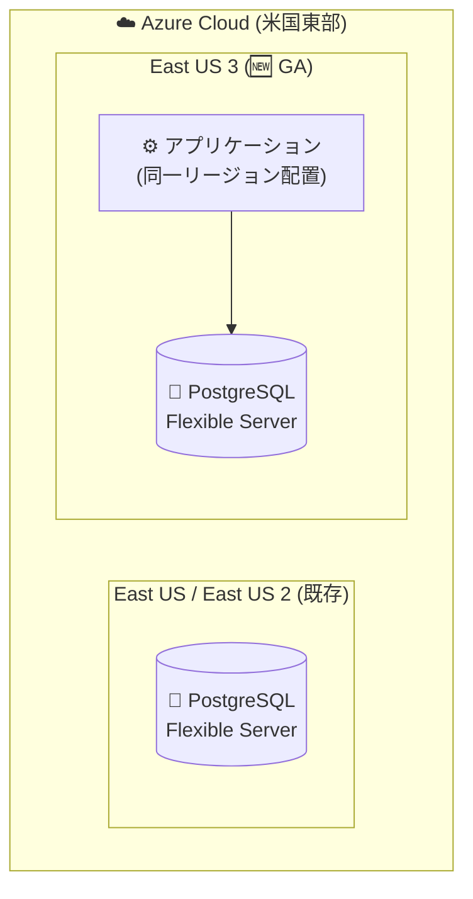

# Azure Database for PostgreSQL: フレキシブルサーバーが East US 3 リージョンで一般提供開始

**リリース日**: 2026-10-08

**サービス**: Azure Database for PostgreSQL

**機能**: フレキシブルサーバーの East US 3 リージョン対応 (GA)

**ステータス**: Launched (GA)

[このアップデートのインフォグラフィックを見る](https://takech9203.github.io/azure-news-summary/20261008-postgresql-flexible-server-east-us-3.html)

## 概要

Azure Database for PostgreSQL フレキシブルサーバーが、新たに **East US 3** リージョンにデプロイできるようになりました。2026 年 10 月に一般提供 (GA) として発表されたリージョン展開のアップデートです。

Azure Database for PostgreSQL フレキシブルサーバーは、コミュニティ版 PostgreSQL をベースとしたフルマネージドのデータベースサービスです。コンピュートとストレージを分離したアーキテクチャ、単一/複数可用性ゾーンでの高可用性構成、自動バックアップ、停止/開始によるコスト最適化、組み込みの PgBouncer 接続プーラーなどの機能を提供します。

**アップデート前の課題**

- East US 3 リージョンではフレキシブルサーバーをデプロイできず、米国東部でワークロードを配置する場合は East US や East US 2 など他リージョンを選択する必要があった

**アップデート後の改善**

- East US 3 リージョンでフレキシブルサーバーのデプロイが可能になり、米国東部地域でのリージョン選択肢が拡大した
- East US 3 に配置した他の Azure リソースとデータベースを同一リージョンに集約でき、レイテンシーの低減やデータ所在地要件への対応がしやすくなった

## アーキテクチャ図

East US 3 リージョンが新たにデプロイ先として追加され、同一リージョン内にアプリケーションとデータベースを集約できます。

## 利用可能リージョン

East US 3 リージョンでフレキシブルサーバーが一般提供されました。

なお、本レポート作成時点では Microsoft Learn のリージョン一覧 (コンピュート種別、ゾーン冗長 HA、Geo 冗長バックアップの対応状況の表) に East US 3 の詳細はまだ反映されていません。East US 3 で利用可能な SKU や HA オプションの詳細は、以下の公式ドキュメントで最新情報を確認してください。

- [Azure regions - Azure Database for PostgreSQL flexible server](https://learn.microsoft.com/en-us/azure/postgresql/flexible-server/overview#azure-regions)

## 料金

リージョンごとの料金は公式の料金ページで確認してください。

- [Azure Database for PostgreSQL の料金](https://azure.microsoft.com/pricing/details/postgresql/flexible-server/)

## 関連サービス・機能

- **Azure Database Migration Service**: 既存の PostgreSQL データベースを最小限のダウンタイムでフレキシブルサーバーへ移行する際に使用
- **Azure Virtual Network**: 仮想ネットワーク統合によりプライベート IP のみでのアクセス構成が可能
- **Azure Monitor**: 組み込みのメトリック (1 分間隔、30 日保持) とアラートによるパフォーマンス監視

## 参考リンク

- [インフォグラフィック](https://takech9203.github.io/azure-news-summary/20261008-postgresql-flexible-server-east-us-3.html)
- [公式アップデート情報](https://azure.microsoft.com/updates?id=573691)
- [Microsoft Learn ドキュメント (概要)](https://learn.microsoft.com/en-us/azure/postgresql/flexible-server/overview)
- [料金ページ](https://azure.microsoft.com/pricing/details/postgresql/flexible-server/)

## まとめ

Azure Database for PostgreSQL フレキシブルサーバーのデプロイ先として East US 3 リージョンが追加されました。米国東部でワークロードを運用している、または East US 3 への展開を計画している場合、データベースを同一リージョンに配置する選択肢が増えます。East US 3 で利用可能な SKU・高可用性オプションの詳細は公式ドキュメントのリージョン一覧で確認した上で、デプロイを検討してください。

---

**タグ**: Azure Database for PostgreSQL, Databases, Hybrid + multicloud, リージョン展開, East US 3, GA
