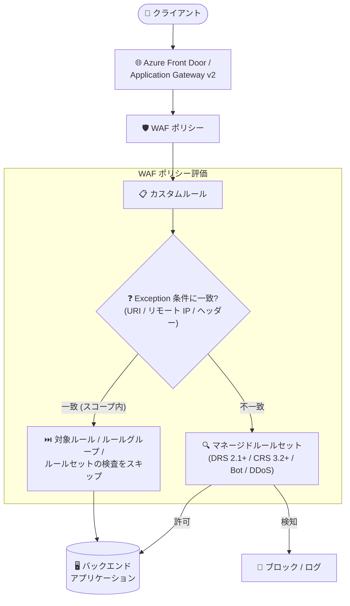

# Azure Web Application Firewall: Application Gateway / Front Door 向け Exceptions (例外) 機能が一般提供開始

**リリース日**: 2026-10-08

**サービス**: Azure Web Application Firewall (Azure Application Gateway / Azure Front Door)

**機能**: Exceptions in WAF for Azure Application Gateway and Azure Front Door

**ステータス**: Launched (GA)

[このアップデートのインフォグラフィックを見る](https://takech9203.github.io/azure-news-summary/20261008-waf-exceptions-app-gateway-front-door.html)

## 概要

Azure Application Gateway および Azure Front Door 上の Web Application Firewall (WAF) における「例外 (Exceptions)」機能の一般提供 (GA) が発表されました。Azure WAF は Web アプリケーションを一般的な脅威や攻撃から保護しますが、安全で想定されたリクエストを誤ってブロック (誤検知/False Positive) してしまう場合があります。

従来からの「除外 (Exclusions)」機能では、ヘッダー、Cookie、クエリ文字列引数、本文フィールドといった特定の「リクエスト属性」を WAF 評価から除外することで誤検知を減らせましたが、評価単位はあくまでリクエストの一部分でした。今回 GA となった Exceptions は、条件に一致した「特定のリクエスト」そのものを、ルール単位・ルールグループ単位・マネージドルールセット全体のいずれかのスコープで WAF 検査からバイパスさせる機能です。例外の条件はリクエスト URI、リモート IP アドレス、リクエストヘッダーの名前と値で定義できます。

これにより、カスタムルールの Allow アクション (全マネージドルールセットを一括バイパス) と Exclusions (リクエスト属性の部分除外) の中間にあたる、きめ細かな誤検知チューニングが可能になり、他の保護を有効に保ちながら WAF ポリシーをより正確に調整できます。

**アップデート前の課題**

- Exclusions はヘッダー・Cookie・クエリ引数・本文フィールドなど「リクエストの一部分」しか除外できず、特定の URI や送信元 IP からのリクエスト全体を特定ルールの評価対象外にする手段がなかった
- カスタムルールの Allow アクションでリクエスト全体を許可すると、DRS/CRS と Bot Protection ルールセットの検査が一括かつ無条件にバイパスされ、選択的な適用ができなかった (シグネチャ検知・異常スコアリングが実質無効化される)
- 特定の 1 ルールだけが正当なトラフィックをブロックするケースでも、ルール自体の無効化や広範な許可設定といった、保護レベルを下げるトレードオフを伴う対処が必要だった

**アップデート後の改善**

- 条件 (リクエスト URI / リモート IP / リクエストヘッダー) に一致するリクエストを、特定ルール・ルールグループ・ルールセット全体の 3 段階のスコープで選択的にバイパス可能になった
- 問題のある 1 ルールのみ検査を外し、他のすべての保護 (他の DRS/CRS ルール、Bot Protection、HTTP DDoS 保護) は有効なまま維持できる
- Exceptions は DRS、CRS、Bot Protection に加えて HTTP DDoS ルールセットにも適用でき、カスタムルール Allow では不可能だった粒度の制御が可能になった

## アーキテクチャ図



Exception 条件に一致したリクエストは、指定したスコープ (特定ルール / ルールグループ / ルールセット全体) の検査のみをバイパスし、スコープ外の保護は引き続き適用されます。

## サービスアップデートの詳細

### 主要機能

1. **リクエスト単位の選択的バイパス**
   - 条件に一致したリクエストに対して WAF 検査をバイパスする。Exclusions (リクエスト属性の部分除外) と異なり、リクエスト全体を対象に特定ルールの評価をスキップできる

2. **3 段階の適用スコープ**
   - 特定ルール (per-rule)、ルールグループ、マネージドルールセット全体のいずれかを選択可能。公式ドキュメントでは、攻撃者に悪用される余地を避けるため、可能な限り per-rule の最小スコープを推奨

3. **柔軟なマッチ条件**
   - リクエスト URI、リモート IP アドレス、リクエストヘッダー (名前と値) の 3 種類の属性で条件を定義
   - 演算子は Equals / Starts with / Ends with / Contains / IP Match をサポート

4. **幅広いルールセットへの適用**
   - DRS、CRS、Bot Protection に加え、HTTP DDoS ルールセットにも適用可能 (カスタムルールの Allow アクションでは HTTP DDoS ルールセットはバイパスされない)

### 誤検知対応 3 手段の使い分け (Before/After)

| 手段 | バイパス対象 | 粒度 | 特徴 |
|------|------------|------|------|
| Exclusions (従来) | リクエストの特定属性 (ヘッダー、Cookie、クエリ引数、本文フィールド) | 属性単位 | リクエストの残りの部分は通常どおり検査される |
| カスタムルール Allow (従来) | リクエスト全体 | 全ルールセット一括 | DRS/CRS/Bot Protection を無条件に一括バイパス (選択不可)。HTTP DDoS 保護のみ継続 |
| **Exceptions (今回 GA)** | リクエスト全体 | **ルール / ルールグループ / ルールセット単位で選択可能** | 問題のあるルールのみスキップし、他の保護は維持。DDoS ルールセットにも適用可 |

## 技術仕様

| 項目 | 詳細 |
|------|------|
| 対象サービス | Azure Application Gateway v2 (WAF)、Azure Front Door Premium (WAF) |
| 必要なルールセットバージョン | Application Gateway: CRS 3.2 / DRS 2.1 以降、Front Door: DRS 2.1 以降 |
| WAF エンジン | 次世代 WAF エンジンのみサポート |
| マッチ変数 | リクエスト URI、リモート IP アドレス、リクエストヘッダー (名前と値) |
| 演算子 | Equals、Starts with、Ends with、Contains、IP Match |
| 適用スコープ | 特定ルール / ルールグループ / マネージドルールセット全体 |
| ポリシーあたりの上限 | 60 例外 |
| ゲートウェイあたりの上限 | 60 例外 (関連付けられた全 WAF ポリシーの合計) |
| 1 例外あたりの上限 | IP アドレス 600 件、または URI 10 件、またはリクエストヘッダー 10 件 |

## 設定方法

### 前提条件

1. Application Gateway v2 または Azure Front Door Premium に WAF ポリシーが関連付けられていること
2. マネージドルールセットが CRS 3.2 / DRS 2.1 以降であること (古いバージョンの場合はルールセットのアップグレードが必要)

### Azure Portal

1. WAF ポリシーに移動し、**Settings** の **Managed rules** を選択
2. **Exceptions** タブで **Add exceptions** を選択
3. **Applies to** で対象ルールセット (例: `Microsoft_DefaultRuleSet_2.1`) とスコープ (ルールセット全体 / ルールグループ / 特定ルール) を選択
4. **Add exception** でマッチ変数、演算子、値を設定し、**Add** → **Save** で適用

### Azure CLI (Application Gateway の例)

```bash
# SQL インジェクションルール評価時に特定 URI の検査をバイパスする例外を追加
az network application-gateway waf-policy managed-rule exception add \
    -g "myResourceGroup" \
    --policy-name "myWAF" \
    --match-variable "RequestURI" \
    --value-operator Equals \
    --values "login.php" "default.aspx" "account/images" \
    --rule-sets [0].rule-set-type=Microsoft_Default_Ruleset [0].rule-set-version=2.1
```

### Azure PowerShell (Application Gateway の例)

```powershell
$ruleGroupEntry = New-AzApplicationGatewayFirewallPolicyExclusionManagedRuleGroup `
    -RuleGroupName 'REQUEST-942-APPLICATION-ATTACK-SQLI'

$exclusionManagedRuleSet = New-AzApplicationGatewayFirewallPolicyExclusionManagedRuleSet `
    -RuleSetType 'Microsoft_DefaultRuleSet' `
    -RuleSetVersion '2.1' `
    -RuleGroup $ruleGroupEntry

$exceptionEntry = New-AzApplicationGatewayFirewallPolicyException `
    -MatchVariable "RequestURI" `
    -ValueMatchOperator 'Equals' `
    -Values login.php, logout.php `
    -ExceptionManagedRuleSet $exclusionManagedRuleSet

$wafPolicy = Get-AzApplicationGatewayFirewallPolicy `
    -Name $wafPolicyName `
    -ResourceGroupName $resourceGroupName

$wafPolicy.ManagedRules[0].Exceptions.Add($exceptionEntry)
$wafPolicy | Set-AzApplicationGatewayFirewallPolicy
```

## メリット

### ビジネス面

- 誤検知による正当なユーザートラフィックのブロックを、保護レベルを大きく下げずに解消でき、サービス可用性とユーザー体験を維持できる
- ルール無効化や広範な Allow ルールに頼らないため、セキュリティ態勢 (コンプライアンス) を保ったまま運用上の例外に対応できる

### 技術面

- 誤検知の原因となる特定ルールのみをピンポイントでスキップし、他の DRS/CRS ルール、Bot Protection、HTTP DDoS 保護は継続適用される
- URI・リモート IP・ヘッダーという運用で特定しやすい条件で例外を定義でき、Portal / CLI / PowerShell で管理可能
- カスタムルール Allow と異なり HTTP DDoS ルールセットを含めた適用対象の選択が可能で、WAF チューニングの表現力が向上

## デメリット・制約事項

- 次世代 WAF エンジンのみのサポートであり、ルールセットが CRS 3.2 / DRS 2.1 以降であることが必要 (古い CRS を使用中の場合はアップグレードが前提)
- Front Door では Premium レベルが対象 (ドキュメントの Applies to は Front Door Premium)
- WAF ポリシーあたり最大 60 例外、ゲートウェイ/Front Door あたり合計最大 60 例外の上限がある
- 1 例外あたり IP アドレス 600 件 / URI 10 件 / リクエストヘッダー 10 件の上限がある
- 例外は条件一致リクエストの検査をバイパスするため、スコープを広く取りすぎると攻撃の侵入経路になり得る。公式ドキュメントは可能な限り per-rule の最小スコープを推奨している

## ユースケース

### ユースケース 1: ログインページの SQL インジェクション誤検知対応

**シナリオ**: `/login.php` と `/logout.php` への正当なリクエストが SQL インジェクションルール (REQUEST-942 グループ) で誤検知されブロックされる。

**実装例**:

```bash
az network application-gateway waf-policy managed-rule exception add \
    -g "myResourceGroup" \
    --policy-name "myWAF" \
    --match-variable "RequestURI" \
    --value-operator Equals \
    --values "login.php" "logout.php" \
    --rule-sets [0].rule-set-type=Microsoft_Default_Ruleset [0].rule-set-version=2.1
```

**効果**: 対象 URI へのリクエストのみ SQL インジェクションルールの検査をスキップし、他のルールと保護はすべて有効なまま誤検知を解消できる。

### ユースケース 2: モバイルアプリの Content-Type 誤検知対応

**シナリオ**: 単一の DRS ルール (例: Restrict Content-Type Header) が正当なモバイルアプリのリクエストをブロックしている。

**実装**: 該当ルール 1 件のみを対象とした per-rule の例外を作成する。

**効果**: 他のすべての DRS ルール、Bot Protection、DDoS 保護は引き続きトラフィックに適用され、保護レベルの低下を最小限にとどめられる。従来のカスタムルール Allow では全マネージドルールセットが一括バイパスされていたのに対し、影響範囲を 1 ルールに限定できる。

## 料金

このアップデートに関する追加料金の情報は、公式アップデートおよびドキュメントでは確認できませんでした。WAF の料金は Application Gateway (WAF_v2) および Azure Front Door Premium の料金体系に従います。詳細は料金ページを参照してください。

- [Application Gateway の料金](https://azure.microsoft.com/pricing/details/application-gateway/)
- [Azure Front Door の料金](https://azure.microsoft.com/pricing/details/frontdoor/)
- [Web Application Firewall の料金](https://azure.microsoft.com/pricing/details/web-application-firewall/)

## 関連サービス・機能

- **Azure Application Gateway (v2)**: WAF ポリシーを関連付けるリージョナル L7 ロードバランサー。本機能の適用対象
- **Azure Front Door (Premium)**: WAF ポリシーを関連付けるグローバルエッジ配信サービス。本機能の適用対象
- **WAF Exclusions (除外リスト)**: ヘッダー・Cookie・クエリ引数・本文フィールドなどリクエストの一部分を検査から外す従来機能。Exceptions と使い分ける
- **WAF カスタムルール (Allow アクション)**: 信頼できるトラフィックに対して DRS/CRS/Bot Protection を一括バイパスする手段。Exceptions より粒度が粗い
- **マネージドルールセット (DRS / CRS / Bot Manager)**: Exceptions の適用対象。CRS 3.2 / DRS 2.1 以降が必要

## 参考リンク

- [インフォグラフィック](https://takech9203.github.io/azure-news-summary/20261008-waf-exceptions-app-gateway-front-door.html)
- [公式アップデート情報](https://azure.microsoft.com/updates?id=574343)
- [Application Gateway WAF Exceptions ドキュメント (Microsoft Learn)](https://learn.microsoft.com/azure/web-application-firewall/ag/application-gateway-exceptions)
- [Front Door WAF Exceptions ドキュメント (Microsoft Learn)](https://learn.microsoft.com/azure/web-application-firewall/afds/front-door-exceptions)
- [Application Gateway WAF Exclusion Lists (Microsoft Learn)](https://learn.microsoft.com/azure/web-application-firewall/ag/application-gateway-waf-configuration)
- [Web Application Firewall の料金](https://azure.microsoft.com/pricing/details/web-application-firewall/)

## まとめ

Azure WAF の Exceptions 機能が Application Gateway と Azure Front Door で GA となり、誤検知対応の選択肢が「属性単位の Exclusions」「全ルールセット一括の カスタムルール Allow」に加えて「ルール/ルールグループ/ルールセット単位の選択的バイパス」へと広がりました。URI・リモート IP・ヘッダーを条件に、問題のあるルールだけをスキップして他の保護を維持できるため、保護レベルを犠牲にした広範な許可設定やルール無効化で誤検知に対処している環境では、Exceptions への置き換えを検討する価値があります。利用には次世代 WAF エンジンと CRS 3.2 / DRS 2.1 以降のルールセットが必要なため、古い CRS を使用中の場合はまずルールセットのアップグレードを計画してください。例外のスコープは per-rule を基本に、最小限に絞ることが推奨されます。

---

**タグ**: Networking, Security, Application Gateway, Azure Front Door, Web Application Firewall, Features, GA
