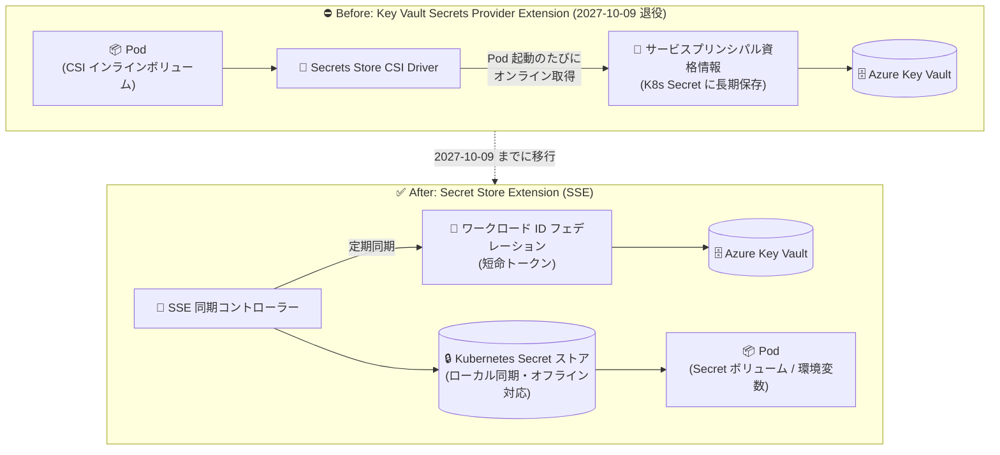

# Azure Arc-enabled Kubernetes: Azure Key Vault Secrets Provider Extension の退役告知

**リリース日**: 2026-10-09

**サービス**: Azure Arc-enabled Kubernetes / Azure Key Vault

**機能**: Azure Key Vault Secrets Provider Extension の退役 (2027 年 10 月 9 日)

**ステータス**: Retirement (退役告知)

[このアップデートのインフォグラフィックを見る](https://takech9203.github.io/azure-news-summary/20261009-arc-keyvault-secrets-provider-retirement.html)

## 概要

Azure Arc-enabled Kubernetes クラスター向けの **Azure Key Vault Secrets Provider Extension** (AKV SPE) が **2027 年 10 月 9 日に退役** することが発表されました。退役後は新機能の追加、バグ修正、セキュリティ更新、テクニカルサポートが提供されなくなります。

現在この拡張機能を使用している顧客は、退役日までに **Azure Key Vault Secret Store Extension (SSE)** への移行を計画する必要があります。SSE は Azure Key Vault からシークレットを取得・同期する同等の機能を提供することに加え、**シークレットへのオフラインアクセス**や**ワークロード ID フェデレーションによる認証** (クラスター上に長期資格情報を保存せずに Azure Key Vault へアクセス可能) といった強化が含まれています。

Microsoft からは、ワークロードと構成を SSE へ移行するための公式な移行ガイダンスが提供されています。

**退役対象 (旧拡張機能) の課題**

- Secrets Store CSI Driver ベースのオンライン型アーキテクチャのため、シークレットを使用する Pod の起動・再起動のたびに Azure Key Vault への接続が必要であり、接続断時にワークロードが影響を受けた
- Arc 対応クラスターではサービスプリンシパルによる認証が使われ、クライアント ID / シークレットを Kubernetes Secret としてクラスター上に保存する必要があった (長期資格情報の管理リスク)

**移行先 (SSE) での改善**

- シークレットを Kubernetes Secret ストアにローカル同期するため、Azure Key Vault への接続が一時的に失われてもワークロードが中断しない (オフライン耐性)
- ワークロード ID フェデレーションにより、短命のサービスアカウントトークンで Azure に認証し、長期資格情報をクラスター上に保存しない
- `jitterSeconds` 設定により同期タイミングをランダム化し、大規模フリートで多数のクラスターが同時に Key Vault をポーリングする際の負荷集中を回避

## アーキテクチャ図



旧拡張機能は Pod 起動時に CSI Driver 経由でオンラインのまま Key Vault からシークレットを取得していましたが、SSE はワークロード ID フェデレーションで認証した同期コントローラーがシークレットを Kubernetes Secret ストアへ定期同期し、Pod は通常の Kubernetes Secret として (オフラインでも) 利用できます。

## サービスアップデートの詳細

### 退役スケジュールと影響

1. **退役日: 2027 年 10 月 9 日**
   - Azure Key Vault Secrets Provider Extension (extension type: `Microsoft.AzureKeyVaultSecretsProvider`) が退役
   - 退役後は新機能、バグ修正、セキュリティ更新、テクニカルサポートが提供されない

2. **推奨アクション: Azure Key Vault Secret Store Extension (SSE) への移行**
   - SSE (extension type: `microsoft.azure.secretstore`) は Azure Key Vault のシークレットへのアクセス・同期について同等の機能を提供
   - 公式の移行ガイダンスが公開されており、構成の変換手順とワークロードの更新手順が案内されている

3. **SSE の主な強化点**
   - **オフラインアクセス**: シークレットのローカルコピーを Kubernetes Secret ストアに保持し、半切断 (semi-disconnected) 状態のクラスターでも利用可能
   - **ワークロード ID フェデレーション認証**: 長期資格情報をクラスターに保存せず、短命トークンで Azure Key Vault にアクセス
   - **大規模フリート対応**: `jitterSeconds` による同期タイミングの分散

## 技術仕様 (新旧比較)

| 項目 | AKV Secrets Provider Extension (退役対象) | Secret Store Extension (移行先) |
|------|------|------|
| 拡張機能タイプ | `Microsoft.AzureKeyVaultSecretsProvider` | `microsoft.azure.secretstore` |
| アーキテクチャ | Secrets Store CSI Driver + Azure Provider (CSI インラインボリュームでマウント) | 同期コントローラーが Kubernetes Secret ストアへシークレットを同期 |
| シークレットの消費方法 | CSI ボリュームマウント (オプションで K8s Secret への同期 `syncSecret.enabled`) | ネイティブ Kubernetes Secret (ボリュームマウント / 環境変数 `secretKeyRef`) |
| Key Vault への接続要件 | Pod の起動・再起動のたびに接続が必要 (オンライン前提) | 定期同期時のみ。一時的な切断に耐性あり (オフラインアクセス) |
| 認証方式 (Arc クラスター) | サービスプリンシパル (資格情報を K8s Secret に保存) | ワークロード ID フェデレーション (短命トークン、長期資格情報不要) |
| 構成リソース | `SecretProviderClass` | `SecretProviderClass` + `SecretSync` (直接構成、GA) または `AKVSync` (簡易構成、プレビュー) |
| Kubernetes バージョン要件 | - | 1.27 以降 (OIDC issuer / `service-account-issuer` 設定が必要) |
| 追加の前提拡張機能 | なし | Certificate Management for Azure Arc 拡張機能 (クラスター内 TLS 用) |
| Windows コンテナー | サポート | 非サポート (Linux のみ) |
| ソブリンクラウド | `cloudName` で Azure Government / 21Vianet に対応 | 非サポート (`cloudName` パラメーターなし) |

## 設定方法 (移行手順の概要)

### 前提条件

1. クラスターで Kubernetes 1.27 以降が稼働し、kube-apiserver の `service-account-issuer` を設定できること (ワークロード ID フェデレーションの有効化に必要)
2. Certificate Management for Azure Arc 拡張機能のインストール (OSS 版 cert-manager / trust-manager が稼働中の場合は先にアンインストール)
3. シークレットを消費する Namespace ごとに 1 つのサービスアカウントとフェデレーション資格情報を計画 (1 つのマネージド ID につきフェデレーション資格情報は最大 20 件)
4. 切り替えウィンドウの計画 (旧拡張機能と SSE は同一クラスターでの併用がサポートされないため、切り替え中はシークレットを消費するワークロードが中断する)

### 移行の 6 ステージ (公式移行ガイダンスより)

1. **インベントリ**: 既存の `SecretProviderClass` と CSI ボリュームをマウントするワークロードを棚卸し
2. **SSE 前提条件の準備**: マネージド ID の作成、ワークロード ID の有効化、Certificate Management 拡張機能のインストール
3. **切り替え**: 旧拡張機能をアンインストールし、SSE をインストール
4. **構成の変換**: 既存の `SecretProviderClass` を編集 (`clientID` の追加、`usePodIdentity` 等の削除) し、生成する Kubernetes Secret ごとに `SecretSync` を作成
5. **ワークロードの更新**: CSI ボリュームを Secret ボリュームまたは `secretKeyRef` に置き換え
6. **検証とクリーンアップ**: 同期を確認後、旧サービスプリンシパルのアクセス権を失効し、残存資格情報を削除

### Azure CLI

```bash
# ワークロード ID (OIDC issuer) の有効化
az connectedk8s update --name $CLUSTER_NAME --resource-group $RESOURCE_GROUP --enable-oidc-issuer

# 旧拡張機能のアンインストール
az k8s-extension delete --cluster-type connectedClusters \
  --cluster-name $CLUSTER_NAME --resource-group $RESOURCE_GROUP --name akvsecretsprovider

# Certificate Management for Azure Arc 拡張機能のインストール (SSE の前提)
az k8s-extension create --resource-group $RESOURCE_GROUP --cluster-name $CLUSTER_NAME \
  --cluster-type connectedClusters --name "azure-cert-management" \
  --extension-type "microsoft.certmanagement"

# Secret Store Extension (SSE) のインストール
az k8s-extension create --cluster-name $CLUSTER_NAME --cluster-type connectedClusters \
  --extension-type microsoft.azure.secretstore --resource-group $RESOURCE_GROUP \
  --name ssarcextension --scope cluster
```

## メリット

### ビジネス面

- 退役日 (2027 年 10 月 9 日) まで約 1 年の移行猶予があり、計画的な移行が可能
- SSE への移行により、エッジや半切断環境 (工場、店舗、遠隔拠点など) でのワークロードの可用性が向上
- 長期資格情報の排除により、資格情報漏えいリスクとローテーション運用の負担を軽減

### 技術面

- Kubernetes ネイティブな Secret として消費できるため、ボリュームマウント・環境変数などの標準的な方法でシークレットを利用可能
- ワークロード ID フェデレーションによる短命トークン認証でセキュリティ姿勢が向上
- `AKVSync` (プレビュー) による簡易構成で、構成リソースを 1 つに集約可能

## デメリット・制約事項

- **ダウンタイムが発生**: 旧拡張機能と SSE の併用はサポートされないため、切り替え中はシークレットを消費するワークロードが中断する。旧拡張機能のアンインストール後、移行完了まで Pod の起動・再起動・再スケジュールで CSI ボリュームのマウントが失敗する
- **Windows コンテナー非対応**: SSE は Linux のみサポート
- **ソブリンクラウド非対応**: SSE は `cloudName` パラメーターを受け付けないため、Azure Government / Microsoft Azure operated by 21Vianet 上の Key Vault には利用不可
- **シークレットがクラスター上に永続化される**: SSE はシークレットのコピーを Kubernetes Secret ストアに書き込むため、クラスターの RBAC・監査・保存時暗号化がセキュリティ要件を満たすか事前確認が必要
- **クラスターレベルの構成変更が必要**: ワークロード ID の有効化には kube-apiserver の引数変更 (`service-account-issuer`) と再起動が必要で、一部のステップは元に戻すのが困難。本番展開前に非本番クラスターでの試行が推奨されている
- マネージド ID 1 つあたりのフェデレーション資格情報は最大 20 件のため、消費 Namespace が多いクラスターでは複数のマネージド ID が必要

## 関連サービス・機能

- **Azure Key Vault**: シークレット・キー・証明書の保存元。SSE 利用時はマネージド ID に「Key Vault Reader」と「Key Vault Secrets User」ロールを付与する
- **Azure Arc-enabled Kubernetes**: 対象のクラスター基盤。SSE はクラスター拡張機能 (`k8s-extension`) として配信される
- **ワークロード ID フェデレーション (Microsoft Entra ID)**: SSE の認証基盤。クラスターの OIDC issuer と連携し、サービスアカウントトークンを検証する
- **Certificate Management for Azure Arc**: SSE のクラスター内 TLS 通信に必須の拡張機能 (cert-manager / trust-manager をインストール)
- **AKS (Azure クラウド内)**: Azure クラウド内で Key Vault への接続が安定しているクラスターでは、ローカルコピーを作らないオンライン型の Secrets Provider が引き続き案内されている (本退役は Arc-enabled Kubernetes 向け拡張機能が対象)

## 参考リンク

- [インフォグラフィック](https://takech9203.github.io/azure-news-summary/20261009-arc-keyvault-secrets-provider-retirement.html)
- [公式アップデート情報](https://azure.microsoft.com/updates?id=570313)
- [Microsoft Learn: Azure Key Vault Secrets Provider Extension (退役対象)](https://learn.microsoft.com/azure/azure-arc/kubernetes/tutorial-akv-secrets-provider)
- [Microsoft Learn: Azure Key Vault Secret Store Extension (移行先)](https://learn.microsoft.com/azure/azure-arc/kubernetes/secret-store-extension)
- [Microsoft Learn: 移行ガイダンス (AKV SPE から SSE への移行)](https://learn.microsoft.com/azure/azure-arc/kubernetes/secret-store-extension-migration)

## まとめ

Azure Arc-enabled Kubernetes 向けの Azure Key Vault Secrets Provider Extension が 2027 年 10 月 9 日に退役します。退役後はセキュリティ更新やサポートが提供されないため、利用中の組織は後継の Azure Key Vault Secret Store Extension (SSE) への移行を計画すべきです。SSE はオフラインアクセスとワークロード ID フェデレーションというエッジ環境に適した強化を備える一方、Windows コンテナーやソブリンクラウドの非対応、切り替え時のワークロード中断、kube-apiserver の構成変更といった考慮点があります。公式の移行ガイダンス (6 ステージ) に沿って、まず非本番クラスターで試行し、退役日までに計画的に切り替えることを推奨します。

---

**タグ**: Azure Arc, Kubernetes, Azure Key Vault, Retirement, Secret Store Extension, Workload Identity, セキュリティ
